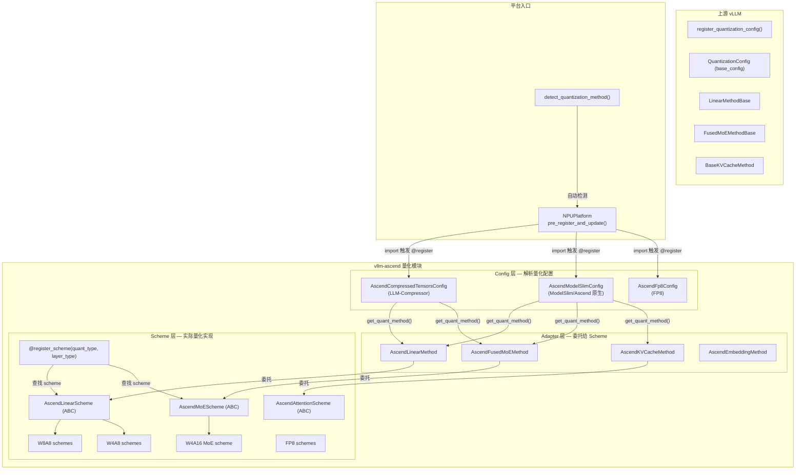
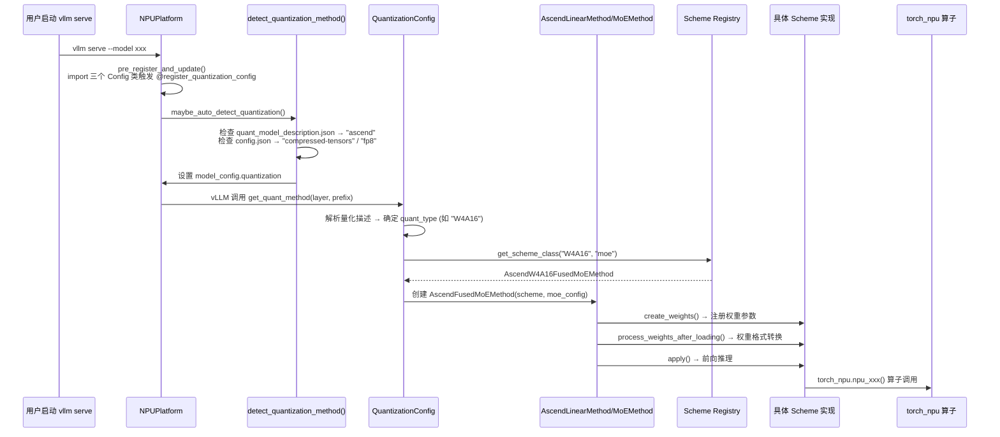
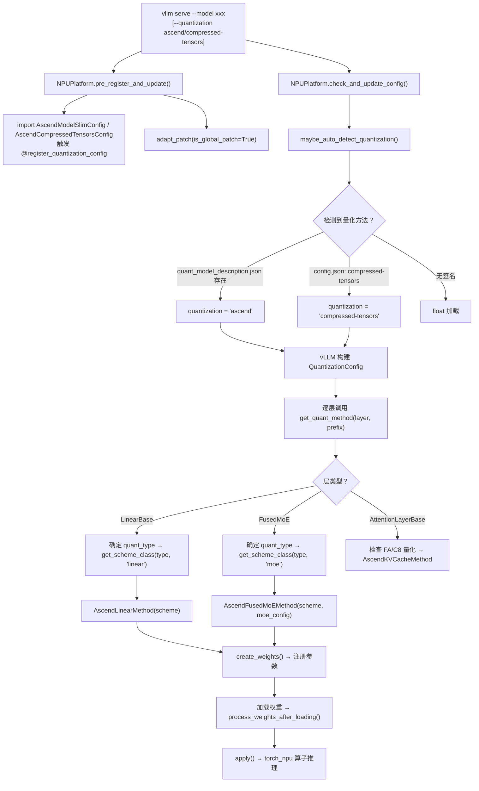
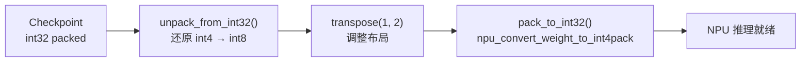

# vllm-ascend 量化适配流程指南 — 以 W4A16 为例

## 1. 问题分析

本文档整理 vllm-ascend 当前的量化适配全流程，并以 W4A16 量化方式为例，说明适配一个新的量化方式需要完成哪些步骤、涉及哪些文件、以及关键的 NPU 适配要点。

**当前 W4A16 现状**：代码库中已有 `methods/w4a16.py`，但仅注册了 MoE 层（`@register_scheme("W4A16", "moe")`），尚未支持 Linear 层。如需完整适配 W4A16，还需补充 Linear 层的 Scheme 实现。

---

## 2. 量化系统架构总览

### 2.1 组件图



### 2.2 数据流



---

## 3. 适配新量化方式的完整流程（5 步）

### 步骤总览

| 步骤 | 文件 | 操作 |
|------|------|------|
| ① 添加 QuantType 枚举 | `quant_type.py` | 在 `QuantType` 枚举中添加新类型 |
| ② 实现 Scheme 类 | `methods/xxx.py` | 继承 ABC，实现 `get_weight()` + `apply()` |
| ③ 注册 Scheme | `methods/xxx.py` | 使用 `@register_scheme(quant_type, layer_type)` |
| ④ 导出 Scheme | `methods/__init__.py` | 添加 import 和 `__all__` |
| ⑤ 更新 Config 层 | `compressed_tensors_config.py` 或 `modelslim_config.py` | 添加量化类型检测逻辑 |

---

### 步骤 ① — 添加 QuantType 枚举

**文件**: `vllm_ascend/quantization/quant_type.py`

```python
class QuantType(Enum):
    NONE = 0
    W8A8 = 1
    W4A8 = 2
    MXFP8 = 3
    W4A16 = 4       # ← 已存在
    MXFP4 = 5
    W4A8MXFP = 6
    # 新增示例：
    # W4A16_NEW = 7
```

> **注意**：`QuantType` 主要用于 MoE Scheme 的 `quant_type` 属性声明和 MoE runtime 分发。Linear Scheme 不强制使用此枚举，但建议保持一致。

---

### 步骤 ② — 实现 Scheme 类

根据层类型选择继承的基类：

| 层类型 | 基类 | 必须实现的方法 |
|--------|------|--------------|
| Linear | `AscendLinearScheme` | `get_weight()`, `apply()` |
| MoE | `AscendMoEScheme` | `get_weight()`, `get_dynamic_quant_param()`, `apply()` |
| Attention | `AscendAttentionScheme` | `apply()` |

#### W4A16 Linear 示例（当前缺失，需要新增）

**文件**: `vllm_ascend/quantization/methods/w4a16.py`（在现有文件中添加）

```python
from .base import AscendLinearScheme
from .registry import register_scheme

@register_scheme("W4A16", "linear")
class AscendW4A16LinearMethod(AscendLinearScheme):

    def __init__(self) -> None:
        self.num_bits = 4
        self.pack_factor = 8  # 8 个 int4 打包到 1 个 int32
        vllm_config = get_current_vllm_config()
        self.group_size = vllm_config.quant_config.quant_description.get("group_size", 32)

    def get_weight(self, input_size: int, output_size: int, params_dtype: torch.dtype) -> dict[str, Any]:
        return {
            "weight_packed": torch.empty(
                output_size, input_size // self.pack_factor, dtype=torch.int32
            ),
        }

    def get_perchannel_param(self, output_size: int, params_dtype: torch.dtype) -> dict[str, Any]:
        return {
            "weight_scale": torch.empty(output_size, dtype=params_dtype),
        }

    def get_pergroup_param(
        self, input_size: int, output_size: int, params_dtype: torch.dtype, layer_type: str | None = None
    ) -> dict[str, Any]:
        if self.group_size > 0:
            return {
                "weight_scale": torch.empty(
                    output_size, input_size // self.group_size, dtype=params_dtype
                ),
            }
        return {}

    def apply(self, layer, x, bias=None, tp_rank=0):
        # 调用 torch_npu 的 W4A16 matmul 算子
        return torch_npu.npu_quant_matmul(
            x, layer.weight_packed, layer.weight_scale,
            ...
        )

    def process_weights_after_loading(self, layer):
        # 权重格式转换：unpack → transpose → repack
        ...
```

#### W4A16 MoE 示例（已存在）

当前 `methods/w4a16.py` 中的 `AscendW4A16FusedMoEMethod` 已实现，注册为 `@register_scheme("W4A16", "moe")`。

关键实现要点：
- `get_weight()`: 返回 `w13_weight_packed` 和 `w2_weight_packed`（int32 打包格式）
- `get_dynamic_quant_param()`: 返回 `w13/w2_weight_scale`、`w13/w2_weight_offset`、`w13/w2_weight_shape`
- `apply()`: 通过 `moe_comm_method.fused_experts()` 执行 MoE 推理
- `process_weights_after_loading()`: unpack → transpose → repack 到 NPU 所需布局

---

### 步骤 ③ — 注册 Scheme

使用 `@register_scheme` 装饰器自动注册到全局 `_SCHEME_REGISTRY`：

```python
@register_scheme("W4A16", "linear")  # (quant_type, layer_type)
class AscendW4A16LinearMethod(AscendLinearScheme):
    ...

@register_scheme("W4A16", "moe")     # 已存在
class AscendW4A16FusedMoEMethod(AscendMoEScheme):
    ...
```

注册后，Config 层通过 `get_scheme_class("W4A16", "linear")` 即可查找到对应实现。

---

### 步骤 ④ — 导出 Scheme

**文件**: `vllm_ascend/quantization/methods/__init__.py`

```python
# 添加 import
from .w4a16 import AscendW4A16FusedMoEMethod, AscendW4A16LinearMethod  # 新增 LinearMethod

# 添加到 __all__
__all__ = [
    ...
    "AscendW4A16FusedMoEMethod",
    "AscendW4A16LinearMethod",  # 新增
    ...
]
```

---

### 步骤 ⑤ — 更新 Config 层的量化类型检测

根据量化权重来源（ModelSlim 或 LLM-Compressor），需要在对应的 Config 类中添加类型检测逻辑。

#### 5a. LLM-Compressor 路径（`compressed_tensors_config.py`）

在 `_detect_quant_type()` 方法中添加 W4A16 的检测逻辑：

```python
def _detect_quant_type(self, weight_quant, input_quant, format):
    ...
    # 已有：
    if self._is_w4a16(weight_quant, input_quant):
        return "W4A16"
    ...
```

**当前状态**：`_is_w4a16()` 已实现，检测条件为：
- `input_quant is None`（无激活量化）
- `weight_quant.num_bits == 4`
- `weight_quant.strategy == GROUP`
- `weight_quant.type == INT`
- `not weight_quant.dynamic`（静态量化）

#### 5b. ModelSlim 路径（`modelslim_config.py`）

ModelSlim 通过 `quant_model_description.json` 中的字符串标识量化类型（如 `"W4A16"`），直接作为 `quant_type` 字符串传递给 `get_scheme_class()`。

**需要确认**：ModelSlim 工具是否会为 W4A16 生成 `"W4A16"` 标识。如果是，则无需额外修改。

---

## 4. 关键路径：从启动到推理的完整流程



---

## 5. 文件结构

### 新增/修改文件清单（以完整 W4A16 适配为例）

```
vllm_ascend/quantization/
├── quant_type.py                    # [已有] W4A16 = 4 枚举
├── methods/
│   ├── __init__.py                  # [修改] 添加 AscendW4A16LinearMethod import + __all__
│   ├── base.py                      # [无需修改] ABC 基类
│   ├── registry.py                  # [无需修改] 注册机制
│   └── w4a16.py                     # [修改] 新增 AscendW4A16LinearMethod
├── compressed_tensors_config.py     # [已有] _is_w4a16() 检测逻辑已实现
├── modelslim_config.py              # [可能修改] 确认 ModelSlim 的 W4A16 标识
├── method_adapters.py               # [无需修改] 通用 Adapter 层
└── utils.py                         # [无需修改] 自动检测
```

### 现有量化方案注册表

| 量化类型 | Linear | MoE | 文件 |
|---------|--------|-----|------|
| W8A8 (static) | `AscendW8A8LinearMethod` | — | `w8a8_static.py` |
| W8A8_DYNAMIC | `AscendW8A8DynamicLinearMethod` | `AscendW8A8DynamicFusedMoEMethod` | `w8a8_dynamic.py` |
| W8A8_MXFP8 | `AscendW8A8MXFP8DynamicLinearMethod` | — | `w8a8_mxfp8.py` |
| W8A8_PDMIX | `AscendW8A8PDMixLinearMethod` | `AscendW8A8PDMixFusedMoeMethod` | `w8a8_pdmix.py` |
| W8A16 | `AscendW8A16LinearMethod` | — | `w8a16.py` |
| W4A8_DYNAMIC | `AscendW4A8DynamicLinearMethod` | `AscendW4A8DynamicFusedMoEMethod` | `w4a8.py` |
| W4A8_MXFP | `AscendW4A8MXFPDynamicLinearMethod` | `AscendW4A8MXFPDynamicFusedMoEMethod` | `w4a8_mxfp4.py` |
| **W4A16** | **缺失** | `AscendW4A16FusedMoEMethod` | `w4a16.py` |
| W4A4_FlatQuant | `AscendW4A4FlatQuantDynamicLinearMethod` | — | `w4a4_flatquant.py` |
| W4A4_Laos | `AscendW4A4LaosDynamicLinearMethod` | — | `w4a4_laos_dynamic.py` |
| W4A4_MXFP4 | `AscendW4A4MXFP4DynamicLinearMethod` | `AscendW4A4MXFP4DynamicFusedMoEMethod` | `w4a4_mxfp4.py` |
| MXFP8 (FP8) | `AscendW8A8MXFP8DSDynamicLinearMethod` | `AscendW4A8MXFPDSDynamicFusedMoEMethod` | `fp8.py` |
| KV_C8 | — | `AscendC8KVCacheAttentionMethod` (Attention) | `kv_c8.py` |

---

## 6. NPU 适配要点

### 6.1 W4A16 特有的 NPU 算子

| 操作 | torch_npu API | 说明 |
|------|--------------|------|
| 权重打包 | `torch_npu.npu_convert_weight_to_int4pack()` | 将 int8/int32 权重打包为 int32 格式 |
| 量化矩阵乘 | `torch_npu.npu_quant_matmul()` | W4A16 量化推理核心算子 |
| MoE 融合 | `moe_comm_method.fused_experts()` | 通过 MoE runtime 分发到 NPU MoE 算子 |

### 6.2 通用 NPU 约束

| 约束 | 说明 | 替代方案 |
|------|------|---------|
| 禁止 `tensor.item()` | 触发 NPU→CPU 同步 | 使用 `tensor.cpu()` 或设备端操作 |
| 优先 in-place | `x = x + 1` 产生额外内存拷贝 | `x.add_(1)` |
| 使用 `torch_npu` API | 不支持 CUDA API | `torch.npu.*` / `torch_npu.npu_*` |
| ACL Graph 兼容 | 确保算子可被 ACL Graph 捕获 | 避免动态 shape 和 CPU 同步点 |

### 6.3 权重格式转换

W4A16 的 `process_weights_after_loading()` 需要完成：



---

## 7. 权衡与注意事项

| 决策点 | 说明 |
|--------|------|
| **W4A16 Linear 是否需要新增** | 当前仅 MoE 层支持 W4A16。如果目标模型（如 Kimi-K2）只有 MoE 层使用 W4A16，则无需 Linear 实现。如果 Dense 模型也需要 W4A16，则必须新增 Linear Scheme |
| **ModelSlim vs LLM-Compressor** | 两种量化工具的权重格式和配置文件不同。LLM-Compressor 路径已支持 W4A16 检测，ModelSlim 路径需确认是否生成对应标识 |
| **group_size 配置** | W4A16 依赖 group quantization（默认 group_size=32），需要从 `quant_description` 中正确读取 |
| **EPLB 兼容** | MoE 的 W4A16 实现已声明 `quant_type = QuantType.W4A16`，需要确保 MoE runtime 的 `fused_experts` 支持该量化类型的 EPLB |

---

## 8. 快速 Checklist

适配一个新的量化方式（如 W4A16 Linear）时，按以下清单逐项确认：

- [ ] `quant_type.py` 中添加/确认 `QuantType` 枚举值
- [ ] `methods/xxx.py` 中实现 Scheme 类（继承正确的 ABC）
- [ ] 使用 `@register_scheme(quant_type, layer_type)` 注册
- [ ] `methods/__init__.py` 中添加 import 和 `__all__` 导出
- [ ] `compressed_tensors_config.py` 的 `_detect_quant_type()` 中添加检测逻辑（如适用）
- [ ] `modelslim_config.py` 确认 ModelSlim 标识匹配（如适用）
- [ ] `packed_modules_model_mapping` 中添加新模型的融合模块映射（如需要）
- [ ] `apply()` 中使用 `torch_npu` 算子，避免 NPU 性能陷阱
- [ ] `process_weights_after_loading()` 完成权重格式转换
- [ ] 运行 `bash format.sh ci` 通过 lint 检查
- [ ] 运行 `mypy --config-file mypy.ini vllm_ascend/` 通过类型检查
