# vLLM 大模型推理全流程代码走读技术文档

> **文档版本**: 1.0
> **分析代码版本**: vLLM main 分支（截至 2025-06）
> **最后更新**: 2025-06-11

---

## 文档概述

本文档以 vLLM v1 引擎为蓝本，系统梳理**大语言模型推理**从用户请求到 Token 输出的完整链路。文档覆盖以下核心环节：

1. **请求接入层**：API Server / 离线 LLM 类如何接收并预处理请求
2. **调度层**：Scheduler 如何组 Batch、分配 KV Cache、实现 Chunked Prefill 与 Prefix Caching
3. **执行层**：Model Runner 如何准备输入、执行模型前向传播、管理 Attention 与 KV Cache
4. **采样层**：Sampler 如何从 Logits 中采样下一个 Token
5. **输出层**：Detokenizer 如何将 Token ID 转换为文本并返回给用户

**目标读者**：希望深入理解 vLLM 推理引擎内部工作机制的工程师与研究者。

**阅读建议**：建议按顺序阅读第一至第三部分建立全局认知，后续部分可按需查阅。

---

# 第一部分：推理流程基础与架构总览

## 1.1 大模型推理基本原理

### 1.1.1 自回归生成

大语言模型（LLM）的推理本质是**自回归生成**（Autoregressive Generation）：给定 prompt tokens $x_1, x_2, \ldots, x_n$，模型逐步预测下一个 token：

$$P(x_{t+1} | x_1, \ldots, x_t) = \text{softmax}(\text{LM\_Head}(h_t))$$

其中 $h_t$ 是 Transformer 最后一层在位置 $t$ 的 hidden state。

### 1.1.2 Prefill 与 Decode 两阶段

| 阶段 | 输入 | 计算特征 | 瓶颈 |
|------|------|----------|------|
| **Prefill** | 整个 prompt（$n$ tokens） | 大规模矩阵乘法，高并行度 | Compute-bound |
| **Decode** | 单个 token（上一步输出） | 小矩阵乘法，低并行度 | Memory-bandwidth-bound |

Prefill 阶段计算所有 prompt tokens 的 KV Cache 并缓存；Decode 阶段每步仅计算一个新 token 的 Attention，同时读取历史 KV Cache。

### 1.1.3 KV Cache 机制

Transformer 的 Self-Attention 需要查询（Q）与所有历史位置的 Key（K）和 Value（V）做点积。为避免重复计算，vLLM 将已计算的 K/V 存储在 GPU 显存中，称为 **KV Cache**：

$$\text{Attention}(Q_t, K_{1:t}, V_{1:t}) = \text{softmax}\left(\frac{Q_t K_{1:t}^T}{\sqrt{d_k}}\right) V_{1:t}$$

KV Cache 的显存占用为：

$$\text{Memory} = 2 \times n_{\text{layers}} \times n_{\text{heads}} \times d_{\text{head}} \times \text{seq\_len} \times \text{dtype\_size}$$

vLLM 使用 **PagedAttention** 将 KV Cache 划分为固定大小的 Block，按需分配和回收，避免显存碎片化。

### 1.1.4 关键性能指标

| 指标 | 含义 | 优化方向 |
|------|------|----------|
| **TTFT**（Time To First Token） | 首 token 延迟 | 减少 Prefill 时间 |
| **TPOT**（Time Per Output Token） | 每个输出 token 耗时 | 提高 Decode 吞吐 |
| **Throughput** | 每秒处理的 token 总数 | 增大 Batch Size |
| **GPU Utilization** | GPU 计算利用率 | 减少空闲时间 |

## 1.2 vLLM 推理系统整体架构

### 1.2.1 系统架构总览图

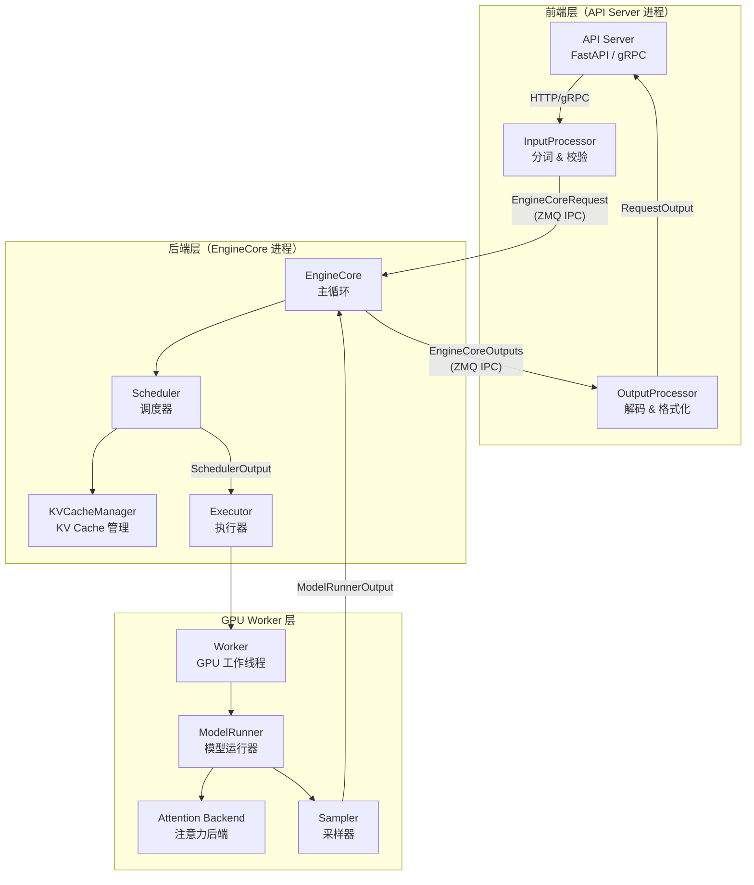

### 1.2.2 核心组件与职责划分

| 组件 | 文件路径 | 职责 |
|------|----------|------|
| **API Server** | `vllm/entrypoints/openai/api_server.py` | 接收 HTTP 请求，构建 OpenAI 兼容响应 |
| **AsyncLLM / LLMEngine** | `vllm/v1/engine/async_llm.py`, `llm_engine.py` | 前端引擎，管理输入/输出处理 |
| **InputProcessor** | `vllm/v1/engine/input_processor.py` | 输入校验、Tokenization、构建 EngineCoreRequest |
| **OutputProcessor** | `vllm/v1/engine/output_processor.py` | 输出 Detokenization、Logprobs 处理 |
| **EngineCore** | `vllm/v1/engine/core.py` | 后端核心循环：调度 + 执行 + 输出 |
| **Scheduler** | `vllm/v1/core/sched/scheduler.py` | 请求调度、Batch 组装、KV Cache 分配 |
| **KVCacheManager** | `vllm/v1/core/kv_cache_manager.py` | KV Cache Block 的分配、回收、Prefix Caching |
| **Executor** | `vllm/v1/executor/abstract.py` | 管理 GPU Worker，分发 SchedulerOutput |
| **Worker** | `vllm/v1/worker/gpu_worker.py` | GPU 工作线程，执行模型前向传播 |
| **GPUModelRunner** | `vllm/v1/worker/gpu_model_runner.py` | 输入准备、模型执行、Attention 元数据构建 |
| **Sampler** | `vllm/v1/sample/sampler.py` | Logits 处理、Token 采样 |

### 1.2.3 数据流与控制流分析

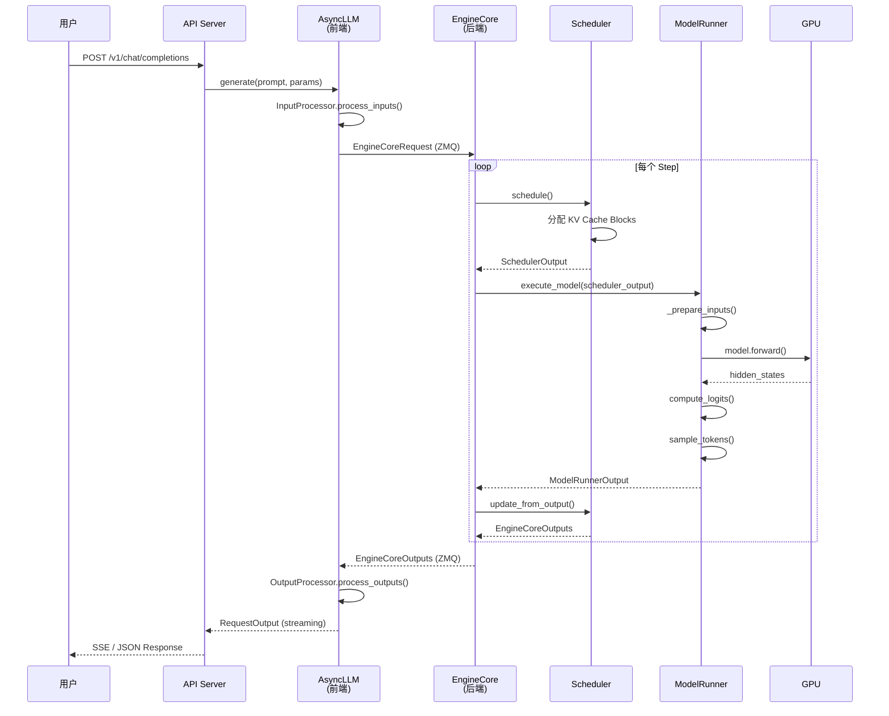

## 1.3 完整执行流程详解

### 1.3.1 示例场景

假设用户发送请求：`"What is machine learning?"`，模型为 Llama-3-8B。

### 1.3.2 端到端流程走读

| 步骤 | 阶段 | 操作 | 关键数据结构 |
|------|------|------|-------------|
| 1 | 请求接入 | API Server 接收 HTTP 请求 | `ChatCompletionRequest` |
| 2 | 输入预处理 | Tokenizer 将文本转为 token IDs | `EngineCoreRequest` |
| 3 | IPC 传输 | ZMQ 序列化发送到 EngineCore 进程 | msgpack bytes |
| 4 | 请求入队 | Scheduler 将请求加入 waiting 队列 | `Request` |
| 5 | 调度决策 | Scheduler 选择请求，分配 KV Cache Blocks | `SchedulerOutput` |
| 6 | 输入准备 | ModelRunner 构建 input_ids, positions, slot_mapping | GPU Tensors |
| 7 | 模型前向 | Transformer 前向传播，写入 KV Cache | hidden_states |
| 8 | Logits 计算 | LM Head 将 hidden states 映射到词表空间 | logits `[1, vocab_size]` |
| 9 | Token 采样 | Sampler 从 logits 分布中采样 | `SamplerOutput` |
| 10 | 输出处理 | Scheduler 追加 token，检查停止条件 | `EngineCoreOutput` |
| 11 | Detokenize | 将 token ID 转为文本，检查 stop strings | `RequestOutput` |
| 12 | 返回用户 | 流式或一次性返回生成结果 | JSON / SSE |

---

# 第二部分：核心接口与数据流分析

## 2.1 请求接入层

### 2.1.1 在线推理入口（OpenAI API）

```python
# 文件: vllm/entrypoints/openai/chat_completion/serving.py
class OpenAIServingChat(OpenAIServing):
    async def create_chat_completion(self, request, raw_request):
        # 1. 渲染 chat 消息为 engine inputs
        conversation, engine_inputs = self.render_chat_request(request)
        # 2. 构建 SamplingParams
        sampling_params = request.to_sampling_params(max_tokens, ...)
        # 3. 调用引擎生成
        result_generator = self.engine_client.generate(
            engine_input, sampling_params, request_id, ...
        )
        # 4. 流式或收集输出
        async for request_output in result_generator:
            yield format_response(request_output)
```

### 2.1.2 离线推理入口（LLM 类）

```python
# 文件: vllm/entrypoints/llm.py
class LLM:
    def generate(self, prompts, sampling_params, ...):
        # 1. 添加请求
        self._run_completion(prompts, sampling_params)
        # 2. 循环执行直到所有请求完成
        # _run_engine() 内部循环调用 llm_engine.step()
```

### 2.1.3 输入预处理

```python
# 文件: vllm/v1/engine/input_processor.py
class InputProcessor:
    def process_inputs(self, request_id, prompt, params, ...):
        # 1. 校验 SamplingParams
        self._validate_params(params)
        # 2. 预处理 prompt（分词、多模态处理）
        engine_input = self.preprocessor.preprocess(prompt)
        # 3. 校验输入长度、token 范围
        self._validate_model_inputs(engine_input)
        # 4. 提取多模态特征
        mm_features = extract_mm_features(engine_input)
        # 5. 构建 EngineCoreRequest
        return EngineCoreRequest(
            request_id=request_id,
            prompt_token_ids=token_ids,
            sampling_params=params,
            mm_features=mm_features,
            ...
        )
```

## 2.2 EngineCore — 核心循环

### 2.2.1 EngineCore 类

```python
# 文件: vllm/v1/engine/core.py
class EngineCore:
    """Inner loop of vLLM's Engine."""

    def __init__(self, vllm_config, executor_class, ...):
        # 1. 创建模型执行器
        self.model_executor = executor_class(vllm_config)
        # 2. 初始化 KV Cache（显存 profiling + 分配）
        self._initialize_kv_caches(vllm_config)
        # 3. 创建调度器
        self.scheduler = Scheduler(vllm_config, kv_cache_config, ...)

    def step(self):
        """Schedule, execute, and make output."""
        # 1. 调度：选择请求，分配资源
        scheduler_output = self.scheduler.schedule()
        # 2. 执行：模型前向传播
        future = self.model_executor.execute_model(
            scheduler_output, non_block=True
        )
        # 3. 获取结构化输出语法掩码
        grammar_output = self.scheduler.get_grammar_bitmask(scheduler_output)
        # 4. 采样：从 logits 中采样 token
        model_output = future.result()
        if model_output is None:
            model_output = self.model_executor.sample_tokens(grammar_output)
        # 5. 更新：处理模型输出
        engine_core_outputs = self.scheduler.update_from_output(
            scheduler_output, model_output
        )
        return engine_core_outputs
```

> **关键洞察**：EngineCore 的 `step()` 方法是整个推理引擎的心脏。每次 step 完成一轮"调度→执行→采样→更新"的完整循环。

### 2.2.2 前端/后端分离架构

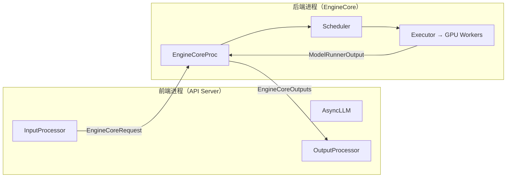

前端和后端通过 **ZMQ IPC** 通信，各自运行在独立进程中：
- **前端**：处理 HTTP 连接、Tokenization、Detokenization（CPU 密集型）
- **后端**：运行调度器和 GPU 执行（GPU 密集型）
- **IO 线程**：后端进程内有独立的输入/输出 IO 线程，实现序列化/反序列化与 GPU 执行的 overlap

## 2.3 核心数据结构流转

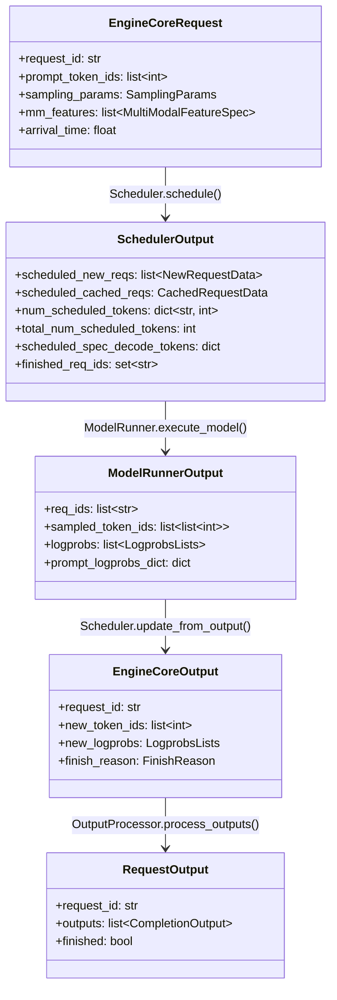

---

# 第三部分：调度层深度分析

## 3.1 Scheduler 核心算法

### 3.1.1 统一 Token-Budget 调度模型

vLLM v1 的调度器采用**统一 token-budget 模型**，不区分"Prefill 阶段"和"Decode 阶段"：

```python
# 文件: vllm/v1/core/sched/scheduler.py
def schedule(self) -> SchedulerOutput:
    # 核心思想：没有 "decoding phase" 也没有 "prefill phase"
    # 每个请求有 num_computed_tokens 和 num_tokens_with_spec
    # 调度器尝试让 num_computed_tokens 追上 num_tokens_with_spec
    #
    # num_tokens_with_spec = len(prompt) + len(output) + len(spec_tokens)
    
    token_budget = self.max_num_scheduled_tokens  # 总 token 预算
    
    # Phase 1: 调度 RUNNING 请求（decode + 进行中的 chunked prefill）
    # Phase 2: 调度 WAITING 请求（新的 prefill）
```

### 3.1.2 调度算法流程图

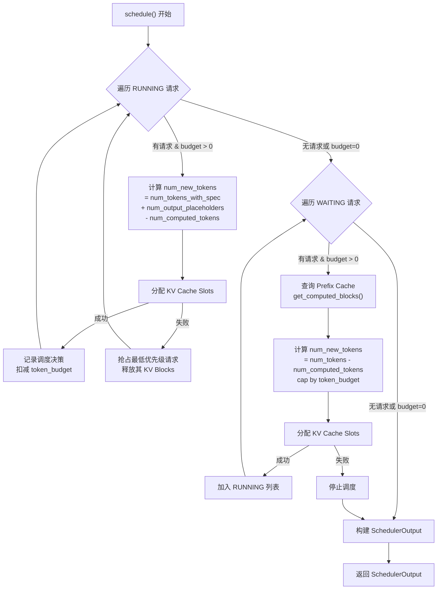

### 3.1.3 Phase 1：调度 RUNNING 请求

```python
# 文件: vllm/v1/core/sched/scheduler.py
# Phase 1: 调度 RUNNING 请求
req_index = 0
while req_index < len(self.running) and token_budget > 0:
    request = self.running[req_index]
    
    # 计算需要调度的 token 数
    num_new_tokens = (
        request.num_tokens_with_spec
        + request.num_output_placeholders
        - request.num_computed_tokens
    )
    # 受 token_budget 和 max_model_len 限制
    num_new_tokens = min(num_new_tokens, token_budget,
                         self.max_model_len - 1 - request.num_computed_tokens)
    
    # 分配 KV Cache
    new_blocks = self.kv_cache_manager.allocate_slots(
        request, num_new_tokens, ...
    )
    
    if new_blocks is None:
        # KV Cache 不足 → 抢占最低优先级请求
        self._preempt_request(request)
        continue
    
    # 记录调度决策
    num_scheduled_tokens[request.request_id] = num_new_tokens
    token_budget -= num_new_tokens
```

### 3.1.4 Phase 2：调度 WAITING 请求

```python
# 文件: vllm/v1/core/sched/scheduler.py
# Phase 2: 调度 WAITING 请求
while self.waiting and token_budget > 0:
    request = self.waiting.peek_request()
    
    # 查询 Prefix Cache 命中
    if request.num_computed_tokens == 0:
        computed_blocks, num_computed_tokens = (
            self.kv_cache_manager.get_computed_blocks(request)
        )
    
    # 计算 prefill token 数
    num_new_tokens = request.num_tokens - request.num_computed_tokens
    num_new_tokens = min(num_new_tokens, token_budget)
    
    # Chunked Prefill 控制
    if not self.enable_chunked_prefill and num_new_tokens > token_budget:
        break  # 整个 prompt 必须一次完成
    
    # 分配 KV Cache
    new_blocks = self.kv_cache_manager.allocate_slots(
        request, num_new_tokens,
        num_new_computed_tokens=num_new_tokens,
        new_computed_blocks=computed_blocks,
    )
    
    if new_blocks is None:
        break  # 显存不足，停止调度
    
    # 将请求从 waiting 移到 running
    self.waiting.pop_request()
    self.running.append(request)
```

### 3.1.5 调度后更新

```python
# 文件: vllm/v1/core/sched/scheduler.py
def _update_after_schedule(self, scheduler_output):
    for req_id, num_tokens in scheduler_output.num_scheduled_tokens.items():
        request = self.requests[req_id]
        # 推进 num_computed_tokens（Chunked Prefill 的关键）
        request.num_computed_tokens += num_tokens
        # 标记是否仍在 prefill 中
        request.is_prefill_chunk = (
            request.num_computed_tokens
            < request.num_tokens + request.num_output_placeholders
        )
```

## 3.2 KV Cache 管理

### 3.2.1 PagedAttention Block 管理

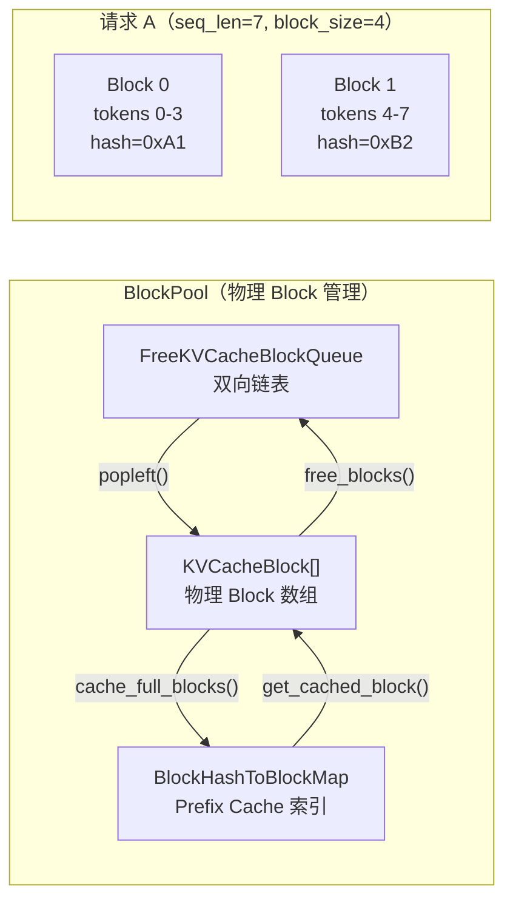

### 3.2.2 KVCacheManager 核心方法

```python
# 文件: vllm/v1/core/kv_cache_manager.py
class KVCacheManager:
    def get_computed_blocks(self, request):
        """查找最长 Prefix Cache 命中"""
        max_cache_hit_length = request.num_tokens - 1  # 至少重算最后一个 token
        return self.coordinator.find_longest_cache_hit(
            request.block_hashes, max_cache_hit_length
        )

    def allocate_slots(self, request, num_new_tokens, ...):
        """分配 KV Cache Slots"""
        # Block 布局:
        # | < comp > | < new_comp > | < ext_comp > | < new > | < lookahead > |
        #   已计算     新前缀命中     外部缓存        新分配    投机解码预留
        
        # 1. 释放不需要的 blocks（如滑动窗口外）
        self.coordinator.remove_skipped_blocks(request)
        # 2. 检查是否有足够空闲 blocks
        num_needed = self.coordinator.get_num_blocks_to_allocate(...)
        if num_needed > available:
            return None  # 分配失败
        # 3. 分配新 blocks
        self.coordinator.allocate_new_computed_blocks(...)
        self.coordinator.allocate_new_blocks(...)
        # 4. 缓存满 blocks（提交 hash）
        self.coordinator.cache_blocks(request, ...)
```

### 3.2.3 Prefix Caching 原理

每个完整的 Block 通过链式 hash 标识：

$$\text{block\_hash}_i = H(\text{block\_hash}_{i-1}, \text{token\_ids}_i, \text{extra\_keys})$$

查找时从左到右逐个匹配 hash，直到第一个 miss：

| 步骤 | 操作 | 结果 |
|------|------|------|
| 1 | 查找 block_hash[0] = 0xA1 | 命中 → Block 5 |
| 2 | 查找 block_hash[1] = 0xB2 | 命中 → Block 12 |
| 3 | 查找 block_hash[2] = 0xC3 | 未命中 → 停止 |
| 4 | 返回 cache_hit_length = 2 × block_size | 只需计算剩余 tokens |

### 3.2.4 Block 驱逐策略

```python
# 文件: vllm/v1/core/kv_cache_utils.py
class FreeKVCacheBlockQueue:
    """双向链表实现的 LRU 空闲队列"""
    
    def popleft(self):
        """分配 block：从队列头部取出（最久未使用）"""
        block = self.head.next_free_block
        self._remove(block)
        return block
    
    def append(self, block):
        """释放 block：加入队列尾部（最近释放，最后被驱逐）"""
        ...
    
    def prepend_n(self, blocks):
        """释放 scratch blocks：加入队列头部（优先复用）"""
        ...
```

## 3.3 Chunked Prefill

### 3.3.1 工作原理

Chunked Prefill 将长 prompt 的 Prefill 拆分为多个 step，与 Decode 请求混合执行：

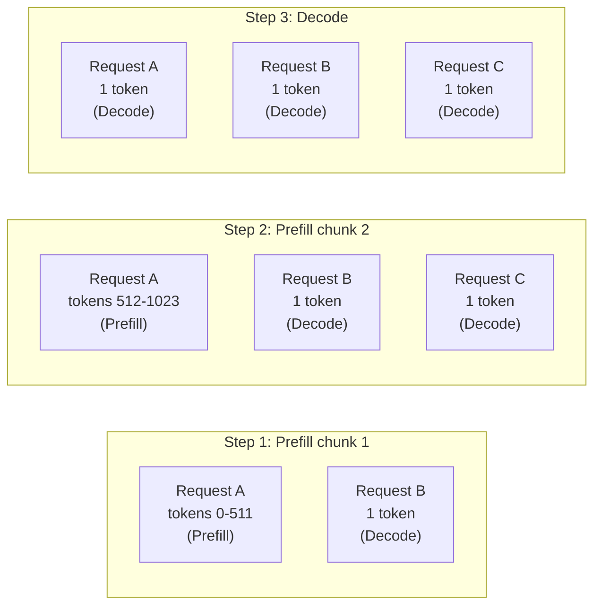

### 3.3.2 关键参数

| 参数 | 默认值 | 说明 |
|------|--------|------|
| `enable_chunked_prefill` | `True` | 是否启用 Chunked Prefill |
| `max_num_batched_tokens` | 模型相关 | 每步最大 token 数（token budget） |
| `long_prefill_token_threshold` | 无限制 | 单次 prefill 的额外上限 |

---

# 第四部分：执行层深度分析

## 4.1 Worker 与 ModelRunner

### 4.1.1 Worker 执行流程

```python
# 文件: vllm/v1/worker/gpu_worker.py
class Worker(WorkerBase):
    def execute_model(self, scheduler_output):
        # 1. 等待上一轮 PP 通信完成
        # 2. 如果不是第一个 PP rank，接收 intermediate_tensors
        if not get_pp_group().is_first_rank:
            intermediate_tensors = get_pp_group().irecv_tensor_dict()
        
        # 3. 委托给 ModelRunner
        output = self.model_runner.execute_model(
            scheduler_output, intermediate_tensors
        )
        
        # 4. 如果不是最后一个 PP rank，发送 intermediate_tensors
        if isinstance(output, IntermediateTensors):
            get_pp_group().isend_tensor_dict(output)
            return None
        
        return output
```

### 4.1.2 GPUModelRunner.execute_model() — 三阶段执行

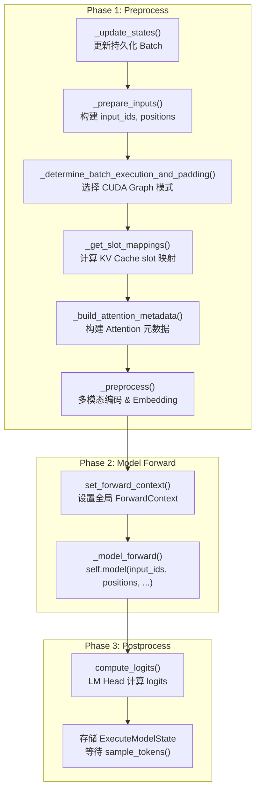

### 4.1.3 输入准备详解

```python
# 文件: vllm/v1/worker/gpu_model_runner.py
def _prepare_inputs(self, scheduler_output, num_scheduled_tokens):
    # 1. 提交 block table 到 GPU（异步拷贝）
    self.input_batch.block_table.commit_block_table(num_reqs)
    
    # 2. 构建请求索引
    # E.g., [2, 5, 3] tokens per request
    # -> req_indices = [0, 0, 1, 1, 1, 1, 1, 2, 2, 2]
    req_indices = np.repeat(arange[:num_reqs], num_scheduled_tokens)
    
    # 3. 构建位置编码
    # positions = num_computed_tokens[req_indices] + query_pos
    positions_np = (
        self.input_batch.num_computed_tokens_cpu[req_indices]
        + self.query_pos.np[:total_tokens]
    )
    
    # 4. 从 CPU token 缓冲区 gather input_ids
    # token_indices = positions + req_indices * max_model_len
    input_ids = torch.index_select(
        self.input_batch.token_ids_cpu_tensor.flatten(), 0, token_indices
    )
    
    # 5. 计算 slot_mapping（每个 token 对应的 KV Cache 物理位置）
    slot_mapping = self.input_batch.block_table.compute_slot_mapping(
        req_indices, positions_np
    )
    
    # 6. 拷贝所有 CPU tensor 到 GPU
    return logits_indices, spec_decode_metadata
```

### 4.1.4 Forward Context 与 Attention 元数据

```python
# 文件: vllm/vllm/forward_context.py
@contextmanager
def set_forward_context(attn_metadata, vllm_config, ...):
    """全局上下文管理器，将 Attention 元数据传递给所有 Attention 层"""
    context = ForwardContext(
        attn_metadata=attn_metadata,     # 每层的 Attention 元数据
        slot_mapping=slot_mapping,       # 每层的 KV Cache slot 映射
        cudagraph_runtime_mode=mode,     # CUDA Graph 模式
        batch_descriptor=batch_desc,     # Batch 描述符
    )
    _forward_context = context  # 设置为全局变量
    yield
    _forward_context = None  # 清理
```

每个 Attention 层在前向传播时从全局 `ForwardContext` 读取自己的元数据：

```python
# 文件: vllm/v1/attention/backends/flash_attn.py (概念示意)
class FlashAttentionImpl:
    def forward(self, query, key, value, kv_cache):
        ctx = get_forward_context()
        attn_metadata = ctx.attn_metadata[self.layer_idx]
        slot_mapping = ctx.slot_mapping[self.layer_idx]
        
        # 写入 KV Cache
        kv_cache[slot_mapping] = torch.cat([key, value], dim=-1)
        
        # 执行 FlashAttention
        output = flash_attn_varlen_func(
            q=query,
            k=kv_cache[:, :num_kv_heads],
            v=kv_cache[:, num_kv_heads:],
            cu_seqlens_q=attn_metadata.cu_seqlens_q,
            cu_seqlens_k=attn_metadata.cu_seqlens_k,
            ...
        )
        return output
```

## 4.2 模型前向传播

### 4.2.1 模型执行

```python
# 文件: vllm/v1/worker/gpu_model_runner.py
# Phase 2: 模型前向传播
with set_forward_context(attn_metadata, self.vllm_config, ...):
    model_output = self._model_forward(
        input_ids=input_ids,           # [total_tokens]
        positions=positions,           # [total_tokens]
        intermediate_tensors=intermediate_tensors,  # PP 中间张量
        inputs_embeds=inputs_embeds,   # 多模态 embeds（如有）
    )

# Phase 3: 后处理
hidden_states = model_output
# 提取需要计算 logits 的 hidden states（每个请求最后一个 token）
sample_hidden_states = hidden_states[logits_indices]
logits = self.model.compute_logits(sample_hidden_states)
```

### 4.2.2 CUDA Graph 优化

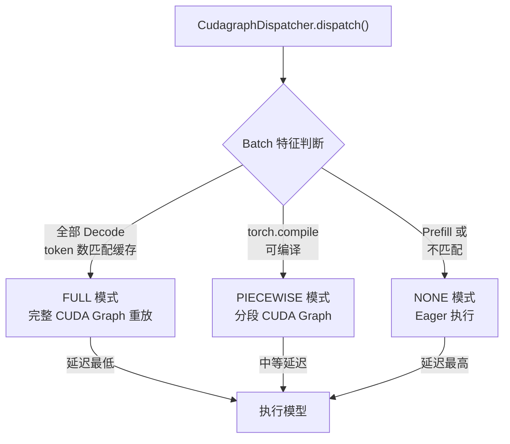

| CUDA Graph 模式 | 适用场景 | 延迟 | 说明 |
|-----------------|----------|------|------|
| **FULL** | 纯 Decode batch | 最低 | 整个前向传播作为一个 CUDA Graph 重放 |
| **PIECEWISE** | torch.compile 兼容 | 中等 | 分段捕获，允许编译优化 |
| **NONE** | Prefill / 混合 | 最高 | 标准 eager 执行 |

## 4.3 Pipeline Parallelism 支持

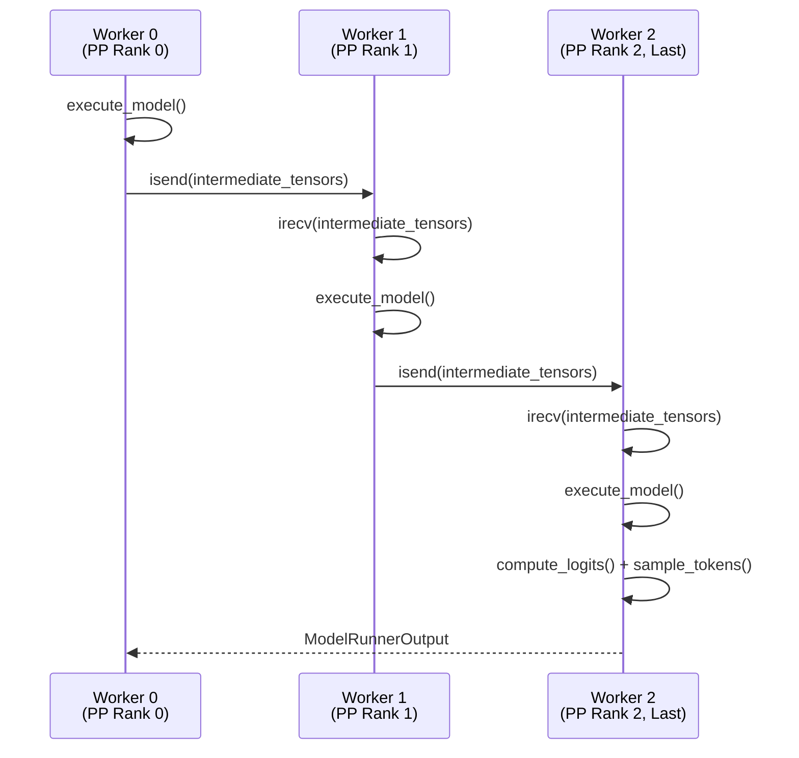

---

# 第五部分：采样层深度分析

## 5.1 Sampler 采样流程

### 5.1.1 完整采样 Pipeline

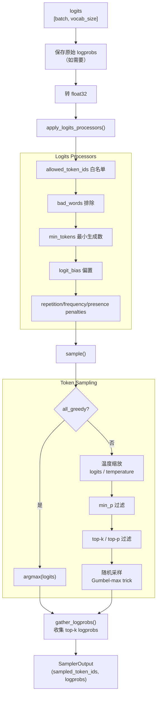

### 5.1.2 Sampler 核心代码

```python
# 文件: vllm/v1/sample/sampler.py
class Sampler(nn.Module):
    def forward(self, logits, sampling_metadata):
        # 1. 保存原始 logprobs（在任何修改之前）
        if num_logprobs is not None:
            raw_logprobs = self.compute_logprobs(logits)
        
        # 2. 转 float32
        logits = logits.to(torch.float32)
        
        # 3. 应用 logits processors
        logits = self.apply_logits_processors(
            logits, sampling_metadata, predict_bonus_token
        )
        
        # 4. 采样
        sampled, processed_logprobs = self.sample(logits, sampling_metadata)
        
        # 5. 收集 logprobs
        logprobs_tensors = self.gather_logprobs(
            raw_logprobs, num_logprobs, token_ids=sampled
        )
        
        return SamplerOutput(
            sampled_token_ids=sampled.unsqueeze(-1),
            logprobs_tensors=logprobs_tensors,
        )
```

### 5.1.3 随机采样：Gumbel-max Trick

vLLM 使用 Gumbel-max trick 替代 `torch.multinomial` 以避免 CPU-GPU 同步：

$$\text{sampled\_id} = \arg\max_i \left( \frac{p_i}{g_i} \right), \quad g_i \sim \text{Exponential}(1)$$

```python
# 文件: vllm/v1/sample/ops/topk_topp_sampler.py
def random_sample(self, probs, generators):
    # Gumbel-max trick: 避免 torch.multinomial 的 CPU-GPU 同步
    # probs / exponential_noise 的 argmax 等价于 multinomial 采样
    exponential_noise = torch.empty_like(probs).exponential_(1.0, generator=gen)
    sampled = probs.div(exponential_noise).argmax(dim=-1)
    return sampled
```

### 5.1.4 Top-K / Top-P 过滤

```python
# 文件: vllm/v1/sample/ops/topk_topp_sampler.py
def apply_top_k_top_p(self, logits, k, p):
    # Top-K: 只保留概率最高的 K 个 token
    if k is not None:
        logits = torch.where(
            logits >= logits.topk(k, dim=-1).values[:, -1:],
            logits, -float('inf')
        )
    
    # Top-P (Nucleus): 保留累积概率达到 P 的最小 token 集合
    if p is not None:
        sorted_logits, sorted_indices = torch.sort(logits, descending=True)
        sorted_probs = sorted_logits.softmax(dim=-1)
        cumsum_probs = torch.cumsum(sorted_probs, dim=-1)
        # 找到累积概率超过 p 的位置，将其后的 token 置为 -inf
        mask = cumsum_probs > p
        sorted_logits[mask] = -float('inf')
        # 恢复原始顺序
        logits = sorted_logits.scatter(1, sorted_indices, sorted_logits)
    
    return logits
```

## 5.2 采样参数速查表

| 参数 | 类型 | 默认值 | 说明 |
|------|------|--------|------|
| `temperature` | float | 1.0 | 温度参数，0 表示 greedy |
| `top_p` | float | 1.0 | Nucleus sampling 阈值 |
| `top_k` | int | 0 | Top-K 采样（0 = 禁用） |
| `min_p` | float | 0.0 | 最小概率阈值 |
| `repetition_penalty` | float | 1.0 | 重复惩罚（>1 抑制重复） |
| `frequency_penalty` | float | 0.0 | 频率惩罚（按出现次数） |
| `presence_penalty` | float | 0.0 | 存在惩罚（是否出现过） |
| `max_tokens` | int | 16 | 最大生成 token 数 |
| `stop` | list[str] | None | 停止字符串 |
| `stop_token_ids` | list[int] | None | 停止 token ID |
| `logprobs` | int | None | 每步返回的 logprobs 数量 |

---

# 第六部分：输出处理层

## 6.1 输出处理流程

### 6.1.1 Scheduler 输出更新

```python
# 文件: vllm/v1/core/sched/scheduler.py
def update_from_output(self, scheduler_output, model_runner_output):
    for i, req_id in enumerate(model_runner_output.req_ids):
        request = self.requests[req_id]
        token_ids = model_runner_output.sampled_token_ids[i]
        
        # 处理投机解码的 token 接受/拒绝
        if spec_decode:
            accepted_tokens = self._verify_spec_tokens(...)
        
        # 追加 token 到请求
        request.output_token_ids.extend(token_ids)
        
        # 检查停止条件
        finish_reason = check_stop(
            request, self.max_model_len, token_ids
        )
        
        # 构建 EngineCoreOutput
        outputs.append(EngineCoreOutput(
            request_id=req_id,
            new_token_ids=token_ids,
            finish_reason=finish_reason,
        ))
```

### 6.1.2 OutputProcessor — Detokenization

```python
# 文件: vllm/v1/engine/output_processor.py
class OutputProcessor:
    def process_outputs(self, engine_core_outputs):
        for output in engine_core_outputs.outputs:
            state = self.request_states[output.request_id]
            
            # 1. 增量 Detokenize
            stop_string = state.detokenizer.update(output.new_token_ids)
            
            # 2. 处理 logprobs
            state.logprobs_processor.update_from_output(output)
            
            # 3. 构建 RequestOutput
            request_output = state.make_request_output(
                output, stop_string
            )
            
            # 4. 推送到请求队列
            state.output_queue.put(request_output)
            
            # 5. 如果完成，清理状态
            if output.finish_reason is not None:
                self._free_request(state)
```

### 6.1.3 增量 Detokenizer

```python
# 文件: vllm/v1/engine/detokenizer.py
class FastIncrementalDetokenizer:
    """使用 tokenizers 库的 DecodeStream 实现高效增量解码"""
    
    def update(self, new_token_ids):
        for token_id in new_token_ids:
            # 调用 tokenizers 原生解码
            text = self.stream.step(self.tokenizer, token_id)
            self.output_text += text
        
        # 检查 stop strings
        return self.check_stop_strings(self.output_text)
    
    def check_stop_strings(self, text):
        """在输出文本中搜索 stop strings"""
        for stop_str in self.stop_strings:
            idx = text.find(stop_str)
            if idx != -1:
                return stop_str  # 命中 stop string
        return None
```

## 6.2 停止条件判断

```python
# 文件: vllm/v1/core/sched/utils.py
def check_stop(request, max_model_len, token_ids):
    # 1. EOS token
    if token_id in request.eos_token_ids:
        return FinishReason.STOP
    
    # 2. 达到 max_tokens
    if len(request.output_token_ids) >= request.max_tokens:
        return FinishReason.LENGTH
    
    # 3. 达到 max_model_len
    if request.num_tokens >= max_model_len:
        return FinishReason.LENGTH
    
    # 4. Stop strings（在 OutputProcessor 中检查）
    # 5. 重复检测
    if request.repetition_detection and detected:
        return FinishReason.REPETITION
    
    return None  # 继续生成
```

---

# 第七部分：完整请求生命周期

## 7.1 在线推理完整链路

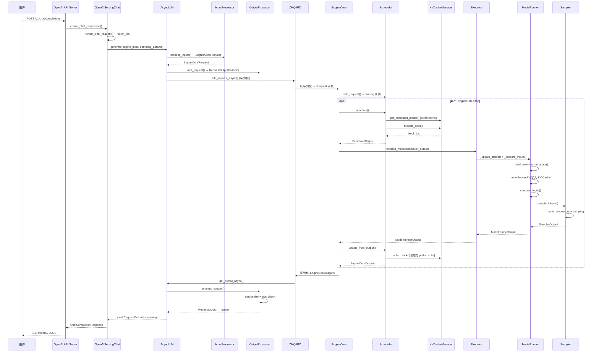

## 7.2 离线推理完整链路

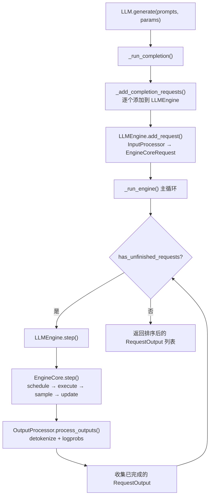

---

# 第八部分：关键优化技术

## 8.1 优化技术总览

| 优化技术 | 优化目标 | 实现位置 |
|----------|----------|----------|
| **PagedAttention** | 减少 KV Cache 显存碎片 | `KVCacheManager` + Attention Backend |
| **Prefix Caching** | 复用共享前缀的 KV Cache | `BlockPool.cached_block_hash_to_block` |
| **Chunked Prefill** | 避免长 prompt 阻塞 Decode | `Scheduler.schedule()` |
| **CUDA Graph** | 减少 GPU kernel launch 开销 | `CudagraphDispatcher` |
| **Continuous Batching** | 动态组 Batch 提高 GPU 利用率 | `Scheduler` 每步重新调度 |
| **Async Scheduling** | 调度与执行 overlap | `AsyncScheduler` + `EngineCore` |
| **Speculative Decoding** | 加速 Decode 阶段 | `spec_decode/` 模块 |
| **Preemption** | 显存不足时优雅降级 | `Scheduler._preempt_request()` |
| **Persistent Batch** | 避免重复分配 GPU 缓冲区 | `InputBatch` 预分配 tensors |
| **ZMQ IPC** | 前后端解耦，避免 GIL | `EngineCoreClient` |

## 8.2 Persistent Batch 优化

```python
# 文件: vllm/v1/worker/gpu_input_batch.py
class InputBatch:
    """持久化 Batch，预分配 CPU/GPU tensors 避免重复分配"""
    
    def __init__(self, max_num_reqs, max_model_len, ...):
        # 预分配 CPU pinned tensors
        self.token_ids_cpu_tensor = torch.zeros(
            max_num_reqs, max_model_len, dtype=torch.int32,
            pin_memory=True
        )
        self.num_computed_tokens_cpu = np.zeros(max_num_reqs, dtype=np.int32)
        
        # 预分配 GPU tensors（采样参数）
        self.temperature = torch.zeros(max_num_reqs, device=device)
        self.top_p = torch.zeros(max_num_reqs, device=device)
        self.top_k = torch.zeros(max_num_reqs, device=device)
        # ...
    
    def add_request(self, request):
        """将请求添加到 Batch（只修改对应 slot）"""
        idx = self._get_free_slot()
        self.token_ids_cpu_tensor[idx, :len(request.token_ids)] = request.token_ids
        self.req_id_to_index[request.req_id] = idx
    
    def remove_request(self, req_id):
        """从 Batch 移除请求（释放 slot）"""
        idx = self.req_id_to_index.pop(req_id)
        self._free_slots.append(idx)
```

## 8.3 Async Scheduling 优化

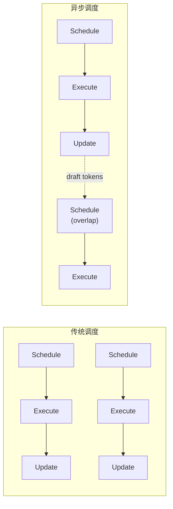

异步调度允许在当前 batch 执行的同时调度下一个 batch，通过 `num_output_placeholders` 预留输出位置。

---

# 第九部分：配置与使用指南

## 9.1 关键引擎参数

| 参数 | 默认值 | 说明 |
|------|--------|------|
| `max_model_len` | 模型 config | 最大序列长度 |
| `max_num_seqs` | 256 | 最大并发请求数 |
| `max_num_batched_tokens` | 自动 | 每步最大 token 数 |
| `gpu_memory_utilization` | 0.9 | GPU 显存利用率 |
| `enable_chunked_prefill` | True | 启用 Chunked Prefill |
| `enable_prefix_caching` | False | 启用 Automatic Prefix Caching |
| `block_size` | 16 | KV Cache Block 大小（tokens） |
| `tensor_parallel_size` | 1 | Tensor Parallelism 大小 |
| `pipeline_parallel_size` | 1 | Pipeline Parallelism 大小 |
| `enforce_eager` | False | 禁用 CUDA Graph |
| `swap_space` | 4 | CPU swap 空间（GB） |

## 9.2 典型配置示例

### 高吞吐场景

```python
from vllm import LLM

llm = LLM(
    model="meta-llama/Llama-3-70B-Instruct",
    tensor_parallel_size=4,
    max_num_seqs=512,
    max_num_batched_tokens=8192,
    enable_chunked_prefill=True,
    gpu_memory_utilization=0.95,
)
```

### 低延迟场景

```python
llm = LLM(
    model="meta-llama/Llama-3-8B-Instruct",
    max_num_seqs=32,
    max_num_batched_tokens=2048,
    enable_chunked_prefill=False,
    enforce_eager=False,  # 启用 CUDA Graph
    gpu_memory_utilization=0.9,
)
```

### Prefix Caching 场景

```python
llm = LLM(
    model="meta-llama/Llama-3-8B-Instruct",
    enable_prefix_caching=True,
    block_size=16,
    # 适用于共享 system prompt 的场景
)
```

## 9.3 性能调优建议

| 场景 | 建议 |
|------|------|
| TTFT 过高 | 启用 Chunked Prefill，减小 `max_num_batched_tokens` |
| TPOT 过高 | 减小 `max_num_seqs`，启用 CUDA Graph |
| 显存不足 | 降低 `gpu_memory_utilization`，减小 `max_model_len` |
| 吞吐量不足 | 增大 `max_num_seqs` 和 `max_num_batched_tokens` |
| Prefix Cache 命中率低 | 增大 `block_size`，确保共享前缀对齐到 block 边界 |

---

# 附录

## A. 关键代码位置索引

| 组件 | 文件路径 | 关键行号 |
|------|----------|----------|
| EngineCore 主循环 | `vllm/v1/engine/core.py` | `step()` @ L443 |
| EngineCore 进程版 | `vllm/v1/engine/core.py` | `EngineCoreProc` @ L860 |
| AsyncLLM | `vllm/v1/engine/async_llm.py` | `generate()` @ L524 |
| LLMEngine | `vllm/v1/engine/llm_engine.py` | `step()` @ L287 |
| InputProcessor | `vllm/v1/engine/input_processor.py` | `process_inputs()` @ L242 |
| OutputProcessor | `vllm/v1/engine/output_processor.py` | `process_outputs()` @ L576 |
| Detokenizer | `vllm/v1/engine/detokenizer.py` | `FastIncrementalDetokenizer` @ L167 |
| Scheduler | `vllm/v1/core/sched/scheduler.py` | `schedule()` @ L340 |
| Scheduler 输出 | `vllm/v1/core/sched/output.py` | `SchedulerOutput` @ L181 |
| 请求队列 | `vllm/v1/core/sched/request_queue.py` | `FCFSRequestQueue` @ L75 |
| KVCacheManager | `vllm/v1/core/kv_cache_manager.py` | `allocate_slots()` @ L238 |
| BlockPool | `vllm/v1/core/block_pool.py` | `BlockPool` @ L130 |
| KV Cache Block | `vllm/v1/core/kv_cache_utils.py` | `KVCacheBlock` @ L117 |
| FreeBlockQueue | `vllm/v1/core/kv_cache_utils.py` | `FreeKVCacheBlockQueue` @ L165 |
| GPU Worker | `vllm/v1/worker/gpu_worker.py` | `execute_model()` @ L806 |
| GPUModelRunner | `vllm/v1/worker/gpu_model_runner.py` | `execute_model()` @ L4000 |
| 输入准备 | `vllm/v1/worker/gpu_model_runner.py` | `_prepare_inputs()` @ L1872 |
| InputBatch | `vllm/v1/worker/gpu_input_batch.py` | `InputBatch` @ L91 |
| BlockTable | `vllm/v1/worker/block_table.py` | `BlockTable` @ L18 |
| ForwardContext | `vllm/forward_context.py` | `set_forward_context()` @ L250 |
| Sampler | `vllm/v1/sample/sampler.py` | `forward()` @ L72 |
| TopKTopPSampler | `vllm/v1/sample/ops/topk_topp_sampler.py` | `forward_native()` @ L131 |
| SamplingMetadata | `vllm/v1/sample/metadata.py` | `SamplingMetadata` |
| SamplingParams | `vllm/sampling_params.py` | `SamplingParams` @ L198 |
| OpenAI API Server | `vllm/entrypoints/openai/api_server.py` | `build_app()` @ L156 |
| Chat Completion | `vllm/entrypoints/openai/chat_completion/serving.py` | `create_chat_completion()` @ L219 |
| LLM 离线类 | `vllm/entrypoints/llm.py` | `generate()` @ L422 |
| EngineCoreRequest | `vllm/v1/engine/__init__.py` | L83 |
| EngineCoreOutput | `vllm/v1/engine/__init__.py` | L170 |
| Executor 抽象类 | `vllm/v1/executor/abstract.py` | `Executor` @ L37 |

## B. 术语表

| 术语 | 英文 | 说明 |
|------|------|------|
| Prefill | Prefill | 预填充阶段，处理 prompt tokens 并计算 KV Cache |
| Decode | Decode | 解码阶段，逐步生成输出 tokens |
| KV Cache | KV Cache | 存储已计算的 Key/Value 张量，避免重复计算 |
| PagedAttention | PagedAttention | 将 KV Cache 分页管理的注意力机制 |
| Block | Block | KV Cache 的固定大小分配单元 |
| Slot Mapping | Slot Mapping | Token 到 KV Cache 物理位置的映射 |
| Chunked Prefill | Chunked Prefill | 将长 prompt 的 Prefill 拆分为多个 chunk |
| Prefix Caching | Prefix Caching | 缓存已计算的 KV Cache Block，供共享前缀复用 |
| Continuous Batching | Continuous Batching | 动态组 Batch，请求完成即退出、新请求随时加入 |
| CUDA Graph | CUDA Graph | 预编译的 GPU 执行图，减少 kernel launch 开销 |
| Token Budget | Token Budget | 每步可调度的最大 token 总数 |
| Preemption | Preemption | 显存不足时抢占低优先级请求，释放其 KV Cache |
| Speculative Decoding | Speculative Decoding | 投机解码，用小模型预测多个 token 再验证 |
| TTFT | Time To First Token | 首 token 延迟 |
| TPOT | Time Per Output Token | 每个输出 token 耗时 |
| Pipeline Parallelism | Pipeline Parallelism | 将模型层切分到多个 GPU 上 |
| Tensor Parallelism | Tensor Parallelism | 将单层计算切分到多个 GPU 上 |
| Detokenizer | Detokenizer | 将 token ID 序列转换回文本 |
| Logits Processor | Logits Processor | 在采样前修改 logits 分布的处理器 |
| Gumbel-max Trick | Gumbel-max Trick | 用 Gumbel 噪声实现高效随机采样 |
| Forward Context | Forward Context | 全局上下文，传递 Attention 元数据给模型层 |
| EngineCoreRequest | EngineCoreRequest | 前端发送到后端的序列化请求 |
| SchedulerOutput | SchedulerOutput | 调度器的输出，描述本步要执行的请求和资源分配 |
| ModelRunnerOutput | ModelRunnerOutput | 模型运行器的输出，包含采样的 token 和 logprobs |
