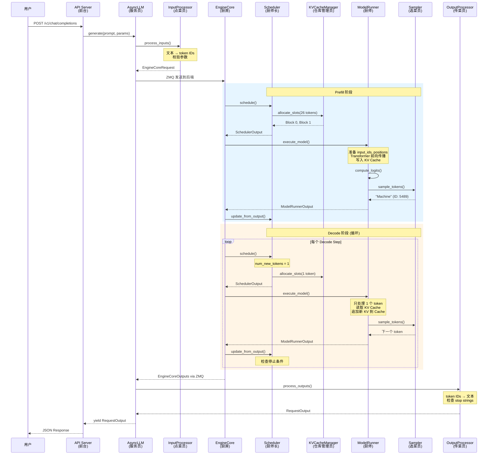

# vLLM 大模型推理全流程详解（通俗版）

> **文档版本**: 2.0
> **分析代码版本**: vLLM main 分支（截至 2025-06）
> **最后更新**: 2025-06-11

---

## 写在前面：这篇文档怎么读

这篇文档面向**对大模型和 vLLM 不太熟悉**的读者，目标是用一个具体的例子，带你从零理解"用户输入一句话，大模型是怎么一步步生成回答的"。

我们会用一个贯穿全文的例子：

> **用户输入**：`"What is machine learning?"`
> **使用模型**：Llama-3-8B（一个 80 亿参数的大语言模型）
> **推理框架**：vLLM（一个高性能的大模型推理引擎）

文档分为三大部分：
1. **先搞懂原理**：大模型推理到底在干什么？（不涉及代码，纯讲概念）
2. **跟着例子走一遍**：从用户输入到模型输出，每一步发生了什么？
3. **vLLM 代码走读**：每个环节在 vLLM 里是怎么实现的？

---

# 第一部分：先搞懂原理 — 大模型推理到底在干什么？

## 1.1 大模型本质上是一个"接龙游戏"

大语言模型（LLM）的核心能力其实很简单：**给它一段文字，它预测下一个词（token）**。

举个例子，假设你给模型这段文字：

```
What is machine
```

模型会计算词表里每个词作为下一个词的概率：

| 候选词 | 概率 |
|--------|------|
| learning | 35% |
| learning? | 12% |
| translation | 5% |
| ... | ... |

模型选了 `learning`，然后把 `learning` 拼接到原文后面，变成：

```
What is machine learning
```

再预测下一个词，如此反复，直到生成结束符（比如句号或 EOS token）。这就是所谓的**自回归生成（Autoregressive Generation）**——每次只生成一个词，然后把生成的词拼回去，再生成下一个。

> **类比**：想象你在玩文字接龙。你写"今天天气"，你的朋友接"很好"，然后你接"，适合"，他接"出去"……每次只接一小段，但整体是连贯的。大模型就是那个"朋友"，只不过它的"接龙"能力是通过阅读海量文本训练出来的。

## 1.2 什么是 Token？

大模型不直接处理文字，而是先把文字切分成 **token**。Token 可以是一个完整的英文单词，也可以是一个子词（subword）、一个中文字、甚至一个标点符号。

以 Llama-3 的分词器（Tokenizer）为例：

```
输入文本: "What is machine learning?"

分词结果:
  Token 0: "What"    → ID: 1724
  Token 1: " is"     → ID: 338
  Token 2: " machine" → ID: 3060
  Token 3: " learning" → ID: 4715
  Token 4: "?"       → ID: 30

共 5 个 token，对应的 ID 序列为: [1724, 338, 3060, 4715, 30]
```

> **为什么要分词？** 因为计算机只能处理数字。分词器（Tokenizer）就是一个"翻译官"，把人类语言翻译成模型能理解的数字序列。每个大模型都有自己的分词器和词表（vocabulary），Llama-3 的词表大约有 128,000 个 token。

## 1.3 推理的两个阶段：Prefill 和 Decode

大模型推理分为两个截然不同的阶段，理解这一点非常重要：

### 阶段一：Prefill（预填充）— "读题"

模型一次性读完用户输入的所有 token（即 prompt），理解用户的问题，并为每个 token 计算出"记忆"（即 KV Cache，后面会详细解释）。

```
输入: [1724, 338, 3060, 4715, 30]  （5 个 token 一次性处理）

模型内部做的事:
  - "What" 看到了自己
  - "is" 看到了 "What" 和自己
  - "machine" 看到了 "What is" 和自己
  - "learning" 看到了 "What is machine" 和自己
  - "?" 看到了前面所有词和自己
  
  每个 token 都会产生一组 Key 和 Value（记忆），存到 KV Cache 里
```

**特点**：这是一次大规模并行计算，5 个 token 同时处理，计算量大但只做一次。

> **类比**：就像考试时读题。你一次性读完整个题目（prompt），理解题意，在脑子里形成对题目的"记忆"。这个过程只做一次。

### 阶段二：Decode（解码）— "一个字一个字写答案"

模型开始生成回答，每次只生成一个 token：

```
第 1 步 Decode:
  输入: 上一步的 "?" 的 hidden state
  输出: "Machine" (ID: 5489)  ← 模型认为答案应该以 "Machine" 开头
  KV Cache: 追加 "Machine" 的 K 和 V

第 2 步 Decode:
  输入: 上一步的 "Machine" 的 hidden state
  输出: " learning" (ID: 4715)
  KV Cache: 追加 " learning" 的 K 和 V

第 3 步 Decode:
  输入: 上一步的 " learning" 的 hidden state
  输出: " is" (ID: 338)
  KV Cache: 追加 " is" 的 K 和 V

... 持续生成 ...

第 N 步 Decode:
  输出: "<EOS>"  ← 结束符，停止生成
```

**特点**：每步只处理 1 个 token，但需要反复执行很多步。每步都要从 KV Cache 里读取之前所有 token 的"记忆"。

> **类比**：就像考试时写答案。你一个字一个字地写，每写一个字都要回忆之前写了什么（KV Cache），确保答案连贯。

### 两个阶段的对比

| 对比项 | Prefill（读题） | Decode（写答案） |
|--------|----------------|-----------------|
| 输入 | 整个 prompt（多个 token） | 每次 1 个 token |
| 计算量 | 大（但只做一次） | 小（但要做很多步） |
| 瓶颈 | GPU 算力不够用（Compute-bound） | GPU 显存带宽不够用（Memory-bound） |
| 关键指标 | TTFT（首 token 延迟） | TPOT（每个输出 token 耗时） |

## 1.4 KV Cache — 大模型的"短期记忆"

这是理解大模型推理最关键的概念之一。

### 为什么需要 KV Cache？

在 Transformer 的注意力机制（Attention）中，生成每个新 token 时，都需要和**之前所有 token** 做"注意力计算"。如果不做缓存，每生成一个新 token 都要把之前所有 token 重新算一遍，极其浪费。

KV Cache 就是把之前算过的中间结果（Key 和 Value）存下来，下次直接用：

```
没有 KV Cache 的情况（每次重新算，极慢）:
  生成第 6 个 token: 重新计算 token 1~5 的 Key/Value → 计算注意力
  生成第 7 个 token: 重新计算 token 1~6 的 Key/Value → 计算注意力
  生成第 8 个 token: 重新计算 token 1~7 的 Key/Value → 计算注意力
  ...

有 KV Cache 的情况（缓存历史，很快）:
  Prefill 阶段: 计算 token 1~5 的 Key/Value → 存入 KV Cache
  生成第 6 个 token: 只算 token 5 的 Key/Value → 追加到 KV Cache → 用整个 KV Cache 算注意力
  生成第 7 个 token: 只算 token 6 的 Key/Value → 追加到 KV Cache → 用整个 KV Cache 算注意力
  ...
```

> **类比**：KV Cache 就像你做笔记。读题时你把关键信息记在笔记本上（Prefill），写答案时随时翻看笔记（Decode），而不是每次都重新读一遍题目。

### KV Cache 的显存占用

KV Cache 存在 GPU 显存里，占用量随序列长度线性增长：

```
显存占用 = 2 × 层数 × 注意力头数 × 头维度 × 序列长度 × 数据类型大小

以 Llama-3-8B 为例（32层, 32头, 头维度128, float16=2字节）:
  单个请求, 序列长度 2048:
  = 2 × 32 × 32 × 128 × 2048 × 2
  = 1,073,741,824 字节 ≈ 1 GB

如果有 100 个并发请求，光 KV Cache 就需要 ~100 GB 显存！
```

这就是为什么 KV Cache 的管理效率直接决定了推理引擎能同时服务多少用户。

## 1.5 vLLM 是什么？为什么需要它？

vLLM 是一个**大模型推理引擎**，它的核心价值是：让你能高效地同时服务大量用户请求。

如果不用 vLLM，你可以用 HuggingFace Transformers 直接跑模型，但问题是：
- 一次只能处理一个请求，吞吐量低
- KV Cache 管理粗糙，显存浪费严重
- 没有请求调度，无法并发

vLLM 解决的核心问题：
1. **PagedAttention**：像操作系统管理内存一样管理 KV Cache，按需分配，减少浪费
2. **Continuous Batching**：动态把多个请求打包在一起执行，提高 GPU 利用率
3. **高效调度**：智能决定每个请求在每个 step 处理多少 token

## 1.6 vLLM 系统架构一览

在深入细节之前，先看看 vLLM 的整体结构。你可以把它想象成一个"餐厅"：

```
┌─────────────────────────────────────────────────────────────┐
│                    vLLM 系统架构（餐厅类比）                    │
├─────────────────────────────────────────────────────────────┤
│                                                             │
│  ┌─────────────────────────────────────┐                    │
│  │  前端层（API Server）— "前台+服务员"   │                    │
│  │  · 接待客人（接收 HTTP 请求）          │                    │
│  │  · 翻译菜单（文本 → token IDs）       │                    │
│  │  · 上菜（token IDs → 文本返回用户）    │                    │
│  └──────────────┬──────────────────────┘                    │
│                 │ ZMQ 进程间通信                             │
│  ┌──────────────▼──────────────────────┐                    │
│  │  后端层（EngineCore）— "厨房"         │                    │
│  │  ┌────────────────────────────┐     │                    │
│  │  │ 调度器（Scheduler）— "厨师长" │     │                    │
│  │  │ · 决定先做哪桌的菜           │     │                    │
│  │  │ · 分配灶台（KV Cache）       │     │                    │
│  │  └────────────┬───────────────┘     │                    │
│  │  ┌────────────▼───────────────┐     │                    │
│  │  │ 执行器（Executor）— "厨师"   │     │                    │
│  │  │ · 真正炒菜（GPU 前向传播）   │     │                    │
│  │  │ · 出菜（采样下一个 token）   │     │                    │
│  │  └────────────────────────────┘     │                    │
│  └─────────────────────────────────────┘                    │
│                                                             │
└─────────────────────────────────────────────────────────────┘
```

### 核心组件职责

| 组件 | 类比 | 职责 |
|------|------|------|
| **API Server** | 前台 | 接收 HTTP 请求，返回响应 |
| **InputProcessor** | 点菜员 | 把用户的文本转成 token IDs |
| **Scheduler** | 厨师长 | 决定每个 step 处理哪些请求、分配多少 KV Cache |
| **KVCacheManager** | 仓库管理员 | 管理 KV Cache 的分配和回收 |
| **ModelRunner** | 厨师 | 在 GPU 上执行模型计算 |
| **Sampler** | 选菜员 | 从模型输出中"选"下一个 token |
| **OutputProcessor** | 传菜员 | 把 token IDs 转回文本，返回给用户 |

---

# 第二部分：跟着例子走一遍 — 从输入到输出的完整旅程

现在让我们用具体的例子，一步步走完整个推理流程。

## 我们的例子

```
用户通过 OpenAI 兼容 API 发送请求：

POST /v1/chat/completions
{
  "model": "meta-llama/Llama-3-8B-Instruct",
  "messages": [
    {"role": "system", "content": "You are a helpful assistant."},
    {"role": "user", "content": "What is machine learning?"}
  ],
  "max_tokens": 100,
  "temperature": 0.7
}
```

## Step 1：请求接入 — "客人进门点菜"

### 发生了什么？

用户发送 HTTP 请求到 vLLM 的 API Server。API Server 基于 FastAPI 框架，接收到请求后，调用 `OpenAIServingChat.create_chat_completion()` 处理。

### 通俗解释

就像客人进了餐厅，对服务员说："我要一份宫保鸡丁，微辣，不要花生"。服务员需要：
1. 听懂客人说什么（解析 HTTP 请求）
2. 把客人的要求翻译成厨房能理解的格式（构建引擎内部请求）
3. 把订单送到厨房（发送到 EngineCore）

### vLLM 实现

```python
# 文件: vllm/entrypoints/openai/chat_completion/serving.py
class OpenAIServingChat(OpenAIServing):
    async def create_chat_completion(self, request, raw_request):
        # 1. 把 Chat 消息格式转为引擎可处理的格式
        conversation, engine_inputs = self.render_chat_request(request)
        
        # 2. 从请求中提取采样参数（温度、最大 token 数等）
        sampling_params = request.to_sampling_params(max_tokens, ...)
        
        # 3. 调用引擎开始生成（异步的，像下单后等厨房做菜）
        result_generator = self.engine_client.generate(
            engine_input, sampling_params, request_id, ...
        )
        
        # 4. 流式返回结果（像一道一道上菜）
        async for request_output in result_generator:
            yield format_response(request_output)
```

## Step 2：输入预处理 — "把菜名翻译成配方"

### 发生了什么？

`InputProcessor` 把用户的文本 prompt 转换成模型能理解的 token ID 序列。

### 通俗解释

服务员把"宫保鸡丁，微辣"翻译成厨房的标准配方卡：鸡肉 200g、干辣椒 5 个、花椒 10 粒……

### 具体过程

```
原始输入（Chat 消息格式）:
  system: "You are a helpful assistant."
  user: "What is machine learning?"

第一步：Chat Template 渲染
  Llama-3 的 chat template 会把消息格式化成一段完整的文本：
  "<|begin_of_text|><|start_header_id|>system<|end_header_id|>
   You are a helpful assistant.<|eot_id|>
   <|start_header_id|>user<|end_header_id|>
   What is machine learning?<|eot_id|>
   <|start_header_id|>assistant<|end_header_id|>"

第二步：Tokenizer 分词
  上面这段文本被分词器切分成 token，得到 ID 序列：
  [128000, 128006, 9125, 128007, 271, 2675, 527, 264, 11915,
   12775, 13, 128009, 128006, 882, 128007, 271, 1724, 338,
   3060, 4715, 30, 128009, 128006, 78191, 128007, 271]
  
  共 26 个 token

第三步：构建 EngineCoreRequest
  {
    request_id: "cmpl-abc123",
    prompt_token_ids: [128000, 128006, 9125, ..., 271],  # 26 个 token
    sampling_params: { temperature: 0.7, max_tokens: 100 },
    arrival_time: 1718100000.0
  }
```

### vLLM 实现

```python
# 文件: vllm/v1/engine/input_processor.py
class InputProcessor:
    def process_inputs(self, request_id, prompt, params, ...):
        # 1. 校验采样参数是否合法（比如温度不能是负数）
        self._validate_params(params, supported_tasks)
        
        # 2. 分词：文本 → token IDs
        processed_inputs = self.input_preprocessor.preprocess(prompt)
        
        # 3. 校验输入长度（不能超过模型最大长度）
        self._validate_model_inputs(encoder_inputs, decoder_inputs)
        
        # 4. 打包成标准格式，准备发送到后端
        return EngineCoreRequest(
            request_id=request_id,
            prompt_token_ids=token_ids,      # [128000, 128006, ...]
            sampling_params=params,           # {temperature: 0.7, ...}
            ...
        )
```

## Step 3：前后端通信 — "把订单送到厨房"

### 发生了什么？

前端进程（API Server）把 `EngineCoreRequest` 通过 **ZMQ IPC**（进程间通信）发送到后端进程（EngineCore）。

### 为什么要分两个进程？

```
前端进程（CPU 密集）:           后端进程（GPU 密集）:
  - 处理 HTTP 连接               - 调度请求
  - 分词（Tokenization）          - 执行模型
  - 解词（Detokenization）        - 管理 KV Cache
  
  如果放在一个进程里，分词的 CPU 计算会阻塞 GPU 的执行，
  导致 GPU 空转，性能下降。
```

> **类比**：餐厅把前台和厨房分开。前台负责接待和点菜（CPU 活），厨房负责做菜（GPU 活）。两边各干各的，互不影响。订单通过传菜窗口（ZMQ）传递。

### vLLM 实现

```python
# 文件: vllm/v1/engine/async_llm.py
class AsyncLLM:
    async def generate(self, prompt, sampling_params, request_id, ...):
        # 1. 创建输出队列（用于接收厨房做好的"菜"）
        q = await self.add_request(request_id, prompt, sampling_params, ...)
        
        # 2. 从队列中逐个获取输出，流式返回给用户
        while True:
            out = await q.get()  # 等待后端返回结果
            yield out             # 返回给 API Server
            if out.finished:
                break
```

## Step 4：调度 — "厨师长安排做菜顺序"

### 发生了什么？

EngineCore 的 `step()` 方法被调用，Scheduler（调度器）决定这一步要处理哪些请求、每个请求处理多少 token。

### 通俗解释

厨师长（Scheduler）看一下当前所有订单：
- A 桌：新来的，还没开始做（waiting 队列）
- B 桌：菜做了一半，还差最后一步（running 队列，decode 中）
- C 桌：也是做了一半（running 队列，decode 中）

厨师长决定：这一步同时处理 B 桌的最后一步 + C 桌的最后一步 + 开始做 A 桌。

### 具体过程（以我们的例子为例）

假设当前系统里只有我们这一个请求：

```
Scheduler 状态:
  waiting 队列: [我们的请求（26 个 prompt token）]
  running 队列: []（空的）

调度决策:
  Phase 1: 遍历 running 队列 → 空的，跳过
  Phase 2: 遍历 waiting 队列 → 发现我们的请求
  
  对我们的请求:
    1. 查 Prefix Cache：有没有之前算过的相同前缀？
       → 假设没有命中（第一次请求）
    2. 计算需要处理的 token 数：26 个（整个 prompt）
    3. 检查 token budget：假设 budget=2048，26 < 2048，OK
    4. 分配 KV Cache：需要 2 个 Block（block_size=16, 26 tokens 需要 ceil(26/16)=2 个 Block）
    5. 把请求从 waiting 移到 running

输出 SchedulerOutput:
  {
    scheduled_new_reqs: [{request_id: "cmpl-abc123", ...}],
    num_scheduled_tokens: {"cmpl-abc123": 26},  # 这一步处理 26 个 token
    total_num_scheduled_tokens: 26
  }
```

### vLLM 核心调度算法

```python
# 文件: vllm/v1/core/sched/scheduler.py
class Scheduler:
    def schedule(self) -> SchedulerOutput:
        """
        核心思想：不区分 "Prefill" 和 "Decode"。
        每个请求只需要让 num_computed_tokens 追上 num_tokens_with_spec。
        """
        token_budget = self.max_num_scheduled_tokens  # 总 token 预算
        
        # Phase 1: 调度 RUNNING 请求（已经在跑的）
        while req_index < len(self.running) and token_budget > 0:
            request = self.running[req_index]
            # 对于 decode 请求，num_new_tokens 通常为 1
            num_new_tokens = request.num_tokens_with_spec - request.num_computed_tokens
            # 分配 KV Cache
            new_blocks = self.kv_cache_manager.allocate_slots(request, num_new_tokens)
            if new_blocks is None:
                self._preempt_request(request)  # 显存不够，抢占
            token_budget -= num_new_tokens
        
        # Phase 2: 调度 WAITING 请求（新来的）
        while self.waiting and token_budget > 0:
            request = self.waiting.peek_request()
            # 查 Prefix Cache
            computed_blocks = self.kv_cache_manager.get_computed_blocks(request)
            # 分配 KV Cache
            new_blocks = self.kv_cache_manager.allocate_slots(request, num_new_tokens)
            # 从 waiting 移到 running
            self.waiting.pop_request()
            self.running.append(request)
```

## Step 5：KV Cache 分配 — "分配灶台和储物格"

### 发生了什么？

KVCacheManager 为请求分配 KV Cache 的物理存储空间。

### 通俗解释

想象 GPU 显存是一个大仓库，被划分成很多大小相同的"储物格"（Block），每个格子能放 16 个 token 的 KV Cache。

```
GPU 显存中的 KV Cache Block（每个 Block 存 16 个 token 的 K 和 V）:

  Block 0  [空闲]     Block 10 [空闲]     Block 20 [被占用]
  Block 1  [空闲]     Block 11 [空闲]     Block 21 [被占用]
  Block 2  [空闲]     Block 12 [被占用]   ...
  ...                 Block 13 [被占用]

为我们的请求分配 2 个 Block:
  → 分配 Block 0（存 token 0~15 的 KV Cache）
  → 分配 Block 1（存 token 16~25 的 KV Cache，剩余 6 个位置空闲）
```

### PagedAttention — vLLM 的核心创新

传统做法（如 HuggingFace）会为每个请求预分配一整块连续的显存（比如按最大长度 2048 分配），即使请求实际只用了 100 个 token，也占着 2048 的空间，造成巨大浪费。

vLLM 的 PagedAttention 借鉴了操作系统的**虚拟内存分页**思想：

```
传统方式（连续分配，浪费大）:
  请求 A: [████████░░░░░░░░░░░░]  实际 8 token，分配了 20 的空间
  请求 B: [████████████░░░░░░░░]  实际 12 token，分配了 20 的空间
  浪费率: 40%

PagedAttention（分页分配，按需使用）:
  请求 A: Block 3 [████] + Block 7 [████]  8 token，用 2 个 Block（每 Block 4 token）
  请求 B: Block 1 [████] + Block 5 [████] + Block 9 [████]  12 token，用 3 个 Block
  浪费率: 接近 0%（只有最后一个 Block 可能有少量空位）
```

> **类比**：传统方式就像给每个客人预留一整张大桌子，即使只来 2 个人也占着 10 人桌。PagedAttention 就像用可拼合的小方桌，来几个人就拼几个桌子，灵活高效。

### vLLM 实现

```python
# 文件: vllm/v1/core/kv_cache_manager.py
class KVCacheManager:
    def allocate_slots(self, request, num_new_tokens, ...):
        """为请求分配 KV Cache Block"""
        # 1. 计算需要多少个新 Block
        num_needed = self.coordinator.get_num_blocks_to_allocate(...)
        
        # 2. 检查空闲 Block 够不够
        if num_needed > available:
            return None  # 不够！返回 None 触发抢占
        
        # 3. 从空闲队列中取出 Block
        self.coordinator.allocate_new_blocks(...)
        
        # 4. 记录映射关系：请求的逻辑 Block → 物理 Block
        #    逻辑 Block 0 → 物理 Block 5
        #    逻辑 Block 1 → 物理 Block 12
```

### Prefix Caching — 相同前缀不用重复算

如果两个请求有相同的开头（比如相同的 system prompt），Prefix Caching 可以复用之前算好的 KV Cache：

```
请求 A: "You are a helpful assistant. What is ML?"
请求 B: "You are a helpful assistant. What is DL?"
                  ^^^^^^^^^^^^^^^^^^^^^^^^^^^^^^
                  这段前缀完全相同！

没有 Prefix Caching:
  请求 A: 完整计算所有 token 的 KV Cache
  请求 B: 也完整计算所有 token 的 KV Cache（重复计算！）

有 Prefix Caching:
  请求 A: 完整计算，把 "You are a helpful assistant." 的 KV Cache 缓存起来
  请求 B: 发现前缀命中！直接复用 A 的 KV Cache，只需要计算不同的部分
```

vLLM 通过**链式哈希**来识别相同的前缀 Block：

```
Block 0 的 hash = H(初始值, token_ids[0:16])
Block 1 的 hash = H(Block 0 的 hash, token_ids[16:32])
Block 2 的 hash = H(Block 1 的 hash, token_ids[32:48])
...

查找时，从左到右逐个对比 hash：
  Block 0 hash 匹配？→ 是 → 继续
  Block 1 hash 匹配？→ 是 → 继续
  Block 2 hash 匹配？→ 否 → 停止，前两个 Block 可以复用
```

## Step 6：输入准备 — "把食材准备好"

### 发生了什么？

ModelRunner 把调度器输出的"抽象指令"转化为 GPU 能直接使用的 Tensor（张量）。

### 通俗解释

厨师长说"A 桌做 26 个 token"，厨师需要把具体的食材准备好：
- 把 26 个 token ID 放到 GPU 上
- 计算每个 token 的位置编号（位置编码）
- 计算每个 token 的 KV Cache 应该写到哪个物理位置

### 具体过程

```
输入: SchedulerOutput（调度器说"处理 cmpl-abc123 的 26 个 token"）

准备三个关键 Tensor:

1. input_ids（token ID 序列）:
   [128000, 128006, 9125, 128007, 271, 2675, 527, 264,
    11915, 12775, 13, 128009, 128006, 882, 128007, 271,
    1724, 338, 3060, 4715, 30, 128009, 128006, 78191, 128007, 271]
   shape: [26]  → 放到 GPU 上

2. positions（位置编码，告诉模型每个 token 在第几个位置）:
   [0, 1, 2, 3, 4, 5, 6, 7, 8, 9, 10, 11, 12, 13, 14, 15,
    16, 17, 18, 19, 20, 21, 22, 23, 24, 25]
   shape: [26]  → 放到 GPU 上
   
   为什么需要位置？因为 Transformer 本身不知道 token 的顺序，
   需要额外告诉它"你在第几个位置"，这就是位置编码（Positional Encoding）。

3. slot_mapping（每个 token 的 KV Cache 写到哪个物理位置）:
   [0, 1, 2, 3, 4, 5, 6, 7, 8, 9, 10, 11, 12, 13, 14, 15,  ← Block 0
    16, 17, 18, 19, 20, 21, 22, 23, 24, 25]                  ← Block 1
   shape: [26]  → 放到 GPU 上
   
   这告诉 GPU："token 0 的 KV 写到显存的第 0 个位置，
   token 1 的 KV 写到第 1 个位置……"
```

### vLLM 实现

```python
# 文件: vllm/v1/worker/gpu_model_runner.py
def _prepare_inputs(self, scheduler_output, num_scheduled_tokens):
    # 1. 构建请求索引（哪些 token 属于哪个请求）
    #    这里只有 1 个请求，所以全部是 0
    req_indices = np.repeat(arange[:num_reqs], num_scheduled_tokens)
    # → [0, 0, 0, 0, ..., 0]  (26 个 0)
    
    # 2. 构建位置编码
    positions_np = (
        self.input_batch.num_computed_tokens_cpu[req_indices]
        + self.query_pos.np[:total_tokens]
    )
    # → [0, 1, 2, ..., 25]
    
    # 3. 从 CPU 缓冲区 gather token IDs
    input_ids = torch.index_select(
        self.input_batch.token_ids_cpu_tensor.flatten(),
        0, token_indices
    )
    # → [128000, 128006, 9125, ..., 271]
    
    # 4. 计算 slot_mapping
    slot_mapping = self.input_batch.block_table.compute_slot_mapping(
        req_indices, positions_np
    )
    # → [0, 1, 2, ..., 25]
    
    # 5. 把所有 Tensor 从 CPU 拷贝到 GPU（异步拷贝）
    return logits_indices, spec_decode_metadata
```

## Step 7：模型前向传播 — "真正开始做菜"

### 发生了什么？

GPU 执行 Transformer 模型的前向传播（Forward Pass），这是整个推理过程中计算量最大的步骤。

### 通俗解释

这一步就像厨师真正开始炒菜。食材（input_ids, positions）已经准备好了，现在放进"锅"（GPU）里"炒"（矩阵运算）。

### Transformer 前向传播做了什么？

以 Llama-3-8B 为例，模型有 32 层 Transformer Block，每层包含：

```
input_ids [26 个 token]
    │
    ▼
┌─────────────────────┐
│  Embedding 层        │  把 token ID 转成向量（每个 token → 4096 维向量）
│  128000 → [0.12, -0.34, ..., 0.56]  (4096 个数)
└─────────┬───────────┘
          │ shape: [26, 4096]
          ▼
┌─────────────────────┐
│  Transformer Block 1 │
│  ┌─────────────────┐ │
│  │ Self-Attention   │ │  每个 token "看"其他 token，提取上下文信息
│  │ · 计算 Q, K, V   │ │  Q = 查询（我在找什么信息？）
│  │ · Q 和 K 做点积   │ │  K = 键（我有什么信息？）
│  │ · 得到注意力权重   │ │  V = 值（我实际携带的信息）
│  │ · 用权重加权 V     │ │
│  │ · 写入 KV Cache   │ │  把 K 和 V 存到 KV Cache 的 slot_mapping 位置
│  └─────────────────┘ │
│  ┌─────────────────┐ │
│  │ FFN（前馈网络）    │ │  对每个 token 独立做非线性变换
│  └─────────────────┘ │
└─────────┬───────────┘
          │
          ▼
┌─────────────────────┐
│  Transformer Block 2 │  （和 Block 1 结构相同）
└─────────┬───────────┘
          │
         ... (重复 32 层)
          │
          ▼
┌─────────────────────┐
│  RMSNorm（归一化）    │  稳定数值
└─────────┬───────────┘
          │ shape: [26, 4096]
          ▼
    hidden_states（隐藏状态）
    每个 token 对应一个 4096 维的向量，包含了上下文信息
```

### Self-Attention 的具体计算（核心！）

这是 Transformer 最核心的计算，让我们用例子来说明：

```
假设我们只有 5 个 token: "What is machine learning ?"

1. 每个 token 生成 Q, K, V 三个向量（通过线性变换）:
   "What"     → Q_1, K_1, V_1
   "is"       → Q_2, K_2, V_2
   "machine"  → Q_3, K_3, V_3
   "learning" → Q_4, K_4, V_4
   "?"        → Q_5, K_5, V_5

2. 计算注意力分数（Q 和 K 的点积）:
   比如 "?" 的 Q_5 和所有 K 做点积:
   score_1 = Q_5 · K_1  （"?" 和 "What" 的相关性）
   score_2 = Q_5 · K_2  （"?" 和 "is" 的相关性）
   score_3 = Q_5 · K_3  （"?" 和 "machine" 的相关性）
   score_4 = Q_5 · K_4  （"?" 和 "learning" 的相关性）
   score_5 = Q_5 · K_5  （"?" 和 "?" 的相关性）

3. Softmax 归一化（把分数变成概率）:
   weights = softmax([score_1, score_2, score_3, score_4, score_5] / √d_k)
   比如得到: [0.05, 0.02, 0.30, 0.55, 0.08]
   意思是 "?" 最关注 "learning"（55%）和 "machine"（30%）

4. 用注意力权重加权 V:
   output = 0.05 × V_1 + 0.02 × V_2 + 0.30 × V_3 + 0.55 × V_4 + 0.08 × V_5
   
   这个 output 就是 "?" 在考虑了上下文之后的新表示。

5. 同时，把 K_5 和 V_5 写入 KV Cache（通过 slot_mapping）:
   kv_cache[slot_mapping[4]] = [K_5, V_5]
```

### vLLM 实现

```python
# 文件: vllm/v1/worker/gpu_model_runner.py
# 设置全局 ForwardContext 并执行模型前向
with set_forward_context(
    attn_metadata,           # Attention 的元数据（cu_seqlens 等）
    self.vllm_config,
    slot_mapping=slot_mappings,  # KV Cache 写入位置
):
    model_output = self._model_forward(
        input_ids=input_ids,       # [26] token IDs
        positions=positions,       # [26] 位置编码
    )
    # model_output shape: [26, 4096]  每个 token 的隐藏状态
```

```python
# 文件: vllm/forward_context.py
# ForwardContext 是一个全局上下文，让每个 Attention 层能拿到元数据
@contextmanager
def set_forward_context(attn_metadata, vllm_config, ...):
    global _forward_context
    _forward_context = ForwardContext(
        attn_metadata=attn_metadata,
        slot_mapping=slot_mapping,
    )
    yield
    _forward_context = prev_context
```

```python
# 概念示意：每个 Attention 层内部
class FlashAttentionImpl:
    def forward(self, query, key, value, kv_cache):
        ctx = get_forward_context()
        slot_mapping = ctx.slot_mapping[self.layer_idx]
        
        # 1. 把新 token 的 K, V 写入 KV Cache
        kv_cache[slot_mapping] = torch.cat([key, value], dim=-1)
        
        # 2. 执行 FlashAttention（高效的注意力计算）
        output = flash_attn_varlen_func(
            q=query, k=kv_cache_k, v=kv_cache_v,
            cu_seqlens_q=attn_metadata.cu_seqlens_q,
            cu_seqlens_k=attn_metadata.cu_seqlens_k,
        )
        return output
```

## Step 8：Logits 计算 — "给每个候选词打分"

### 发生了什么？

模型输出的 hidden states 经过 **LM Head**（语言模型头）映射到词表空间，得到每个候选 token 的得分（logits）。

### 通俗解释

模型做完前向传播后，对于最后一个 token（`<|start_header_id|>assistant`），它产生了一个 4096 维的向量。LM Head 把这个向量"翻译"成词表大小的得分：

```
最后一个 token 的 hidden state: [0.12, -0.34, ..., 0.56]  (4096 维)

经过 LM Head（一个大的线性变换矩阵: 4096 × 128000）:

logits: [token_0: -2.3, token_1: 0.5, ..., token_5489: 8.7, ..., token_127999: -1.2]
         shape: [128000]  ← 词表里每个 token 的得分

得分最高的几个 token:
  "Machine" (ID: 5489)     → 8.7 分
  "learning" (ID: 4715)    → 6.2 分
  "A" (ID: 32)             → 5.8 分
  "The" (ID: 791)          → 4.1 分
  ...
```

> **类比**：就像厨师做完菜后，要给每道可能的"下一道菜"打分。分数越高，越可能被选中端给客人。

### vLLM 实现

```python
# 文件: vllm/v1/worker/gpu_model_runner.py
# 只取最后一个 token 的 hidden state（用于预测下一个 token）
sample_hidden_states = hidden_states[logits_indices]
# shape: [1, 4096]  （1 个请求 × 最后一个 token）

# LM Head: 4096 维 → 128000 维（词表大小）
logits = self.model.compute_logits(sample_hidden_states)
# shape: [1, 128000]
```

## Step 9：采样 — "从候选词中选一个"

### 发生了什么？

Sampler 从 logits 分布中采样出下一个 token。这不是简单地选最高分，而是有一套完整的处理流水线。

### 通俗解释

有了每个候选词的得分后，怎么选出下一个词？最简单的办法是选得分最高的（贪心），但这样生成的文本会很无聊、重复。所以通常会引入随机性。

### 采样流水线

```
原始 logits: [token_0: -2.3, ..., "Machine": 8.7, "learning": 6.2, ...]

Step 1: 温度缩放（Temperature Scaling）
  temperature = 0.7
  logits = logits / 0.7
  效果：温度 < 1 让分布更"尖锐"（高分更高，低分更低），
        温度 > 1 让分布更"平坦"（更随机），
        温度 = 0 就是贪心（直接选最高分）

Step 2: Top-K 过滤（如果启用了）
  top_k = 50 → 只保留得分最高的 50 个 token，其余设为 -∞
  
Step 3: Top-P 过滤（Nucleus Sampling）
  top_p = 0.9 → 保留累积概率达到 90% 的最小 token 集合
  
  举例：假设排序后的概率为
    "Machine": 35%  → 累积 35% ✓
    "learning": 20% → 累积 55% ✓
    "A": 15%        → 累积 70% ✓
    "The": 12%      → 累积 82% ✓
    "In": 8%        → 累积 90% ✓
    "Deep": 5%      → 累积 95% ✗ 超过 90%，过滤掉
    ... 其余全部过滤

Step 4: Softmax 归一化
  把过滤后的 logits 转成概率分布

Step 5: 随机采样
  按概率随机选一个 token
  
  假设选中了 "Machine" (ID: 5489)
```

### vLLM 的 Gumbel-max 采样技巧

vLLM 使用了一个巧妙的数学技巧来做随机采样，避免 CPU-GPU 同步：

```python
# 文件: vllm/v1/sample/ops/topk_topp_sampler.py
def random_sample(self, probs, generators):
    # 普通做法: torch.multinomial(probs) → 会触发 CPU-GPU 同步，很慢
    # vLLM 做法: Gumbel-max trick → 完全在 GPU 上执行
    
    # 生成指数分布噪声
    noise = torch.empty_like(probs).exponential_(1.0, generator=gen)
    # probs / noise 的 argmax 等价于按 probs 分布采样
    sampled = probs.div(noise).argmax(dim=-1)
    return sampled
```

> **为什么这很重要？** `torch.multinomial` 需要把概率从 GPU 拷到 CPU 做采样，再把结果拷回 GPU，这个同步开销在 Decode 阶段（每步都要采样）会严重影响性能。Gumbel-max trick 完全在 GPU 上完成，零同步。

## Step 10：Decode 循环 — "一个字一个字写答案"

### 发生了什么？

Step 9 采样出了第一个输出 token `"Machine"`。现在进入 Decode 循环，每步生成一个 token。

### 具体过程

```
===== Decode Step 1 =====
输入: "Machine" (ID: 5489)，position = 26
KV Cache: 追加 "Machine" 的 K, V 到 slot 26
模型前向 → hidden state → logits → 采样
输出: " learning" (ID: 4715)

===== Decode Step 2 =====
输入: " learning" (ID: 4715)，position = 27
KV Cache: 追加 " learning" 的 K, V 到 slot 27
模型前向 → hidden state → logits → 采样
输出: " is" (ID: 338)

===== Decode Step 3 =====
输入: " is" (ID: 338)，position = 28
KV Cache: 追加 " is" 的 K, V 到 slot 28
模型前向 → hidden state → logits → 采样
输出: " a" (ID: 264)

... 持续生成 ...

===== Decode Step N =====
输出: "<EOS>" (ID: 128009) → 结束符，停止生成！

最终生成的 token 序列:
[5489, 4715, 338, 264, ...]
对应文本: "Machine learning is a ..."
```

### 每个 Decode Step 的调度

```
Decode Step 1 的 SchedulerOutput:
  num_scheduled_tokens: {"cmpl-abc123": 1}  # 只处理 1 个 token
  （因为 num_computed_tokens=26, num_tokens_with_spec=27, 差 1）

Decode Step 2 的 SchedulerOutput:
  num_scheduled_tokens: {"cmpl-abc123": 1}
  （num_computed_tokens=27, num_tokens_with_spec=28, 差 1）
```

## Step 11：停止判断 — "什么时候停笔"

### 发生了什么？

每生成一个 token，Scheduler 都会检查是否应该停止生成。

### 停止条件

```python
# 文件: vllm/v1/core/sched/utils.py
def check_stop(request, max_model_len, token_ids):
    # 条件 1: 生成了 EOS token（结束符）
    if token_id in request.eos_token_ids:
        return FinishReason.STOP
    
    # 条件 2: 达到了 max_tokens 限制
    if len(request.output_token_ids) >= request.max_tokens:
        return FinishReason.LENGTH
    
    # 条件 3: 总序列长度达到了模型最大长度
    if request.num_tokens >= max_model_len:
        return FinishReason.LENGTH
    
    return None  # 继续生成
```

在我们的例子中，假设模型在第 45 步生成了 EOS token，停止生成。

## Step 12：Detokenize — "把数字翻译回文字"

### 发生了什么？

OutputProcessor 把生成的 token ID 序列转换回人类可读的文本。

### 通俗解释

厨房做好了菜（生成了 token IDs），传菜员需要把菜摆好盘（转成文本），端给客人。

### 具体过程

```
生成的 token IDs: [5489, 4715, 338, 264, 11915, 12775, 13, 128009]

增量 Detokenize（每生成一个 token 就解码一次，而不是等全部生成完）:

  Step 1: [5489]            → "Machine"
  Step 2: [5489, 4715]      → "Machine learning"     （新增 " learning"）
  Step 3: [5489, 4715, 338] → "Machine learning is"  （新增 " is"）
  ...
  Step 8: 检测到 EOS token → 停止

最终输出文本: "Machine learning is a subset of artificial intelligence."
```

### vLLM 实现

```python
# 文件: vllm/v1/engine/detokenizer.py
class FastIncrementalDetokenizer:
    def update(self, new_token_ids):
        for token_id in new_token_ids:
            # 增量解码：只解码新增的 token
            text = self.stream.step(self.tokenizer, token_id)
            self.output_text += text
        
        # 检查是否命中了 stop strings（用户自定义的停止词）
        return self.check_stop_strings(self.output_text)
```

## Step 13：返回结果 — "上菜"

### 发生了什么？

API Server 把生成的文本打包成 OpenAI 兼容的 JSON 格式，返回给用户。

### 最终返回

```json
{
  "id": "cmpl-abc123",
  "object": "chat.completion",
  "model": "meta-llama/Llama-3-8B-Instruct",
  "choices": [{
    "index": 0,
    "message": {
      "role": "assistant",
      "content": "Machine learning is a subset of artificial intelligence."
    },
    "finish_reason": "stop"
  }],
  "usage": {
    "prompt_tokens": 26,
    "completion_tokens": 45,
    "total_tokens": 71
  }
}
```

---

# 第三部分：vLLM 代码深度走读

## 3.1 EngineCore.step() — 推理引擎的心脏

每次 step 完成一轮 "调度 → 执行 → 采样 → 更新" 的完整循环：

```python
# 文件: vllm/v1/engine/core.py
class EngineCore:
    def step(self):
        """每个 step 做四件事"""
        
        # 1. 调度：决定这一步处理哪些请求的哪些 token
        scheduler_output = self.scheduler.schedule()
        
        # 2. 执行：在 GPU 上跑模型前向传播（异步提交）
        future = self.model_executor.execute_model(
            scheduler_output, non_block=True
        )
        
        # 3. 在等待 GPU 的同时，CPU 并行计算语法掩码
        grammar_output = self.scheduler.get_grammar_bitmask(scheduler_output)
        
        # 4. 等 GPU 算完，获取结果
        model_output = future.result()
        if model_output is None:
            model_output = self.model_executor.sample_tokens(grammar_output)
        
        # 5. 更新：把生成的 token 追加到请求中，检查停止条件
        engine_core_outputs = self.scheduler.update_from_output(
            scheduler_output, model_output
        )
        
        return engine_core_outputs
```

## 3.2 GPUModelRunner.execute_model() — GPU 执行三阶段

```python
# 文件: vllm/v1/worker/gpu_model_runner.py
def execute_model(self, scheduler_output):
    
    # === Phase 1: 输入准备 ===
    self._update_states(scheduler_output)      # 更新持久化 Batch 状态
    input_ids, positions, ... = self._prepare_inputs(scheduler_output)  # 构建 Tensor
    slot_mappings = self._get_slot_mappings()  # 计算 KV Cache 写入位置
    attn_metadata = self._build_attention_metadata()  # 构建 Attention 元数据
    
    # === Phase 2: 模型前向传播 ===
    with set_forward_context(attn_metadata, slot_mapping=slot_mappings):
        hidden_states = self._model_forward(input_ids, positions)
    
    # === Phase 3: 后处理 ===
    sample_hidden_states = hidden_states[logits_indices]  # 取最后一个 token
    logits = self.model.compute_logits(sample_hidden_states)  # 计算 logits
    
    # 存储状态，等待 sample_tokens() 调用
    self.execute_model_state = ExecuteModelState(
        scheduler_output, logits, ...
    )
    return None  # 返回 None 表示需要调用 sample_tokens()
```

## 3.3 CUDA Graph 优化 — 减少 GPU 启动开销

### 为什么需要 CUDA Graph？

GPU 执行每个计算核（kernel）都需要 CPU 发送一个"启动指令"（kernel launch），这个指令有固定开销（几微秒）。模型有 32 层，每层有多个 kernel，一次前向传播可能有上百次 kernel launch，累积开销很大。

CUDA Graph 的思路是：**把整个前向传播的所有 kernel 预先录制成一个"执行计划"，之后每次执行只需要"重放"这个计划，一次 launch 搞定**。

```
没有 CUDA Graph:
  CPU → launch kernel 1 → GPU 执行
  CPU → launch kernel 2 → GPU 执行
  CPU → launch kernel 3 → GPU 执行
  ... (上百次 launch，每次都有开销)

有 CUDA Graph:
  录制阶段: CPU 把所有 kernel 录制到一个 Graph 里
  执行阶段: CPU → launch graph → GPU 一口气执行所有 kernel
  (只有 1 次 launch 开销)
```

### vLLM 的三种执行模式

| 模式 | 适用场景 | 延迟 | 说明 |
|------|----------|------|------|
| **FULL** | 纯 Decode batch | 最低 | 整个前向传播作为一个 CUDA Graph 重放 |
| **PIECEWISE** | torch.compile 兼容 | 中等 | 分段捕获 |
| **NONE** | Prefill / 混合 | 最高 | 标准 eager 执行（每次单独 launch kernel） |

> **注意**：CUDA Graph 只能用于输入形状固定的场景。Decode 阶段每步都是 1 个 token，形状固定，适合 CUDA Graph。Prefill 阶段 token 数不固定，不能用 FULL 模式。

## 3.4 Chunked Prefill — 长 prompt 不阻塞其他请求

### 问题

如果一个请求的 prompt 很长（比如 8000 token），Prefill 阶段会占用整个 GPU 很长时间。在这期间，其他正在 Decode 的请求得不到 GPU 资源，延迟飙升。

### 解决方案

把长 prompt 的 Prefill 拆成多个 chunk，每个 chunk 和 Decode 请求混合执行：

```
没有 Chunked Prefill:
  Step 1: [请求 A Prefill 8000 tokens]  ← 请求 B、C 的 Decode 被阻塞！
  Step 2: [请求 B Decode] [请求 C Decode]
  Step 3: [请求 A Decode] [请求 B Decode] [请求 C Decode]

有 Chunked Prefill（chunk_size = 2048）:
  Step 1: [请求 A Prefill chunk 1 (2048 tokens)] [请求 B Decode] [请求 C Decode]
  Step 2: [请求 A Prefill chunk 2 (2048 tokens)] [请求 B Decode] [请求 C Decode]
  Step 3: [请求 A Prefill chunk 3 (2048 tokens)] [请求 B Decode] [请求 C Decode]
  Step 4: [请求 A Prefill chunk 4 (1856 tokens)] [请求 B Decode] [请求 C Decode]
  Step 5: [请求 A Decode] [请求 B Decode] [请求 C Decode]
```

> **类比**：如果有一个大订单（100 份宫保鸡丁），厨师不会停下所有其他订单只做这个大单。而是每次做 20 份，中间穿插做其他小订单。

## 3.5 Continuous Batching — 动态组 Batch

### 传统 Batching 的问题

```
传统 Static Batching:
  Batch = [请求 A (长), 请求 B (短), 请求 C (短)]
  
  Step 1: [A 生成] [B 生成] [C 生成]
  Step 2: [A 生成] [B 完成✓] [C 完成✓]  ← B 和 C 完成了但还在 Batch 里占位
  Step 3: [A 生成] [空] [空]              ← GPU 资源浪费！
  Step 4: [A 完成✓]
  
  新请求 D 必须等整个 Batch 都完成才能加入。
```

### vLLM 的 Continuous Batching

```
vLLM Continuous Batching:
  Step 1: [A 生成] [B 生成] [C 生成]
  Step 2: [A 生成] [B 完成✓退出] [C 完成✓退出]
  Step 3: [A 生成] [D 加入!] [E 加入!]  ← 新请求立即填补空位
  Step 4: [A 完成✓退出] [D 生成] [E 生成]
  Step 5: [F 加入!] [D 生成] [E 生成]
```

> **类比**：传统方式像拼团旅游，必须等所有人都玩完才能走。Continuous Batching 像自助餐厅，有人吃完走了，新客人立刻补上空位。

---

# 第四部分：完整请求生命周期时序图



---

# 第五部分：核心数据结构流转

## 数据在各组件间的变形记

一个请求从进入到输出，数据格式会经历多次变换：

```
用户看到的:
  "What is machine learning?"
       │
       ▼ InputProcessor.process_inputs()
       │
EngineCoreRequest:
  { request_id: "cmpl-abc123",
    prompt_token_ids: [128000, 128006, ..., 271],
    sampling_params: {temperature: 0.7, max_tokens: 100} }
       │
       ▼ Scheduler.schedule()
       │
SchedulerOutput:
  { num_scheduled_tokens: {"cmpl-abc123": 26},
    scheduled_new_reqs: [...],
    total_num_scheduled_tokens: 26 }
       │
       ▼ ModelRunner.execute_model() + Sampler
       │
ModelRunnerOutput:
  { req_ids: ["cmpl-abc123"],
    sampled_token_ids: [[5489]],
    logprobs: [...] }
       │
       ▼ Scheduler.update_from_output()
       │
EngineCoreOutput:
  { request_id: "cmpl-abc123",
    new_token_ids: [5489],
    finish_reason: None }
       │
       ▼ OutputProcessor.process_outputs()
       │
RequestOutput:
  { request_id: "cmpl-abc123",
    outputs: [{text: "Machine", finish_reason: None}],
    finished: False }
       │
       ▼ API Server 格式化
       │
用户看到的:
  {"choices": [{"delta": {"content": "Machine"}}]}
```

## 数据结构说明

| 数据结构 | 谁生产的 | 谁消费的 | 干什么用的 |
|----------|----------|----------|-----------|
| `EngineCoreRequest` | InputProcessor | EngineCore | 前端发给后端的请求描述 |
| `SchedulerOutput` | Scheduler | ModelRunner | 调度决策：谁执行多少 token |
| `ModelRunnerOutput` | ModelRunner | Scheduler | 模型执行结果：采样出的 token |
| `EngineCoreOutput` | Scheduler | OutputProcessor | 每个请求的新 token + 完成状态 |
| `RequestOutput` | OutputProcessor | API Server | 最终输出：文本 + 完成状态 |

---

# 第六部分：关键优化技术速查

| 优化技术 | 解决什么问题 | 怎么解决的 | 在哪里实现的 |
|----------|-------------|-----------|-------------|
| **PagedAttention** | KV Cache 显存浪费 | 把 KV Cache 分成固定大小的 Block，按需分配 | KVCacheManager + Attention Backend |
| **Prefix Caching** | 相同前缀重复计算 | 缓存已算好的 KV Cache Block，通过 hash 匹配复用 | BlockPool |
| **Chunked Prefill** | 长 prompt 阻塞其他请求 | 把 Prefill 拆成多个 chunk，和 Decode 混合执行 | Scheduler.schedule() |
| **CUDA Graph** | GPU kernel launch 开销大 | 预录制执行计划，一次 launch 执行所有 kernel | CudagraphDispatcher |
| **Continuous Batching** | 静态 Batch 浪费 GPU | 请求完成即退出，新请求随时加入 | Scheduler 每步重新调度 |
| **Gumbel-max 采样** | multinomial 触发 CPU-GPU 同步 | 用指数噪声 + argmax 替代 multinomial | TopKTopPSampler |
| **Persistent Batch** | 每次 step 重新分配 GPU 内存 | 预分配固定大小的 Tensor，只修改对应 slot | InputBatch |
| **ZMQ IPC** | Python GIL 阻塞 GPU 执行 | 前后端分进程，通过 ZMQ 通信 | EngineCoreClient |
| **Speculative Decoding** | Decode 阶段太慢 | 用小模型猜多个 token，大模型一次性验证 | spec_decode 模块 |

---

# 第七部分：配置与调优

## 关键引擎参数

| 参数 | 默认值 | 说明 | 什么时候需要调 |
|------|--------|------|---------------|
| `max_model_len` | 模型 config | 最大序列长度 | 显存不够时调小 |
| `max_num_seqs` | 256 | 最大并发请求数 | 显存不够时调小 |
| `max_num_batched_tokens` | 自动 | 每步最大 token 数 | TTFT 太高时调小 |
| `gpu_memory_utilization` | 0.9 | GPU 显存利用率 | OOM 时调小 |
| `enable_chunked_prefill` | True | 启用 Chunked Prefill | 长 prompt 场景保持开启 |
| `enable_prefix_caching` | False | 启用 Prefix Caching | 有共享 system prompt 时开启 |
| `block_size` | 16 | KV Cache Block 大小 | Prefix Cache 命中率低时调大 |
| `tensor_parallel_size` | 1 | Tensor 并行数 | 模型太大单卡放不下时增大 |
| `enforce_eager` | False | 禁用 CUDA Graph | 调试时开启，生产环境关闭 |

## 常见问题排查

| 现象 | 可能原因 | 解决方案 |
|------|----------|----------|
| TTFT 很高 | prompt 太长 / batch 太大 | 启用 Chunked Prefill，减小 max_num_batched_tokens |
| TPOT 很高 | 并发太多 / CUDA Graph 没生效 | 减小 max_num_seqs，确认 enforce_eager=False |
| 显存 OOM | 模型太大 / KV Cache 太多 | 降低 gpu_memory_utilization，减小 max_model_len |
| 吞吐量低 | GPU 利用率不够 | 增大 max_num_seqs 和 max_num_batched_tokens |
| Prefix Cache 命中率低 | 前缀没对齐到 Block 边界 | 调大 block_size，确保 system prompt 长度是 block_size 的倍数 |

## 典型配置

### 高吞吐场景（离线批量推理）

```python
from vllm import LLM

llm = LLM(
    model="meta-llama/Llama-3-70B-Instruct",
    tensor_parallel_size=4,
    max_num_seqs=512,
    max_num_batched_tokens=8192,
    enable_chunked_prefill=True,
    gpu_memory_utilization=0.95,
)
```

### 低延迟场景（在线对话）

```python
llm = LLM(
    model="meta-llama/Llama-3-8B-Instruct",
    max_num_seqs=32,
    max_num_batched_tokens=2048,
    enable_chunked_prefill=False,
    enforce_eager=False,  # 启用 CUDA Graph
    gpu_memory_utilization=0.9,
)
```

### 共享 System Prompt 场景

```python
llm = LLM(
    model="meta-llama/Llama-3-8B-Instruct",
    enable_prefix_caching=True,
    block_size=16,
)
```

---

# 附录

## A. 关键代码位置索引

| 组件 | 文件路径 | 关键方法 |
|------|----------|----------|
| EngineCore 主循环 | `vllm/v1/engine/core.py` | `step()` |
| AsyncLLM | `vllm/v1/engine/async_llm.py` | `generate()` |
| InputProcessor | `vllm/v1/engine/input_processor.py` | `process_inputs()` |
| OutputProcessor | `vllm/v1/engine/output_processor.py` | `process_outputs()` |
| Detokenizer | `vllm/v1/engine/detokenizer.py` | `FastIncrementalDetokenizer` |
| Scheduler | `vllm/v1/core/sched/scheduler.py` | `schedule()` |
| KVCacheManager | `vllm/v1/core/kv_cache_manager.py` | `allocate_slots()` |
| GPUModelRunner | `vllm/v1/worker/gpu_model_runner.py` | `execute_model()` |
| 输入准备 | `vllm/v1/worker/gpu_model_runner.py` | `_prepare_inputs()` |
| ForwardContext | `vllm/forward_context.py` | `set_forward_context()` |
| Sampler | `vllm/v1/sample/sampler.py` | `forward()` |
| TopK/TopP 采样 | `vllm/v1/sample/ops/topk_topp_sampler.py` | `forward_native()` |
| OpenAI API Server | `vllm/entrypoints/openai/api_server.py` | `build_app()` |
| LLM 离线类 | `vllm/entrypoints/llm.py` | `generate()` |

## B. 术语表

| 术语 | 说明 |
|------|------|
| **Token** | 文本的最小单元，可以是一个词、子词或字符 |
| **Tokenizer** | 分词器，把文本转成 token ID 序列 |
| **Prefill** | 预填充阶段，一次性处理所有 prompt token |
| **Decode** | 解码阶段，逐步生成输出 token |
| **KV Cache** | 存储已计算的 Key/Value 张量，避免重复计算 |
| **PagedAttention** | vLLM 的核心创新，分页管理 KV Cache |
| **Block** | KV Cache 的固定大小分配单元（默认 16 token） |
| **Slot Mapping** | Token 到 KV Cache 物理位置的映射 |
| **Chunked Prefill** | 把长 prompt 的 Prefill 拆成多个 chunk |
| **Prefix Caching** | 缓存已计算的 KV Cache Block，供共享前缀复用 |
| **Continuous Batching** | 动态组 Batch，请求完成即退出、新请求随时加入 |
| **CUDA Graph** | 预编译的 GPU 执行图，减少 kernel launch 开销 |
| **Token Budget** | 每步可调度的最大 token 总数 |
| **Preemption** | 显存不足时抢占低优先级请求，释放其 KV Cache |
| **TTFT** | Time To First Token，首 token 延迟 |
| **TPOT** | Time Per Output Token，每个输出 token 耗时 |
| **Logits** | 模型输出的原始得分（未经 softmax） |
| **Gumbel-max Trick** | 用 Gumbel 噪声实现高效随机采样的数学技巧 |
| **Forward Context** | 全局上下文，传递 Attention 元数据给模型层 |
| **Speculative Decoding** | 投机解码，用小模型预测多个 token 再验证 |
