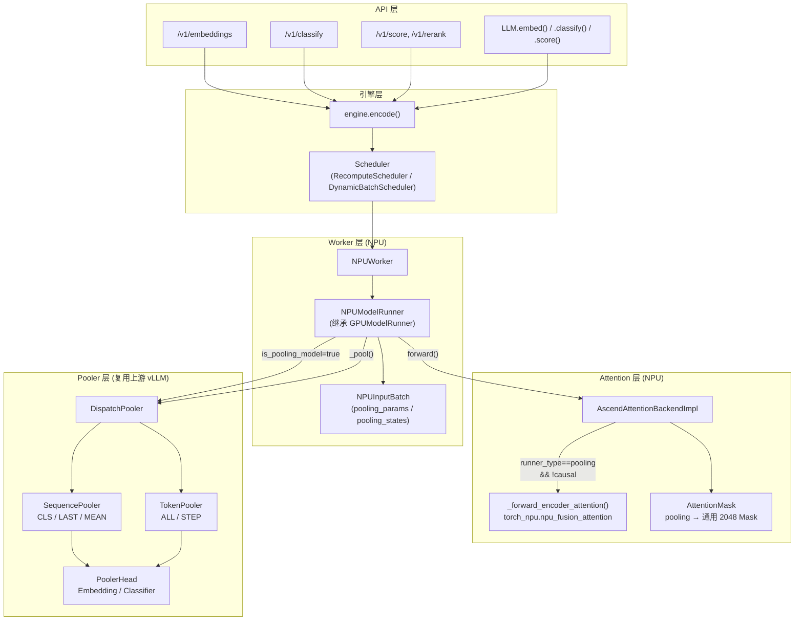
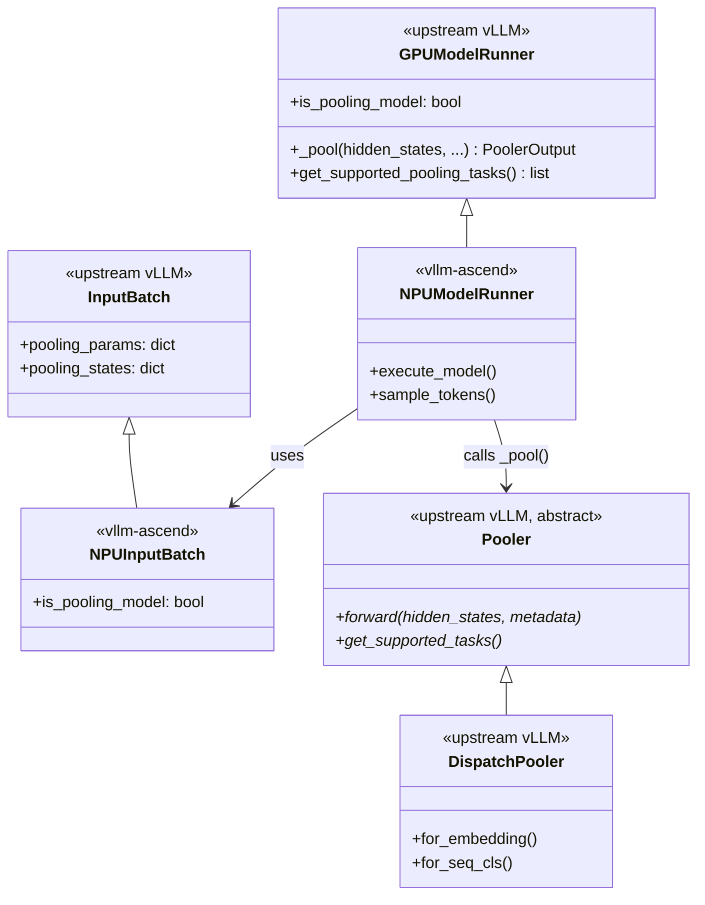
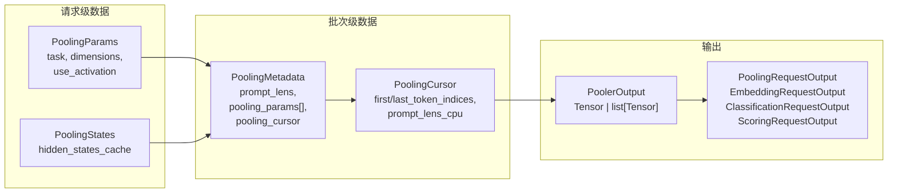
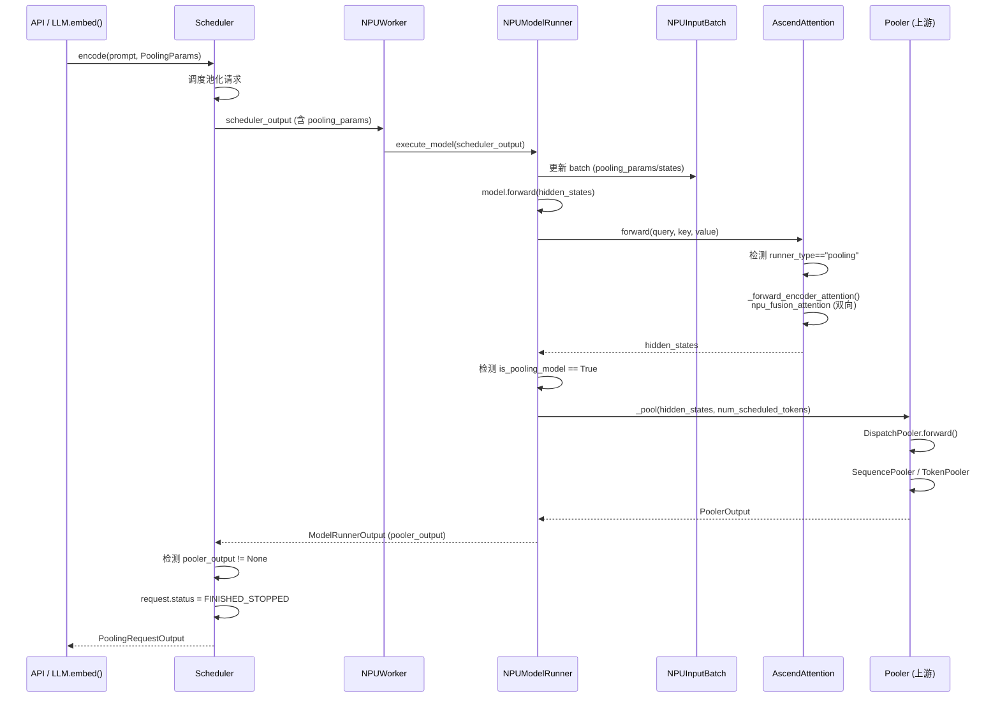

# vLLM Ascend 池化（Pooling）特性指导文档

> **文档版本**: 1.0
> **分析代码版本**: vllm-ascend main 分支（截至 2026-06）
> **最后更新**: 2026-06-11

---

## 文档概述

本文档深入分析 vllm-ascend 中**池化（Pooling）**特性的实现，涵盖 Embedding、Classification、Scoring 等非生成式模型推理任务在 Ascend NPU 上的适配与优化。

**目标读者**：
- 希望在 Ascend NPU 上部署 Embedding/Classification/Reranker 模型的开发者
- 需要理解 vllm-ascend 如何适配上游 vLLM 池化架构的工程师
- 关注 NPU 与 GPU 池化实现差异的性能优化人员

**阅读指南**：
- 第一部分介绍池化任务的背景与 NPU 适配动机
- 第二部分分析插件集成机制（继承 + 分支路由）
- 第三部分深入源码走读，追踪池化请求的完整执行路径
- 第四部分提供配置指南和使用示例

---

# 第一部分: 池化基础与背景

## 1.1 问题背景与动机

### 1.1.1 为什么需要池化支持

vLLM 最初设计为**生成式模型**（LLM）的高性能推理引擎，核心流程是自回归（Autoregressive）解码。然而，大量 NLP 任务不需要自回归生成，而是将输入序列映射为固定维度的向量或标量：

| 任务类型 | 输出形式 | 典型模型 | 应用场景 |
|----------|----------|----------|----------|
| **Embedding** | 向量 (dim=768~4096) | Qwen3-Embedding, BGE, E5 | 语义搜索、RAG、聚类 |
| **Classification** | 标量/概率分布 | Qwen2.5-apeach | 文本分类、情感分析 |
| **Scoring (Reranking)** | 相关性分数 | bge-reranker, Qwen3-Reranker | 搜索排序、Cross-Encoder |
| **Reward Model** | 标量奖励值 | InternLM2-Reward | RLHF 奖励评估 |

这些任务统称为**池化任务**，因为核心操作是将 Transformer 输出的 Token 序列"池化"（Pool）为单一表示。vLLM 通过 `runner="pooling"` 模式支持这类模型，而 vllm-ascend 需要在 Ascend NPU 上适配这一执行路径。

### 1.1.2 与上游 vLLM / GPU 版的差异

| 维度 | GPU (vLLM) | NPU (vllm-ascend) |
|------|-----------|-------------------|
| Attention 后端 | FlashAttention / xFormers（支持双向注意力） | `torch_npu.npu_fusion_attention`（需显式路由到编码器模式） |
| Attention Mask | 动态生成双向/因果 Mask | 池化模型使用固定 2048 长度通用 Mask |
| 模型执行器 | `GPUModelRunner._pool()` | `NPUModelRunner` 继承 `_pool()`，在 `execute_model` 中分支调用 |
| 输入批处理 | `InputBatch` | `NPUInputBatch` 增加 `pooling_params` / `pooling_states` 跟踪 |
| 注意力状态 | 自动检测 Prefill/Decode | 池化模型强制设为 `PrefillNoCache`（Encoder）或 `PrefillCacheHit`（Decoder-based） |
| 310P 支持 | 不适用 | 310P 有独立的 Attention Mask 逻辑和模型执行器 |
| 调度器 | `Scheduler` | `RecomputeScheduler` / `DynamicBatchScheduler` 增加池化分块守卫 |

> **关键洞察**: vllm-ascend 的池化实现**不引入新的 Pooler 类**，而是复用上游 vLLM 的 `Pooler` 层次结构（`DispatchPooler`、`SequencePooler`、`TokenPooler` 等）。NPU 适配集中在**注意力路由**和**执行流分支**上。

## 1.2 核心概念与原理

### 1.2.1 基本思想

池化推理的核心流程是**单次前向传播**（Single-Pass Forward）：

1. 输入文本经 Tokenizer 编码为 Token 序列
2. Transformer 模型执行一次完整的前向传播，输出 Hidden States
3. **Pooler** 层将 Hidden States 聚合为最终输出（向量/标量/分数）
4. 请求立即完成，不进入自回归解码循环

这与生成式模型的关键区别在于：**没有 Decode 阶段**，Prefill 完成后即返回结果。

### 1.2.2 关键术语

| 术语 | 说明 |
|------|------|
| `PoolingTask` | 池化任务类型：`embed`、`classify`、`token_embed`、`token_classify`、`plugin` |
| `PoolingParams` | 每个请求的池化配置（维度截断、激活函数、step_tag_id 等） |
| `PoolingStates` | 请求的池化运行状态（用于 Chunked Prefill 场景下的 Hidden States 缓存累积） |
| `PoolingMetadata` | 池化元数据（prompt_lens、pooling_params 列表、PoolingCursor） |
| `PoolingCursor` | 游标对象，追踪每个请求的 first/last token 索引和完成状态 |
| `Pooler` | 抽象基类，定义 `forward(hidden_states, metadata) -> PoolerOutput` |
| `SequencePoolingType` | 序列级池化方法：`CLS`（首 Token）、`LAST`（末 Token）、`MEAN`（均值） |
| `TokenPoolingType` | Token 级池化方法：`ALL`（全 Token）、`STEP`（步进 Token） |
| `runner_type` | 模型运行器类型：`"generate"` 或 `"pooling"` |

## 1.3 整体架构

### 1.3.1 系统架构总览图



### 1.3.2 核心组件与职责

| 组件 | 文件 | 职责 |
|------|------|------|
| `NPUModelRunner` | `vllm_ascend/worker/model_runner_v1.py` | 执行前向传播，检测 `is_pooling_model` 并分支调用 `_pool()` |
| `NPUInputBatch` | `vllm_ascend/worker/npu_input_batch.py` | 跟踪每个请求的 `PoolingParams` 和 `PoolingStates` |
| `NPUWorker` | `vllm_ascend/worker/worker.py` | 委托 `get_supported_pooling_tasks()` 到 ModelRunner |
| `AscendAttentionBackendImpl` | `vllm_ascend/attention/attention_v1.py` | 检测池化模式，路由到 `_forward_encoder_attention()` |
| `AttentionMask` | `vllm_ascend/attention/attention_mask.py` | 池化模型返回通用 2048 长度 Mask |
| `build_attn_state()` | `vllm_ascend/worker/v2/attn_utils.py` | 池化模型强制设为 `PrefillNoCache` 或 `PrefillCacheHit` |
| `RecomputeScheduler` | `vllm_ascend/core/recompute_scheduler.py` | 池化输出后立即标记 `FINISHED_STOPPED` |

### 1.3.3 与 vLLM 上游的集成关系



> **NPU 差异**: vllm-ascend **不覆写** `_pool()` 方法，完全复用上游 `GPUModelRunner._pool()` 的 Pooler 调用逻辑。NPU 适配集中在 Attention 层的路由和执行流分支上。

---

# 第二部分: 插件集成机制分析

## 2.1 继承与扩展

vllm-ascend 的池化支持通过**继承上游类 + 执行流分支**实现，不使用 patch 机制。

### 2.1.1 NPUModelRunner 继承 GPUModelRunner

```python
# 文件: vllm_ascend/worker/model_runner_v1.py
class NPUModelRunner(GPUModelRunner):
    # 继承 is_pooling_model 属性和 _pool() 方法
    # 在 execute_model() 中增加 NPU 特有的分支逻辑
```

`NPUModelRunner` 在 `execute_model()` 方法中检测 `self.is_pooling_model`，当为 `True` 时调用继承自上游的 `self._pool()` 方法，而非继续执行 logits 计算和采样流程。

### 2.1.2 NPUInputBatch 继承 InputBatch

```python
# 文件: vllm_ascend/worker/npu_input_batch.py
class NPUInputBatch(InputBatch):
    def __init__(self, ..., is_pooling_model: bool = False, ...):
        self.is_pooling_model = is_pooling_model
        # ...
        # for pooling models
        self.pooling_params: dict[str, PoolingParams] = {}
        self.pooling_states: dict[str, PoolingStates] = {}
```

`NPUInputBatch` 在构造时接收 `is_pooling_model` 标志，并初始化池化专用的状态字典。

## 2.2 Attention 层路由（非 Patch，而是条件分支）

池化模型最关键的区别在 Attention 层。vllm-ascend 在 `AscendAttentionBackendImpl.forward()` 中通过条件分支实现路由：

```python
# 文件: vllm_ascend/attention/attention_v1.py (line 1333-1337)
# pooling model branch
if attn_metadata.model_runner_type == "pooling" and not attn_metadata.causal:
    attn_output = self._forward_encoder_attention(
        query, key, value, attn_metadata, output
    )
    output[:num_tokens] = attn_output[:num_tokens]
    return output
```

这一分支在 `forward()` 方法的**主路径**上，位于 KV Cache 写入之后、标准 causal attention 之前。当检测到池化模式且非因果注意力时，直接调用 NPU 编码器注意力算子并返回。

> **关键洞察**: 这种设计避免了 patch 机制的复杂性，因为 Attention 后端本身就需要根据 `attn_metadata` 的不同状态（Prefill/Decode/ChunkedPrefill）做分支，池化只是新增了一个分支条件。

---

# 第三部分: 核心实现深度分析

## 3.1 关键数据结构

### 3.1.1 池化请求的生命周期数据



### 3.1.2 NPUInputBatch 中的池化状态

```python
# 文件: vllm_ascend/worker/npu_input_batch.py (line 228-230)
# for pooling models
self.pooling_params: dict[str, PoolingParams] = {}
self.pooling_states: dict[str, PoolingStates] = {}
```

- `pooling_params`: 以 `request_id` 为 key 存储每个请求的池化配置
- `pooling_states`: 以 `request_id` 为 key 存储每个请求的运行状态（主要用于 Chunked Prefill 场景下累积 Hidden States）

## 3.2 核心执行流程

### 3.2.1 池化请求完整执行时序



### 3.2.2 关键分支点

池化执行流中有三个关键分支点：

1. **Attention 层** (`attention_v1.py:1334`): `runner_type == "pooling" && !causal` → 编码器注意力
2. **Model Runner** (`model_runner_v1.py:2235`): `is_pooling_model` → 调用 `_pool()` 而非 `compute_logits()`
3. **Scheduler** (`recompute_scheduler.py:899`): `pooling_params && pooler_output` → 立即 `FINISHED_STOPPED`

## 3.3 源码走读

### 3.3.1 Model Runner 池化分支

```python
# 文件: vllm_ascend/worker/model_runner_v1.py (line 2226-2248)
if not self.broadcast_pp_output:
    # Common case.
    if not get_pp_group().is_last_rank:
        # Return the intermediate tensors.
        assert isinstance(hidden_states, IntermediateTensors)
        hidden_states.kv_connector_output = kv_connector_output
        self.kv_connector_output = kv_connector_output
        self._finalize_dump_data()
        return hidden_states
    if self.is_pooling_model:
        # Return the pooling output.
        output = self._pool(
            hidden_states, num_scheduled_tokens,
            num_scheduled_tokens_np, kv_connector_output
        )
        output.kv_connector_output = kv_connector_output
        self._finalize_dump_data()
        return output

    sample_hidden_states = hidden_states[logits_indices]
    logits = self.model.compute_logits(sample_hidden_states)
else:
    # Rare case.
    assert not self.is_pooling_model  # 池化模型不支持 broadcast PP output
```

**分析要点**：
- 池化分支在 Pipeline Parallel 的 last rank 上执行 `_pool()`
- `broadcast_pp_output` 模式下断言池化模型不可用（`assert not self.is_pooling_model`）
- `_pool()` 方法完全继承自 `GPUModelRunner`，内部构建 `PoolingMetadata` 并调用 `model.pooler()`

### 3.3.2 NPU 编码器注意力实现

```python
# 文件: vllm_ascend/attention/attention_v1.py (line 1187-1205)
def _forward_encoder_attention(
    self,
    query: torch.Tensor,
    key: torch.Tensor,
    value: torch.Tensor,
    attn_metadata: AscendMetadata,
    _: torch.Tensor,
) -> torch.Tensor:
    # use default sparse_mode 0 in normal scenario, which means no mask works on it
    return torch_npu.npu_fusion_attention(
        query=query,
        key=key,
        value=value,
        head_num=self.num_heads,
        input_layout="TND",
        scale=self.scale,
        actual_seq_qlen=attn_metadata.actual_seq_lengths_q,
        actual_seq_kvlen=attn_metadata.actual_seq_lengths_q,
    )[0]
```

**分析要点**：
- 使用 `torch_npu.npu_fusion_attention` 算子，这是 Ascend NPU 的融合注意力算子
- `input_layout="TND"` 表示 Token-NumHeads-Dim 布局（不同于 GPU 常用的 BSND）
- `sparse_mode=0` 表示不使用稀疏掩码，即**双向注意力**（Bidirectional Attention）
- `actual_seq_qlen` 和 `actual_seq_kvlen` 相同（编码器模型 Q 和 KV 长度一致）
- 这是池化模型（如 BERT、Encoder-only 模型）的核心注意力计算路径

### 3.3.3 Attention Mask 池化分支

```python
# 文件: vllm_ascend/attention/attention_mask.py (line 75-79)
def get_attention_mask(self, causal: bool, model_config: ModelConfig):
    if model_config.runner_type == "pooling":
        return self.get_attn_mask(2048, torch.bool)
    return self.get_splitfuse_attn_mask()
```

**分析要点**：
- 池化模型不使用 SplitFuse 注意力掩码（这是为生成式模型优化的）
- 返回固定 2048 长度的通用布尔掩码
- 对于 Encoder-only 模型，实际注意力计算中 `sparse_mode=0` 不使用此掩码

### 3.3.4 310P 平台的池化 Attention Mask

```python
# 文件: vllm_ascend/_310p/attention/attention_mask.py (line 140-144)
if getattr(model_config, "runner_type", None) == "pooling":
    if causal:
        return self._get_causal_mask(max_seq_len)
    else:
        return self._get_non_causal_mask(max_seq_len, model_config.dtype)
```

**分析要点**：
- 310P 对池化模型有更精细的掩码处理：区分因果和非因果
- 310P 的掩码会转换为 FRACTAL_NZ 格式（NPU 特有的矩阵存储格式）
- 这反映了 310P 芯片与 910B/C 在注意力算子接口上的差异

### 3.3.5 V2 Attention 状态构建

```python
# 文件: vllm_ascend/worker/v2/attn_utils.py (line 146-161)
def build_attn_state(vllm_config, seq_lens_np, num_reqs,
                     num_scheduled_tokens, num_valid_tokens):
    if vllm_config.model_config.runner_type == "pooling":
        if isinstance(
            vllm_config.kv_cache_config.kv_cache_groups[0].kv_cache_spec,
            EncoderOnlyAttentionSpec,
        ):
            attn_state = AscendAttentionState.PrefillNoCache
        else:
            attn_state = AscendAttentionState.PrefillCacheHit
    elif np.array_equal(seq_lens_np[:num_reqs], num_scheduled_tokens):
        attn_state = AscendAttentionState.PrefillNoCache
    # ...
```

**分析要点**：
- 池化模型**永远不会进入 Decode 状态**
- Encoder-only 模型（如 BERT）设为 `PrefillNoCache`：无需 KV Cache
- Decoder-based 池化模型（如 Qwen3-Embedding）设为 `PrefillCacheHit`：使用 KV Cache 但只做一次前向

### 3.3.6 Scheduler 池化输出处理

```python
# 文件: vllm_ascend/core/recompute_scheduler.py (line 892-902)
pooler_output = pooler_outputs[req_index] if pooler_outputs else None

# Check for stop and update request status.
if new_token_ids:
    new_token_ids, stopped = self._update_request_with_output(
        request, new_token_ids
    )
elif request.pooling_params and pooler_output is not None:
    # Pooling stops as soon as there is output.
    request.status = RequestStatus.FINISHED_STOPPED
    stopped = True
```

**分析要点**：
- 池化请求一旦有 `pooler_output` 就立即完成（`FINISHED_STOPPED`）
- 不会进入 `_update_request_with_output`（那是生成式模型的输出追加逻辑）
- 后续将 `pooling_output=pooler_output` 包含在 `EngineCoreOutput` 中返回给客户端

### 3.3.7 Worker 层池化任务声明

```python
# 文件: vllm_ascend/worker/worker.py (line 840-841)
def get_supported_pooling_tasks(self):
    return self.model_runner.get_supported_pooling_tasks()
```

`NPUWorker` 直接委托到 `NPUModelRunner`，后者又继承自 `GPUModelRunner.get_supported_pooling_tasks()`，最终由模型的 `Pooler.get_supported_tasks()` 决定支持哪些池化任务。

## 3.4 NPU 特有优化

### 3.4.1 融合注意力算子

Ascend NPU 的 `torch_npu.npu_fusion_attention` 算子将 QKV 投影、注意力分数计算、Softmax 和输出投影融合为单次调用，相比 GPU 上需要 FlashAttention 或 xFormers 库，NPU 的融合算子在硬件层面实现了更高的计算效率。

### 3.4.2 避免 CPU-NPU 同步

池化输出通过 `_pool()` 方法在 NPU 上完成所有计算后，一次性将结果拷贝回 CPU。这避免了在注意力层或 Pooler 层中间进行 CPU-NPU 同步，符合 vllm-ascend 的核心性能原则。

### 3.4.3 TND 布局优化

NPU 注意力算子使用 `TND`（Token-NumHeads-Dim）布局而非 GPU 常用的 `BSND`（Batch-SeqLen-NumHeads-Dim），这是因为 NPU 的 Paged Attention 实现以 Token 为粒度管理 KV Cache，TND 布局与之天然对齐。

---

# 第四部分: 配置与使用指南

## 4.1 环境变量与配置参数

池化特性本身不引入独立的环境变量，但以下 vllm-ascend 通用配置会影响池化模型的行为：

| 参数 | 类型 | 默认值 | 说明 |
|------|------|--------|------|
| `runner` | str | `"generate"` | 设为 `"pooling"` 启用池化模式 |
| `--enforce-eager` | bool | False | 池化模型建议使用 eager 模式（ACL Graph 对池化支持有限） |
| `VLLM_ASCEND_ENABLE_NZ` | bool | False | 启用 FRACTAL_NZ 矩阵格式，可能影响池化模型权重布局 |
| `--max-num-batched-tokens` | int | 自动 | 池化模型单次前向的最大 Token 数，影响吞吐量 |
| `--max-model-len` | int | 自动 | 模型最大序列长度，池化模型通常不需要很长 |

### 调度器相关

| 参数 | 说明 |
|------|------|
| Chunked Prefill | 池化请求需要显式启用 Chunked Prefill 才能被分块处理 |
| `enable_balance_scheduling` | 平衡调度模式下同样包含池化分块守卫逻辑 |

## 4.2 典型使用场景

### 4.2.1 离线 Embedding

```python
# 文件: examples/offline_embed.py
from vllm import LLM

model = LLM(model="Qwen/Qwen3-Embedding-0.6B", runner="pooling")
outputs = model.embed(input_texts)
embeddings = torch.tensor([o.outputs.embedding for o in outputs])
scores = embeddings[:2] @ embeddings[2:].T
```

### 4.2.2 在线 Embedding 服务

```bash
vllm serve Qwen/Qwen3-Embedding-0.6B --runner pooling
# POST /v1/embeddings
```

### 4.2.3 分类任务

```bash
vllm serve Qwen/Qwen2.5-1.5B-apeach --runner pooling
# POST /v1/classify
```

### 4.2.4 Reranking / Scoring

```bash
vllm serve BAAI/bge-reranker-v2-m3 --runner pooling
# POST /v1/score 或 /v1/rerank
```

### 4.2.5 310P 平台

```bash
# 310P 同样支持池化模型
vllm serve Qwen/Qwen3-Embedding-0.6B --runner pooling --device npu
```

## 4.3 性能调优建议

| 建议 | 说明 |
|------|------|
| **批量大小** | 池化模型是单次前向，增大 `--max-num-batched-tokens` 可显著提升吞吐 |
| **序列长度** | 池化模型通常处理短文本，适当降低 `--max-model-len` 减少内存占用 |
| **Eager 模式** | 对于复杂池化模型（如 Cross-Encoder），使用 `--enforce-eager` 避免图编译开销 |
| **Tensor Parallel** | Embedding 模型通常较小，单卡即可满足，TP>1 收益有限 |

## 4.4 已知限制与注意事项

1. **broadcast_pp_output 不兼容**: 池化模型不支持 `broadcast_pp_output` 模式，即 Pipeline Parallel 的最后一级必须以非广播方式输出
2. **ACL Graph 限制**: 池化模型的执行路径（特别是 `_pool()` 中的动态元数据构建）可能不完全兼容 ACL Graph 捕获
3. **Chunked Prefill 守卫**: 池化请求的分块前向需要显式启用 Chunked Prefill，否则长序列池化请求可能因超出 Token 预算而被拒绝
4. **310P 差异**: 310P 平台的池化注意力掩码处理与 910B/C 不同，使用 FRACTAL_NZ 格式掩码

---

# 附录

## A. 关键代码位置索引

| 组件 | 文件路径 | 关键行号 |
|------|----------|----------|
| Model Runner 池化分支 | `vllm_ascend/worker/model_runner_v1.py` | 2235-2242 |
| NPUInputBatch 池化状态 | `vllm_ascend/worker/npu_input_batch.py` | 48, 228-230 |
| Attention 池化路由 | `vllm_ascend/attention/attention_v1.py` | 1187-1205, 1333-1337 |
| C8 Attention 池化路由 | `vllm_ascend/attention/attention_v1.py` | 1384-1388, 1414-1418, 1429-1433 |
| Attention Mask 池化分支 | `vllm_ascend/attention/attention_mask.py` | 75-79 |
| 310P Attention Mask 池化 | `vllm_ascend/_310p/attention/attention_mask.py` | 140-144 |
| V2 Attention 状态构建 | `vllm_ascend/worker/v2/attn_utils.py` | 146-161 |
| Worker 池化任务声明 | `vllm_ascend/worker/worker.py` | 840-841 |
| Scheduler 池化完成处理 | `vllm_ascend/core/recompute_scheduler.py` | 892-902, 942-953 |
| Dynamic Batch 池化守卫 | `vllm_ascend/core/scheduler_dynamic_batch.py` | 401-406 |
| Balance Schedule 池化守卫 | `vllm_ascend/patch/platform/patch_balance_schedule.py` | 405-410 |
| 310P InputBatch | `vllm_ascend/_310p/npu_input_batch.py` | 42 |
| 310P ModelRunner | `vllm_ascend/_310p/model_runner_310p.py` | 76, 895 |
| 离线 Embedding 示例 | `examples/offline_embed.py` | 全文 |
| E2E 测试 - Embedding | `tests/e2e/pull_request/one_card/pooling/test_embedding.py` | 全文 |
| E2E 测试 - Classification | `tests/e2e/pull_request/one_card/pooling/test_classification.py` | 全文 |
| E2E 测试 - Scoring | `tests/e2e/pull_request/one_card/pooling/test_scoring.py` | 全文 |

## B. 术语表

| 术语 | 英文 | 说明 |
|------|------|------|
| 池化 | Pooling | 将 Token 序列的 Hidden States 聚合为固定维度输出 |
| 编码器注意力 | Encoder Attention | 双向注意力，所有 Token 可互相注意 |
| 因果注意力 | Causal Attention | 单向注意力，Token 只能看到之前的 Token |
| 序列级池化 | Sequence Pooling | 输出单个向量（CLS/LAST/MEAN） |
| Token 级池化 | Token Pooling | 输出每个 Token 的向量（ALL/STEP） |
| 单次前向 | Single-Pass Forward | 池化任务只需一次前向传播，无自回归解码 |
| SplitFuse Mask | SplitFuse Mask | vllm-ascend 为生成式模型优化的注意力掩码策略 |
| FRACTAL_NZ | FRACTAL_NZ | Ascend NPU 特有的矩阵存储格式 |
| TND | Token-NumHeads-Dim | NPU 注意力算子的输入布局格式 |
| PrefillNoCache | PrefillNoCache | 注意力状态：前向传播且无 KV Cache |
| PrefillCacheHit | PrefillCacheHit | 注意力状态：前向传播且有 KV Cache 命中 |

## C. 相关 PR / Issue 索引

| 类型 | 说明 |
|------|------|
| E2E 测试 | `tests/e2e/pull_request/one_card/pooling/` 目录下包含 Embedding、Classification、Scoring 三类端到端测试 |
| 310P 测试 | `tests/e2e/pull_request/one_card/_310p/test_embedding_310p.py` 等 |
| LoRA + Pooling | `tests/e2e/pull_request/one_card/lora/test_qwen3_reranker_lora.py` 测试 LoRA 适配后的 Reranker 池化 |
| 上游 CI | `.github/workflows/scripts/upstream_config.yaml` 列出 50+ 上游 vLLM 池化测试用例 |
