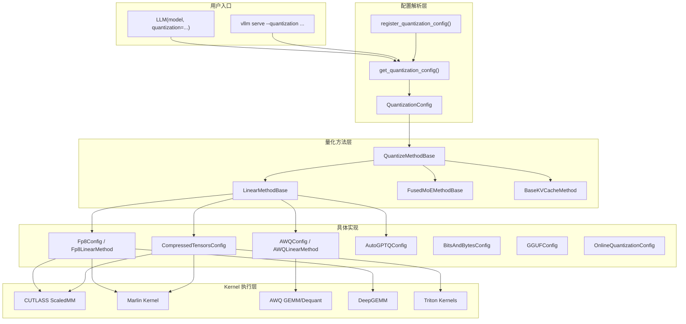
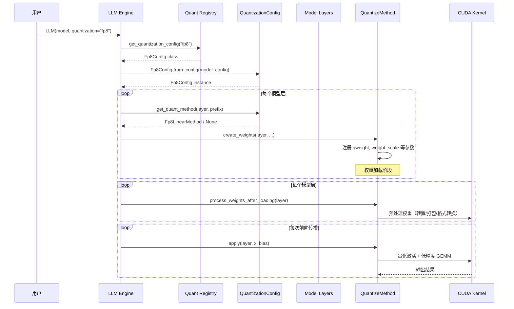
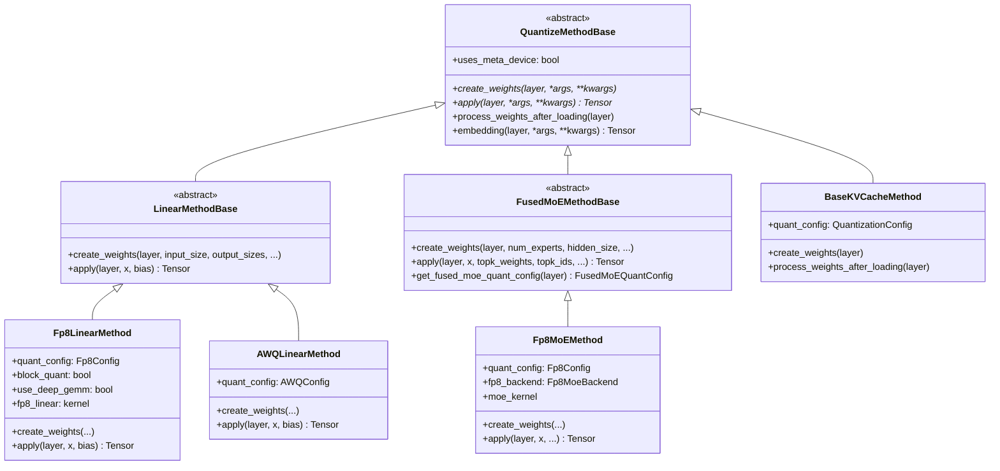
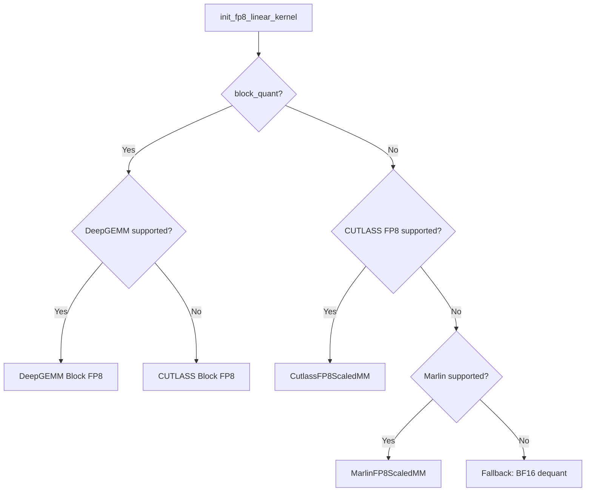
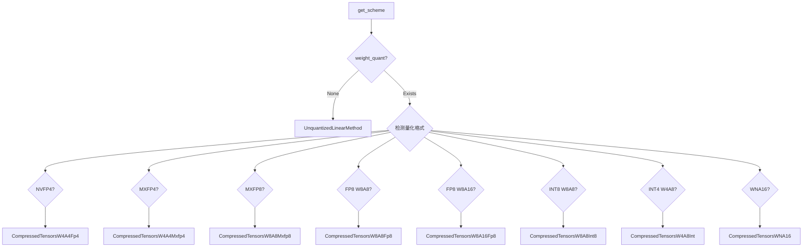
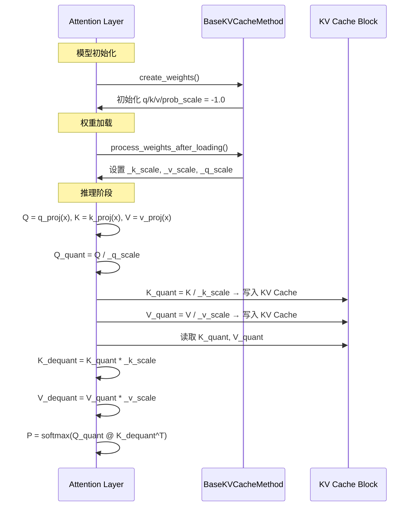
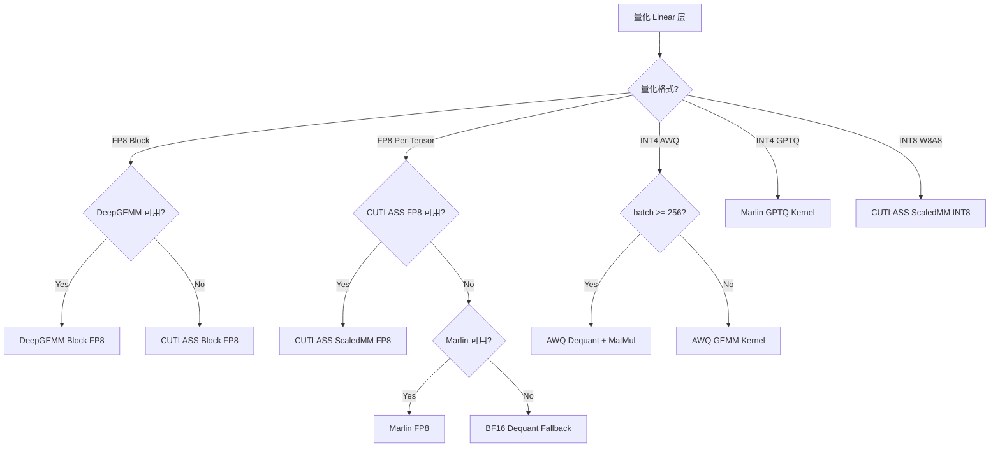

# vLLM Quantization 特性代码走读技术文档

> **文档版本**: 1.0
> **分析代码版本**: vLLM main 分支（截至 2026-06）
> **最后更新**: 2026-06-10

---

## 文档概述

本文档深入解析 vLLM 中的 **Quantization（量化）** 特性，涵盖从基础原理到核心代码实现的完整技术链路。vLLM 支持超过 20 种量化格式，包括 FP8、INT8、INT4、AWQ、GPTQ、GGUF 等，并通过统一的插件化架构实现灵活扩展。

**目标读者**：
- 希望理解 vLLM 量化系统架构的开发者
- 需要为自定义量化方案实现插件的工程师
- 关注模型部署性能优化的 MLOps 团队

**阅读指南**：
- 第一部分：量化基础理论与 vLLM 整体架构
- 第二部分：核心接口与基类分析（`QuantizationConfig` / `QuantizeMethodBase`）
- 第三部分：FP8、AWQ、Compressed-Tensors 等核心实现的深度走读
- 第四部分：不同量化方法的横向对比
- 第五部分：配置与使用指南

---

# 第一部分: Quantization 基础与架构总览

## 1.1 量化原理

### 1.1.1 基本思想

模型量化（Quantization）是将模型中的高精度浮点数权重（如 FP32/FP16/BF16）转换为低精度表示（如 INT8/INT4/FP8）的技术。其核心目标是在保持模型推理精度的前提下，大幅降低显存占用和计算开销。

量化的基本公式为：

$$q = \text{round}\left(\frac{x}{s}\right) + z$$

其中：
- $x$ 为原始高精度值
- $s$ 为缩放因子（scale）
- $z$ 为零点（zero point，对称量化时为 0）
- $q$ 为量化后的低精度整数值

反量化（Dequantization）公式：

$$\hat{x} = s \cdot (q - z)$$

### 1.1.2 量化分类

量化技术可从多个维度进行分类：

| 分类维度 | 类型 | 说明 |
|---------|------|------|
| **量化时机** | Offline（离线量化） | 提前校准并保存量化参数，加载时直接使用 |
| | Online（在线量化） | 加载 BF16/FP16 权重时实时量化，无需预量化 checkpoint |
| **量化对象** | W8A8（权重+激活） | 权重和激活值均量化为 8-bit |
| | W4A16（仅权重） | 仅量化权重到 4-bit，激活保持 16-bit |
| | W8A16 | 权重 8-bit，激活保持 16-bit |
| **粒度** | Per-Tensor | 整个张量共享一个 scale |
| | Per-Channel | 每个输出通道一个 scale |
| | Per-Group | 每 G 个元素共享一个 scale（如 group_size=128） |
| | Per-Block | 二维块共享 scale（如 128×128 block） |
| **数据类型** | INT（整型） | INT8/INT4/INT2 |
| | FP（浮点） | FP8 (e4m3fn) / FP4 |
| | MX（微缩放） | MXFP8 / MXFP4，使用 e8m0 格式的共享缩放 |

### 1.1.3 性能分析

量化对推理性能的影响主要体现在三个方面：

**显存节省**：

$$\text{Memory Ratio} = \frac{\text{bits}_{\text{quant}}}{\text{bits}_{\text{original}}}$$

例如 FP16 → INT4 的理论压缩比为 $4/16 = 0.25$，即节省 75% 权重显存。

**计算加速**：低精度运算（如 INT8 GEMM）在支持的硬件上可获得 2x 理论算力提升。

**精度损失**：量化引入的误差与权重的分布特性密切相关，outlier 越多的层量化损失越大。

### 1.1.4 关键指标定义

| 指标 | 定义 | 典型值 |
|------|------|--------|
| Weight Bits | 权重量化位宽 | 4 / 8 |
| Group Size | 分组量化中每组的元素数 | 32 / 64 / 128 |
| Block Size | 块量化中块的维度 | 128×128 |
| Scale Dtype | 缩放因子的数据类型 | FP32 / E8M0 |
| Pack Factor | 打包因子（32/weight_bits） | 8 (4-bit) / 4 (8-bit) |

## 1.2 vLLM Quantization 整体架构

### 1.2.1 系统架构总览图



### 1.2.2 核心组件与职责划分

| 组件 | 文件路径 | 职责 |
|------|---------|------|
| `QuantizationConfig` | `base_config.py` | 量化配置基类，定义抽象接口 |
| `QuantizeMethodBase` | `base_config.py` | 量化方法基类，定义 create_weights/apply |
| `get_quantization_config()` | `__init__.py` | 工厂方法，根据名称返回配置类 |
| `register_quantization_config()` | `__init__.py` | 装饰器，注册自定义量化方案 |
| `Fp8Config` | `fp8.py` | FP8 量化配置与实现 |
| `AWQConfig` | `awq.py` | AWQ INT4 量化配置与实现 |
| `CompressedTensorsConfig` | `compressed_tensors.py` | LLM Compressor 统一格式支持 |
| `BaseKVCacheMethod` | `kv_cache.py` | KV Cache 量化缩放因子管理 |
| `OnlineQuantizationConfig` | `online/base.py` | 在线量化（加载时量化） |

### 1.2.3 数据流与控制流分析



## 1.3 执行流程详解

### 1.3.1 示例场景：FP8 在线量化加载 Llama-3.1-8B

设定场景：用户使用 `LLM("meta-llama/Llama-3.1-8B", quantization="fp8_per_tensor")` 加载一个 BF16 模型并在线量化为 FP8。

**Step 1: 配置解析**

用户传入 `quantization="fp8_per_tensor"`，这是一个 online quant shorthand。`get_quantization_config("fp8_per_tensor")` 返回 `OnlineQuantizationConfig`，该配置会创建一个 `Fp8Config` 实例，其中 `is_checkpoint_fp8_serialized=False`，`activation_scheme="dynamic"`。

**Step 2: 层方法分派**

对每个 `LinearBase` 层，`Fp8Config.get_quant_method()` 检测到 checkpoint 未预量化，返回 `Fp8OnlineLinearMethod`。该方法设置 `uses_meta_device=True`，权重在 meta device 上创建（不占用实际显存）。

**Step 3: 权重创建与加载**

`create_weights()` 在 meta device 上创建空权重张量，并标记层为 `initialize_online_processing`。权重从 checkpoint 以 BF16 格式逐层加载。

**Step 4: 在线量化**

`process_weights_after_loading()` 被调用时，执行 `ops.scaled_fp8_quant(layer.weight)` 将 BF16 权重量化为 FP8，同时计算 per-tensor scale。量化后的权重替换原始权重。

**Step 5: 推理执行**

`apply()` 阶段，输入激活动态量化为 FP8（per-token 或 per-tensor），通过 `torch._scaled_mm` 或 CUTLASS 执行 FP8 GEMM，最后用 scale 反量化得到 BF16 输出。

---

# 第二部分: 核心接口与基类分析

## 2.1 核心基类详解

### 2.1.1 QuantizationConfig 基类

`QuantizationConfig` 是所有量化配置的抽象基类，定义了量化方案的核心契约：

```python
# 文件: vllm/model_executor/layers/quantization/base_config.py
class QuantizationConfig(ABC):
    """Base class for quantization configs."""

    def __init__(self):
        super().__init__()
        self.packed_modules_mapping: dict[str, list[str]] = dict()

    @abstractmethod
    def get_name(self) -> QuantizationMethods:
        """Name of the quantization method."""

    @abstractmethod
    def get_supported_act_dtypes(self) -> list[torch.dtype]:
        """List of supported activation dtypes."""

    @classmethod
    @abstractmethod
    def get_min_capability(cls) -> int:
        """Minimum GPU capability (70=Volta, 75=Turing, 80=Ampere, 89=Ada, 90=Hopper)."""

    @staticmethod
    @abstractmethod
    def get_config_filenames() -> list[str]:
        """Filenames to search for in model directory."""

    @classmethod
    @abstractmethod
    def from_config(cls, config: dict[str, Any]) -> "QuantizationConfig":
        """Create config from model's quantization config dict."""

    @abstractmethod
    def get_quant_method(
        self, layer: torch.nn.Module, prefix: str
    ) -> QuantizeMethodBase | None:
        """Get the quantize method for a given layer."""
```

> **关键洞察**: `get_quant_method()` 是整个量化系统的分派核心。它根据层的类型（Linear / MoE / Attention）返回对应的量化方法，或返回 `None` 表示该层不需要量化。

### 2.1.2 QuantizeMethodBase 基类

`QuantizeMethodBase` 定义了量化方法的三个核心阶段：

```python
# 文件: vllm/model_executor/layers/quantization/base_config.py
class QuantizeMethodBase(ABC):
    """Base class for different quantized methods."""

    uses_meta_device: bool = False

    @abstractmethod
    def create_weights(self, layer, *weight_args, **extra_weight_attrs):
        """阶段1: 为层创建量化权重参数"""

    @abstractmethod
    def apply(self, layer, *args, **kwargs) -> torch.Tensor:
        """阶段3: 前向传播时应用量化权重"""

    def process_weights_after_loading(self, layer) -> None:
        """阶段2: 权重加载后的预处理（转置/打包/格式转换）"""

    def embedding(self, layer, *args, **kwargs) -> torch.Tensor:
        """可选: Embedding 层的量化实现"""
```



## 2.2 核心接口定义

### 2.2.1 权重创建接口

`create_weights()` 负责为每个层注册量化所需的参数。不同量化方法创建的参数不同：

| 量化方法 | 创建的参数 | 说明 |
|---------|-----------|------|
| FP8 (per-tensor) | `weight` (FP8), `weight_scale` (FP32) | 权重 + per-tensor scale |
| FP8 (block) | `weight` (FP8), `weight_scale_inv` (FP32) | 权重 + per-block scale |
| AWQ (INT4) | `qweight` (INT32 packed), `qzeros` (INT32), `scales` (FP16) | 打包权重 + 零点 + 缩放 |
| GPTQ (INT4) | `qweight` (INT32), `g_idx` (INT32), `scales` (FP16) | 打包权重 + 分组索引 |

### 2.2.2 权重后处理接口

`process_weights_after_loading()` 在权重加载完成后执行，用于：
- 转置权重以匹配 kernel 的内存布局要求
- 将多个 logical shard 的 scale 合并为单个 scale
- 执行格式转换（如 e4m3fn → e4m3fnuz for AMD GPU）
- 对在线量化场景执行实际的量化操作

### 2.2.3 前向推理接口

`apply()` 是量化层的核心计算路径，典型流程：
1. 量化输入激活（动态或静态）
2. 执行低精度矩阵乘法（GEMM）
3. 应用 scale 反量化
4. 添加 bias（如有）

## 2.3 工厂方法与注册机制

### 2.3.1 内置量化方法注册

vLLM 通过 `QuantizationMethods` Literal 类型和 `method_to_config` 字典管理所有内置量化方法：

```python
# 文件: vllm/model_executor/layers/quantization/__init__.py
QuantizationMethods = Literal[
    "awq", "fp8", "fbgemm_fp8", "fp_quant", "modelopt",
    "modelopt_fp4", "modelopt_mxfp8", "modelopt_mixed",
    "gguf", "auto_gptq", "gptq", "gptq_marlin", "awq_marlin",
    "compressed-tensors", "bitsandbytes", "experts_int8",
    "quark", "moe_wna16", "torchao", "inc", "mxfp4",
    "gpt_oss_mxfp4", "deepseek_v4_fp8", "online",
    "fp8_per_tensor", "fp8_per_block", "fp8_per_channel",
    "int8_per_channel_weight_only", "mxfp8",
]

def get_quantization_config(quantization: str) -> type[QuantizationConfig]:
    method_to_config = {
        "awq": AWQConfig,
        "fp8": Fp8Config,
        "compressed-tensors": CompressedTensorsConfig,
        "bitsandbytes": BitsAndBytesConfig,
        # ... 更多映射
    }
    method_to_config.update(_CUSTOMIZED_METHOD_TO_QUANT_CONFIG)
    return method_to_config[quantization]
```

### 2.3.2 自定义量化注册装饰器

```python
# 文件: vllm/model_executor/layers/quantization/__init__.py
def register_quantization_config(quantization: str):
    """Register a customized vllm quantization config."""
    def _wrapper(quant_config_cls):
        if quantization not in QUANTIZATION_METHODS:
            QUANTIZATION_METHODS.append(quantization)
        if not issubclass(quant_config_cls, QuantizationConfig):
            raise ValueError("Must be a subclass of QuantizationConfig")
        _CUSTOMIZED_METHOD_TO_QUANT_CONFIG[quantization] = quant_config_cls
        return quant_config_cls
    return _wrapper
```

使用示例：

```python
@register_quantization_config("my_quant")
class MyQuantConfig(QuantizationConfig):
    def get_name(self) -> str:
        return "my_quant"
    # ... 实现其他抽象方法
```

---

# 第三部分: 核心实现深度分析

## 3.1 FP8 量化实现分析

### 3.1.1 FP8 数据格式

FP8 有两种主要格式：
- **E4M3FN**: 4 位指数 + 3 位尾数，动态范围较小但精度更高，用于权重和激活
- **E5M2**: 5 位指数 + 2 位尾数，动态范围更大但精度较低，用于梯度

vLLM 主要使用 E4M3FN 格式。在 AMD GPU (MI300X/MI325X) 上使用 FNUZ 变体，需要在加载时进行格式转换：

```python
# 文件: vllm/model_executor/layers/quantization/fp8.py
# MI300x and MI325x use FNUZ format for FP8. Convert if needed.
if current_platform.is_fp8_fnuz():
    w13, w13_scale, w13_input_scale = normalize_e4m3fn_to_e4m3fnuz(
        w13, w13_scale, w13_input_scale,
    )
```

### 3.1.2 Fp8Config 配置解析

```python
# 文件: vllm/model_executor/layers/quantization/fp8.py
class Fp8Config(QuantizationConfig):
    def __init__(
        self,
        is_checkpoint_fp8_serialized: bool = False,
        activation_scheme: str = "dynamic",
        ignored_layers: list[str] | None = None,
        weight_block_size: list[int] | None = None,
    ) -> None:
        # is_checkpoint_fp8_serialized: checkpoint 是否已经是 FP8 格式
        # activation_scheme: "static" 或 "dynamic"
        # weight_block_size: [block_n, block_k] 用于 block-wise 量化
```

`Fp8Config` 支持三种量化模式：

| 模式 | `is_checkpoint_fp8_serialized` | `weight_block_size` | 说明 |
|------|-------------------------------|---------------------|------|
| Per-Tensor Offline | `True` | `None` | 预量化 checkpoint，per-tensor scale |
| Per-Tensor Online | `False` | `None` | 加载时量化，per-tensor scale |
| Block-Wise | `True` | `[128, 128]` | 预量化 checkpoint，128×128 block scale |

### 3.1.3 Fp8LinearMethod 核心实现

**权重创建阶段**：

```python
# 文件: vllm/model_executor/layers/quantization/fp8.py
def create_weights(self, layer, input_size_per_partition,
                   output_partition_sizes, ...):
    # 创建 FP8 权重参数
    weight = create_fp8_weight_parameter(
        output_size_per_partition, input_size_per_partition, weight_loader
    )
    layer.register_parameter("weight", weight)

    if not self.block_quant:
        # Per-tensor scale
        scale = create_fp8_scale_parameter(
            PerTensorScaleParameter, output_partition_sizes, ...)
        layer.register_parameter("weight_scale", scale)
    else:
        # Block-wise scale (名称为 weight_scale_inv 兼容 DeepSeek V3)
        scale = create_fp8_scale_parameter(
            BlockQuantScaleParameter, output_partition_sizes,
            ..., self.weight_block_size)
        layer.register_parameter("weight_scale_inv", scale)

    # 初始化 kernel backend
    self.fp8_linear = init_fp8_linear_kernel(
        activation_quant_key=self.activation_quant_key,
        weight_quant_key=self.weight_quant_key,
        ...)
```

**Kernel Backend 选择**：



**前向推理阶段**：

```python
# 文件: vllm/model_executor/layers/quantization/fp8.py
def apply(self, layer, x, bias=None):
    # 统一通过 fp8_linear kernel backend 执行
    return self.fp8_linear.apply_weights(layer, x, bias)
```

### 3.1.4 FP8 MoE 量化

FP8 对 Mixture of Experts 层的量化更为复杂，需要处理多 expert 的权重：

```python
# 文件: vllm/model_executor/layers/quantization/fp8.py
class Fp8MoEMethod(FusedMoEMethodBase):
    def create_weights(self, layer, num_experts, hidden_size,
                       intermediate_size_per_partition, ...):
        # w13: gate + up 合并权重 [num_experts, 2*inter, hidden]
        w13_weight = torch.nn.Parameter(
            torch.empty(num_experts, 2 * intermediate_size_per_partition,
                       hidden_size, dtype=torch.float8_e4m3fn))

        # w2: down 投影权重 [num_experts, hidden, inter]
        w2_weight = torch.nn.Parameter(
            torch.empty(num_experts, hidden_size,
                       intermediate_size_per_partition,
                       dtype=torch.float8_e4m3fn))

        # Block quant 时 scale 形状为 [num_experts, num_blocks_n, num_blocks_k]
        # Per-tensor quant 时 scale 形状为 [num_experts, 2] (w13) / [num_experts] (w2)
```

FP8 MoE 支持多种 backend：

| Backend | 适用硬件 | 说明 |
|---------|---------|------|
| `Fp8MoeBackend.CUTLASS` | Hopper (SM90) | CUTLASS GroupedGEMM |
| `Fp8MoeBackend.AITER` | AMD MI300X | AITER fused MoE kernel |
| `Fp8MoeBackend.TRITON` | 通用 | Triton 实现的 fused MoE |

## 3.2 AWQ 量化实现分析

### 3.2.1 AWQ 算法原理

AWQ (Activation-aware Weight Quantization) 是一种权重仅量化的方法（论文: https://arxiv.org/abs/2306.00978），核心思想是：

1. 识别对激活值影响大的"显著权重通道"
2. 对显著通道给予更大的缩放保护
3. 将权重量化为 INT4，同时保留 per-group 的 FP16 scale

### 3.2.2 AWQConfig 配置

```python
# 文件: vllm/model_executor/layers/quantization/awq.py
class AWQConfig(QuantizationConfig):
    def __init__(self, weight_bits: int, group_size: int,
                 zero_point: bool, modules_to_not_convert=None):
        # 目前仅支持 4-bit 量化
        if self.weight_bits != 4:
            raise ValueError("Only 4-bit weight quantization supported")
        self.pack_factor = 32 // self.weight_bits  # = 8
```

### 3.2.3 AWQLinearMethod 权重存储

AWQ 使用 packed 存储格式，将 8 个 INT4 值打包到一个 INT32 中：

```python
# 文件: vllm/model_executor/layers/quantization/awq.py
def create_weights(self, layer, input_size_per_partition,
                   output_partition_sizes, ...):
    # qweight: [K, N//8] INT32 (8 个 4-bit 值打包为 1 个 INT32)
    qweight = PackedvLLMParameter(
        data=torch.empty(input_size_per_partition,
                        output_size_per_partition // self.quant_config.pack_factor,
                        dtype=torch.int32),
        packed_dim=1, packed_factor=self.quant_config.pack_factor)

    # qzeros: [num_groups, N//8] INT32
    qzeros = PackedvLLMParameter(
        data=torch.empty(num_groups,
                        output_size_per_partition // self.quant_config.pack_factor,
                        dtype=torch.int32), ...)

    # scales: [num_groups, N] FP16
    scales = GroupQuantScaleParameter(
        data=torch.empty(num_groups, output_size_per_partition,
                        dtype=params_dtype), ...)
```

### 3.2.4 AWQ 前向推理

```python
# 文件: vllm/model_executor/layers/quantization/awq.py
def apply(self, layer, x, bias=None):
    # 启发式: token 数 >= 256 时使用 dequant + matmul 路径
    FP16_MATMUL_HEURISTIC_CONDITION = x.shape[:-1].numel() >= 256

    if FP16_MATMUL_HEURISTIC_CONDITION:
        # 先反量化为 FP16，再用标准 matmul（大 batch 更快）
        out = ops.awq_dequantize(qweight, scales, qzeros, 0, 0, 0)
        out = torch.matmul(reshaped_x, out)
    else:
        # 直接使用 AWQ GEMM kernel（小 batch 更快）
        out = ops.awq_gemm(reshaped_x, qweight, scales, qzeros, pack_factor)
```

> **性能提示**: AWQ 的推理路径选择是一个经典的启发式策略——大 batch 时反量化+标准 matmul 的 throughput 更高，小 batch 时 fused AWQ kernel 的 latency 更低。

## 3.3 Compressed-Tensors 统一格式

### 3.3.1 设计理念

`compressed-tensors` 是 Neural Magic（现 Red Hat）的 LLM Compressor 工具定义的统一量化格式。它通过 `config_groups` 支持非均匀量化——不同层可以使用不同的量化策略：

```python
# 文件: vllm/model_executor/layers/quantization/compressed_tensors/compressed_tensors.py
class CompressedTensorsConfig(QuantizationConfig):
    def __init__(self, target_scheme_map, ignore, quant_format,
                 kv_cache_scheme=None, config=None, ...):
        # target_scheme_map: {"Linear": {"weights": QuantArgs, "input_activations": QuantArgs}}
        # 支持按层名、正则、模块类名匹配不同的量化方案
```

### 3.3.2 Scheme 自动检测

`CompressedTensorsConfig` 的核心能力是根据权重量化和激活量化的参数自动选择最优的 Scheme：



关键检测函数示例：

```python
# 文件: compressed_tensors.py
@staticmethod
def _is_fp8_w8a8(weight_quant, input_quant) -> bool:
    is_floating_point = (
        weight_quant.type == QuantizationType.FLOAT
        and input_quant.type == QuantizationType.FLOAT
    )
    is_symmetric_weight = weight_quant.symmetric
    is_static_weight = not weight_quant.dynamic
    is_tensor_or_channel_or_block = weight_quant.strategy in [
        QuantizationStrategy.TENSOR,
        QuantizationStrategy.CHANNEL,
        QuantizationStrategy.BLOCK,
    ]
    return is_floating_point and is_symmetric_weight and is_static_weight \
           and is_tensor_or_channel_or_block
```

## 3.4 KV Cache 量化

### 3.4.1 BaseKVCacheMethod

KV Cache 量化通过 `BaseKVCacheMethod` 实现，它为 Attention 层添加 `q_scale`、`k_scale`、`v_scale` 和 `prob_scale` 参数：

```python
# 文件: vllm/model_executor/layers/quantization/kv_cache.py
class BaseKVCacheMethod(QuantizeMethodBase):
    def create_weights(self, layer):
        layer.q_scale = KVCacheScaleParameter()   # Q 缩放
        layer.k_scale = KVCacheScaleParameter()   # K Cache 缩放
        layer.v_scale = KVCacheScaleParameter()   # V Cache 缩放
        layer.prob_scale = KVCacheScaleParameter() # Attention prob 缩放

    def process_weights_after_loading(self, layer):
        # 处理 scale: 从 checkpoint 加载或使用默认值 1.0
        if layer.k_scale > 0.0 and layer.v_scale > 0.0:
            k_scale = layer.k_scale.to("cpu").tolist()
            v_scale = layer.v_scale.to("cpu").tolist()
        elif layer.k_scale < 0.0 and layer.v_scale < 0.0:
            k_scale = 1.0  # 默认值
            v_scale = 1.0
        # AMD FNUZ 格式需要 scale * 2
        if current_platform.is_fp8_fnuz():
            k_scale *= 2
            v_scale *= 2
```

### 3.4.2 KV Cache 量化工作流



## 3.5 Online Quantization（在线量化）

### 3.5.1 核心机制

Online quantization 允许用户加载 BF16/FP16 模型并在加载时自动量化，无需预量化的 checkpoint：

```python
# 使用示例
llm = LLM("meta-llama/Llama-3.1-8B", quantization="fp8_per_tensor")
llm = LLM("meta-llama/Llama-3.1-8B", quantization="fp8_per_block")
llm = LLM("meta-llama/Llama-3.1-8B", quantization="mxfp8")
```

### 3.5.2 支持的在线量化方案

| Scheme | 权重格式 | 激活格式 | 硬件要求 |
|--------|---------|---------|---------|
| `fp8_per_tensor` | FP8 E4M3 + FP32 per-tensor scale | FP8 E4M3 + FP32 per-tensor scale | SM 89+ (Ada/Hopper) |
| `fp8_per_block` | FP8 E4M3 + FP32 per-128×128 block | FP8 E4M3 + FP32 per-1×128 block | SM 89+ |
| `mxfp8` | FP8 E4M3 + E8M0 per-1×32 block | FP8 E4M3 + E8M0 per-1×32 block | SM 100+ (Blackwell) |
| `int8_per_channel_weight_only` | INT8 per-channel | 无（BF16 激活） | 通用 |

### 3.5.3 在线量化内存优化

在线量化使用 `meta device` 技术减少峰值内存：

```python
# 文件: vllm/model_executor/layers/quantization/fp8.py
class Fp8OnlineLinearMethod(Fp8LinearMethod):
    uses_meta_device: bool = True

    def create_weights(self, layer, ...):
        # 在 meta device 上创建空权重（不占实际显存）
        weight = ModelWeightParameter(
            data=torch.empty(..., device="meta", dtype=params_dtype), ...)
        layer.register_parameter("weight", weight)
        # 标记为在线处理
        initialize_online_processing(layer)

    def process_weights_after_loading(self, layer):
        # 逐层量化 BF16 → FP8，然后释放 BF16 权重
        qweight, weight_scale = ops.scaled_fp8_quant(layer.weight, scale=None)
        replace_parameter(layer, "weight", qweight.t().data)
        replace_parameter(layer, "weight_scale", weight_scale.data)
```

> **关键洞察**: `uses_meta_device=True` 使得权重先在 meta device 上"占位"，实际 BF16 权重逐层加载并立即量化为 FP8，大幅降低峰值显存需求。

---

# 第四部分: 不同量化方法对比

## 4.1 主要量化方法横向对比

| 特性 | FP8 (W8A8) | AWQ (W4A16) | GPTQ (W4A16) | INT8 (W8A8) | Compressed-Tensors | BitsAndBytes |
|------|-----------|-------------|--------------|-------------|-------------------|-------------|
| **权重位宽** | 8-bit | 4-bit | 4-bit | 8-bit | 可变 | 4/8-bit |
| **激活量化** | 是 | 否 | 否 | 是 | 可选 | 否 |
| **量化粒度** | Tensor/Block | Group | Group | Tensor/Token | 可变 | Tensor |
| **需要校准** | 否（dynamic） | 是 | 是 | 是 | 取决于方案 | 否 |
| **压缩比** | 2x | 4x | 4x | 2x | 可变 | 2-4x |
| **精度损失** | 低 | 中 | 中 | 低-中 | 可变 | 中 |
| **推理加速** | 显著 | 中等 | 中等 | 显著 | 可变 | 有限 |
| **预量化要求** | 可选 | 必须 | 必须 | 必须 | 必须 | 否 |

## 4.2 硬件兼容性矩阵

| 量化方法 | Volta (SM70) | Turing (SM75) | Ampere (SM80) | Ada (SM89) | Hopper (SM90) | AMD GPU | Intel GPU |
|---------|:---:|:---:|:---:|:---:|:---:|:---:|:---:|
| AWQ | ❌ | ✅ | ✅ | ✅ | ✅ | ❌ | ✅ |
| GPTQ | ✅ | ✅ | ✅ | ✅ | ✅ | ❌ | ✅ |
| Marlin | ❌ | ✅ | ✅ | ✅ | ✅ | ❌ | ❌ |
| FP8 W8A8 | ❌ | ❌ | ❌ | ✅ | ✅ | ✅ | ❌ |
| INT8 W8A8 | ❌ | ✅ | ✅ | ✅ | ✅ | ❌ | ❌ |
| BitsAndBytes | ✅ | ✅ | ✅ | ✅ | ✅ | ❌ | ❌ |
| GGUF | ✅ | ✅ | ✅ | ✅ | ✅ | ✅ | ❌ |

## 4.3 Kernel Backend 选择策略



## 4.4 量化方法选型指南

| 场景 | 推荐方法 | 理由 |
|------|---------|------|
| 最大化吞吐量（Hopper GPU） | FP8 W8A8 Block | DeepGEMM 提供最高 GEMM 性能 |
| 最大化吞吐量（Ada GPU） | FP8 W8A8 Per-Tensor | CUTLASS ScaledMM 优化良好 |
| 最小化显存（消费级 GPU） | AWQ W4A16 | 4-bit 权重，无需激活量化 |
| 快速部署无预量化 | Online FP8 Per-Tensor | 无需校准数据，加载即量化 |
| 通用兼容性 | GPTQ + Marlin | 广泛硬件支持，成熟生态 |
| 灵活混合精度 | Compressed-Tensors | 支持非均匀量化，层级别定制 |
| MoE 模型 | FP8 MoE | 专为 MoE 架构优化的 kernel |

---

# 第五部分: 配置与使用指南

## 5.1 关键参数说明

### 5.1.1 Fp8Config 参数

| 参数 | 类型 | 默认值 | 说明 |
|------|------|--------|------|
| `is_checkpoint_fp8_serialized` | bool | `False` | checkpoint 是否已预量化为 FP8 |
| `activation_scheme` | str | `"dynamic"` | 激活量化方案: `"static"` 或 `"dynamic"` |
| `ignored_layers` | list[str] | `None` | 跳过量化的层名列表 |
| `weight_block_size` | list[int] | `None` | Block 量化块大小，如 `[128, 128]` |
| `use_deep_gemm` | bool/None | `None` | 是否强制使用 DeepGEMM（None=自动检测） |

### 5.1.2 AWQConfig 参数

| 参数 | 类型 | 默认值 | 说明 |
|------|------|--------|------|
| `weight_bits` | int | 4 | 权重量化位宽（仅支持 4） |
| `group_size` | int | 128 | 分组大小（-1 表示全组） |
| `zero_point` | bool | True | 是否使用零点（asymmetric quant） |
| `modules_to_not_convert` | list[str] | None | 不量化的模块名 |

### 5.1.3 Online Quantization 参数

| 参数 | 说明 |
|------|------|
| `quantization` | 量化方案名称或 shorthand |
| `quantization_config.linear` | Dense 层的量化方案 |
| `quantization_config.moe` | MoE 层的量化方案 |
| `quantization_config.ignore` | 跳过量化的层（支持 regex） |

## 5.2 典型配置示例

### 5.2.1 使用预量化 FP8 Checkpoint

```python
from vllm import LLM

# 使用 Neural Magic 的 FP8 预量化模型
llm = LLM(
    model="neuralmagic/Meta-Llama-3.1-8B-Instruct-FP8",
    # quantization 自动从 config.json 检测
)
```

### 5.2.2 在线 FP8 量化

```python
from vllm import LLM

# Per-tensor FP8 在线量化
llm = LLM("meta-llama/Llama-3.1-8B", quantization="fp8_per_tensor")

# Per-block FP8 在线量化（更高精度）
llm = LLM("meta-llama/Llama-3.1-8B", quantization="fp8_per_block")
```

### 5.2.3 AWQ 量化模型

```python
from vllm import LLM

# 加载 AWQ 预量化模型
llm = LLM(
    model="casperhansen/vicuna-7b-v1.5-awq",
    quantization="awq",
)
```

### 5.2.4 混合量化（Dense + MoE 不同方案）

```python
from vllm import LLM

# Dense 层用 per-block FP8，MoE 层用 per-tensor FP8
llm = LLM(
    "ibm-granite/granite-3.0-1b-a400m-base",
    quantization="fp8_per_tensor",
    quantization_config={
        "linear": "fp8_per_block",
    },
)
```

### 5.2.5 排除特定层

```python
from vllm import LLM

llm = LLM(
    "meta-llama/Llama-3.1-8B",
    quantization="fp8_per_tensor",
    quantization_config={
        "ignore": [
            "model.layers.1.self_attn.o_proj",  # 精确匹配
            "re:.*[qkv]_proj",                   # 正则匹配
        ],
    },
)
```

### 5.2.6 CLI 使用

```bash
# 在线 FP8 量化
vllm serve meta-llama/Llama-3.1-8B --quantization fp8_per_tensor

# 带 MoE 激活覆盖
vllm serve openai/gpt-oss-20b --quantization-config.moe.activation mxfp8

# AWQ 量化模型
vllm serve casperhansen/vicuna-7b-v1.5-awq --quantization awq
```

## 5.3 性能调优建议

### 5.3.1 量化方法选择

| 优先级 | 条件 | 推荐 |
|--------|------|------|
| 1 | Hopper GPU + FP8 checkpoint | FP8 Block (DeepGEMM) |
| 2 | Ada/Hopper GPU + BF16 checkpoint | Online FP8 Per-Block |
| 3 | 消费级 GPU + 显存受限 | AWQ W4A16 |
| 4 | 快速原型验证 | Online FP8 Per-Tensor |

### 5.3.2 精度优化

- **敏感层跳过**: 使用 `ignored_layers` 或 `modules_to_not_convert` 跳过 lm_head 和首尾几层
- **Block 量化优于 Per-Tensor**: 对权重分布不均匀的模型，128×128 block 量化可显著减少精度损失
- **FP8 优于 INT8**: 在支持的硬件上，FP8 W8A8 通常比 INT8 W8A8 有更好的精度-性能平衡

### 5.3.3 性能优化

- **大 batch 优先 W8A8**: 高并发场景下，FP8/INT8 W8A8 的 GEMM 加速效果最显著
- **小 batch 考虑 W4A16**: 低并发（decode 为主）场景下，4-bit 权重的 memory bandwidth 优势更大
- **DeepGEMM 开关**: 在 Hopper GPU 上，`use_deep_gemm=True` 通常可获得最佳 FP8 性能

---

# 附录

## A. 关键代码位置索引

| 组件 | 文件路径 | 关键类/函数 |
|------|---------|------------|
| 量化注册中心 | `vllm/model_executor/layers/quantization/__init__.py` | `get_quantization_config()`, `register_quantization_config()` |
| 基类定义 | `vllm/model_executor/layers/quantization/base_config.py` | `QuantizationConfig`, `QuantizeMethodBase` |
| FP8 实现 | `vllm/model_executor/layers/quantization/fp8.py` | `Fp8Config`, `Fp8LinearMethod`, `Fp8MoEMethod` |
| FP8 Online | `vllm/model_executor/layers/quantization/fp8.py` | `Fp8OnlineLinearMethod`, `Fp8OnlineMoEMethod` |
| AWQ 实现 | `vllm/model_executor/layers/quantization/awq.py` | `AWQConfig`, `AWQLinearMethod` |
| AWQ Marlin | `vllm/model_executor/layers/quantization/awq_marlin.py` | `AWQMarlinConfig` |
| GPTQ | `vllm/model_executor/layers/quantization/auto_gptq.py` | `AutoGPTQConfig` |
| Compressed-Tensors | `vllm/model_executor/layers/quantization/compressed_tensors/compressed_tensors.py` | `CompressedTensorsConfig`, `CompressedTensorsLinearMethod` |
| BitsAndBytes | `vllm/model_executor/layers/quantization/bitsandbytes.py` | `BitsAndBytesConfig` |
| GGUF | `vllm/model_executor/layers/quantization/gguf.py` | `GGUFConfig` |
| KV Cache 量化 | `vllm/model_executor/layers/quantization/kv_cache.py` | `BaseKVCacheMethod`, `KVCacheScaleParameter` |
| Online 量化 | `vllm/model_executor/layers/quantization/online/base.py` | `OnlineQuantizationConfig` |
| ModelOpt | `vllm/model_executor/layers/quantization/modelopt.py` | `ModelOptFp8Config`, `ModelOptNvFp4Config` |
| Quark | `vllm/model_executor/layers/quantization/quark/quark.py` | `QuarkConfig` |
| TorchAO | `vllm/model_executor/layers/quantization/torchao.py` | `TorchAOConfig` |
| INC | `vllm/model_executor/layers/quantization/inc.py` | `INCConfig` |
| MXFP4 | `vllm/model_executor/layers/quantization/mxfp4.py` | `Mxfp4Config` |
| FP8 工具函数 | `vllm/model_executor/layers/quantization/utils/fp8_utils.py` | `create_fp8_weight_parameter()`, `validate_fp8_block_shape()` |
| Marlin 工具函数 | `vllm/model_executor/layers/quantization/utils/marlin_utils.py` | `get_marlin_input_dtype()` |
| W8A8 工具函数 | `vllm/model_executor/layers/quantization/utils/w8a8_utils.py` | `cutlass_fp8_supported()`, `cutlass_block_fp8_supported()` |
| 量化通用工具 | `vllm/model_executor/layers/quantization/utils/quant_utils.py` | `GroupShape`, `is_layer_skipped()` |
| FP8 Linear Kernel | `vllm/model_executor/kernels/linear/scaled_mm.py` | `CutlassFP8ScaledMMLinearKernel`, `MarlinFP8ScaledMMLinearKernel` |
| FP8 MoE Oracle | `vllm/model_executor/layers/fused_moe/oracle/fp8.py` | `select_fp8_moe_backend()`, `make_fp8_moe_kernel()` |

## B. 术语表

| 术语 | 英文 | 说明 |
|------|------|------|
| 量化 | Quantization | 将高精度数值转换为低精度表示 |
| 反量化 | Dequantization | 将低精度数值恢复为高精度表示 |
| 缩放因子 | Scale Factor | 量化/反量化时的乘数 |
| 零点 | Zero Point | 非对称量化中的偏移量 |
| 分组量化 | Group Quantization | 将权重分为若干组，每组独立量化 |
| 块量化 | Block Quantization | 将权重分为二维块，每块独立量化 |
| 在线量化 | Online Quantization | 模型加载时实时执行的量化 |
| 离线量化 | Offline Quantization | 提前校准并保存量化参数 |
| 打包因子 | Pack Factor | 多个低精度值打包到一个高精度容器中的数量 |
| 微缩放 | Microscaling (MX) | 使用极短缩放格式（如 E8M0）的量化方案 |
| Weight-Only | W{N}A16 | 仅量化权重，激活保持高精度 |
| Weight-Activation | W{N}A{M} | 权重和激活均量化 |
| CUTLASS | - | NVIDIA 的高性能 GEMM 模板库 |
| Marlin | - | vLLM 优化的 INT4/FP8 GEMM kernel |
| DeepGEMM | - | 针对 Hopper GPU 优化的 FP8 GEMM 库 |
| PagedAttention | - | vLLM 的分页 KV Cache 注意力机制 |
| FusedMoE | - | 融合的 Mixture-of-Experts 计算层 |
| SM (Streaming Multiprocessor) | - | NVIDIA GPU 的计算单元代际标识 |
