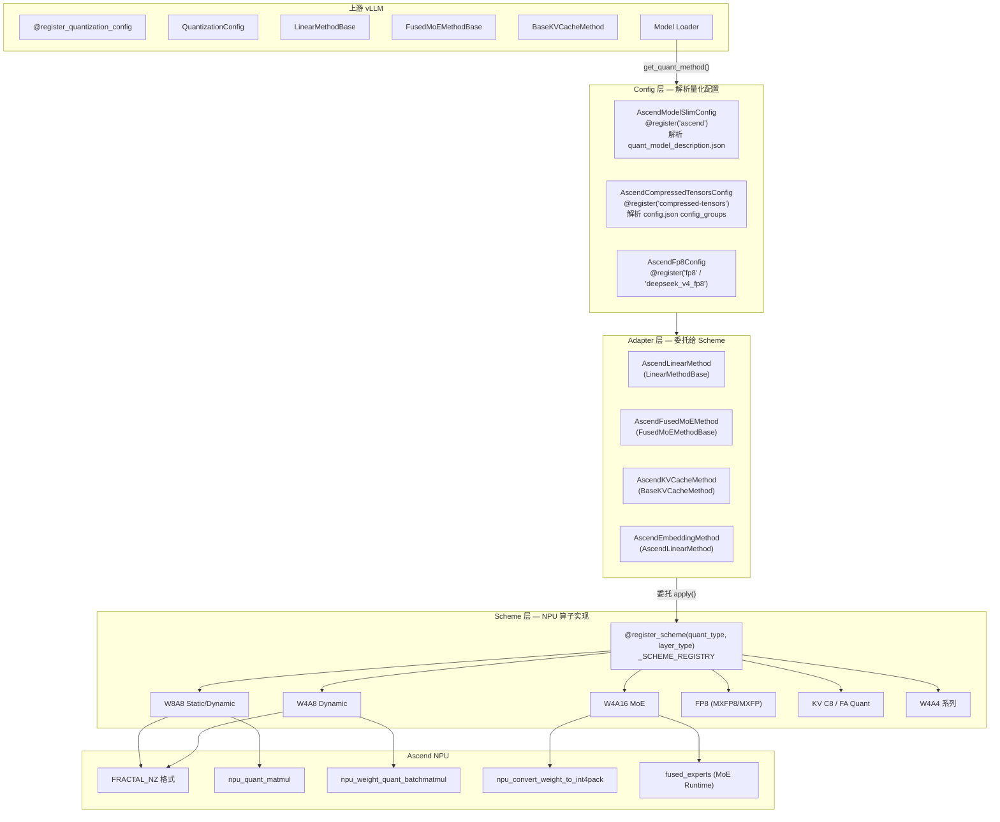
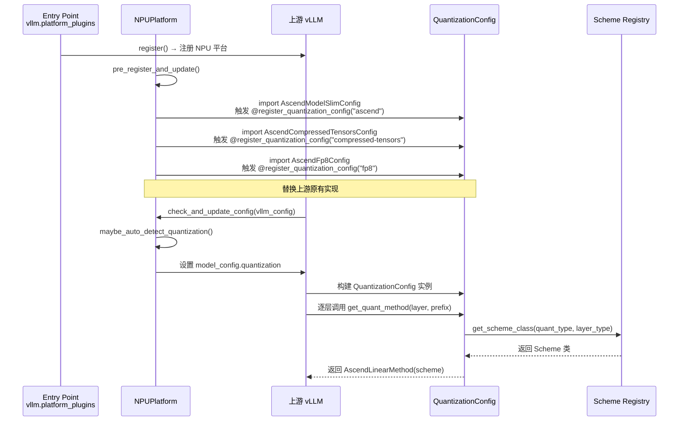
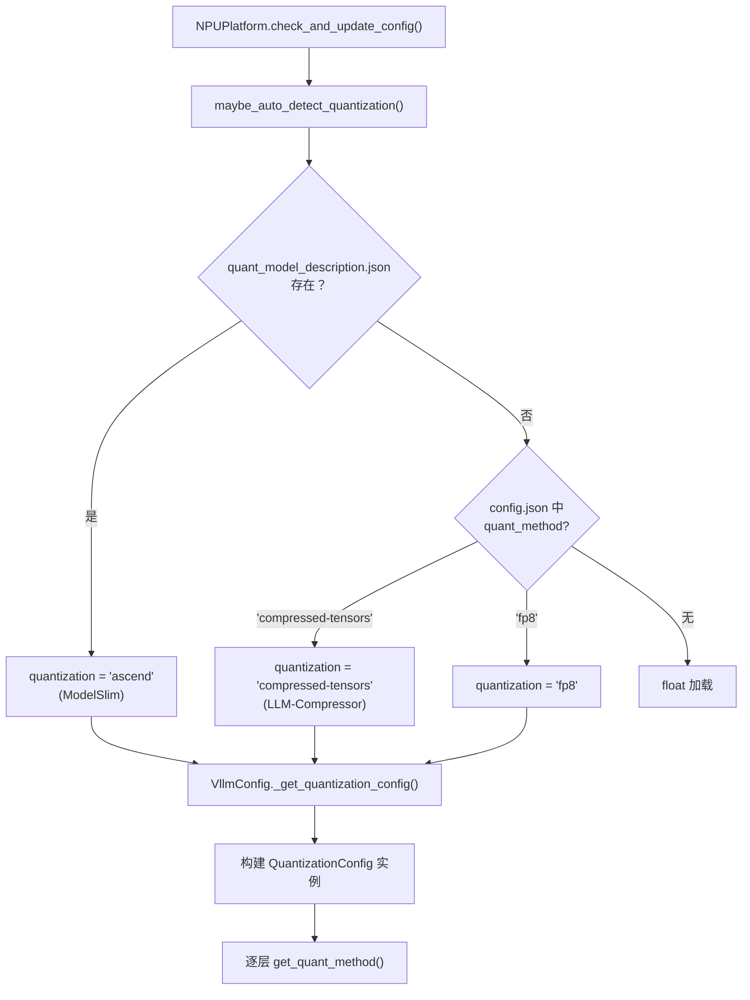
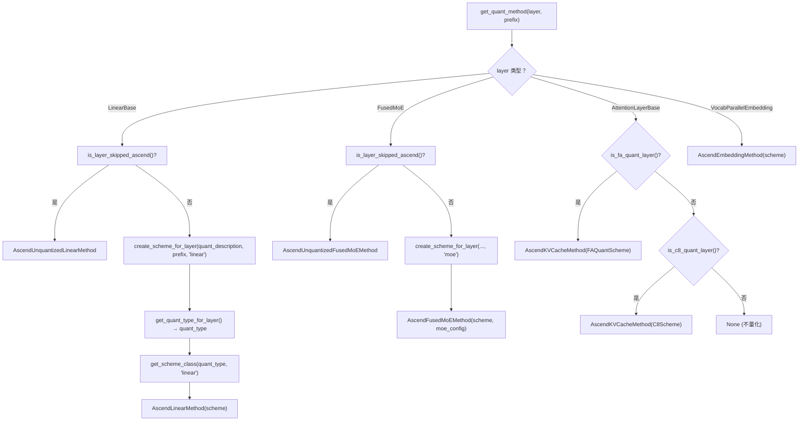

# vLLM Ascend 量化系统特性学习文档

> **文档版本**: 1.0
> **分析代码版本**: vllm-ascend main 分支（截至 2025-06）
> **最后更新**: 2025-06-10

---

## 文档概述

本文档深入分析 vllm-ascend 的量化推理系统。vllm-ascend 通过三层架构（Config → Adapter → Scheme）将上游 vLLM 的量化框架与 Ascend NPU 的硬件算子对接，支持 W8A8、W4A8、W4A16、FP8、KV C8 等多种量化方案。

**目标读者**：
- 需要在 Ascend NPU 上部署量化模型的工程师
- 需要为 vllm-ascend 适配新量化方案的开发者
- 希望理解 NPU 量化推理全链路的系统工程师

**阅读指南**：
- 第一部分：了解为什么需要 NPU 量化以及与 GPU 版的差异
- 第二部分：理解插件如何注册到上游 vLLM
- 第三部分：深入源码实现，追踪从启动到推理的完整路径
- 第四部分：配置参数和使用指南

---

# 第一部分: 量化系统基础与背景

## 1.1 问题背景与动机

### 1.1.1 为什么需要 NPU 量化

大语言模型推理面临两大瓶颈：**内存带宽**和**计算吞吐**。量化通过降低权重和激活的数值精度（如 FP16 → INT8/INT4），直接减少显存占用和计算量：

- **W8A8**：权重 INT8 + 激活 INT8，内存减半，计算吞吐翻倍
- **W4A8/W4A16**：权重 INT4，内存降至 1/4，适合超大 MoE 模型（如 Kimi-K2、DeepSeek-V3）
- **KV C8**：KV Cache INT8 量化，减少 Decode 阶段的显存压力

Ascend NPU 的 Cube 单元原生支持 INT8/INT4 矩阵乘，配合专用量化算子（`torch_npu.npu_quant_matmul`、`torch_npu.npu_weight_quant_batchmatmul`），可以在几乎不损失精度的前提下获得显著加速。

### 1.1.2 与上游 vLLM / GPU 版的差异

| 维度 | GPU (vLLM) | NPU (vllm-ascend) |
|------|-----------|-------------------|
| 量化注册 | 内置 30+ 量化方法（AWQ、GPTQ、FP8 等） | 通过 `@register_quantization_config` 替换/新增 3 个 Config |
| 量化算子 | CUTLASS、Marlin、AWQ kernel | `torch_npu.npu_quant_matmul`、`npu_weight_quant_batchmatmul` |
| 权重格式 | 标准 PyTorch tensor | FRACTAL_NZ 矩阵格式（NPU 专用） |
| INT4 打包 | `torch.uint8` 或 Marlin 格式 | `torch.int32`（8 个 int4 打包到 1 个 int32） |
| 量化工具 | GPTQ、AWQ、LLM-Compressor | ModelSlim（Ascend 原生）+ LLM-Compressor |
| 图优化 | CUDA Graph | ACL Graph（`torch.npu.NPUGraph`） |
| KV Cache 量化 | FP8 KV Cache | INT8 KV Cache（C8）+ FA Quant |

> **关键洞察**: vllm-ascend 没有从零构建量化框架，而是利用上游 vLLM 的 `@register_quantization_config` 机制替换了 `compressed-tensors`、`fp8` 和 `ascend` 三个量化 Config 的实现，将 NPU 算子透明注入到 vLLM 的模型加载流程中。

## 1.2 核心概念与原理

### 1.2.1 基本思想

vllm-ascend 量化系统采用**三层分离架构**：

1. **Config 层**：解析量化配置文件（`quant_model_description.json` 或 `config.json`），决定每个层使用哪种量化方案
2. **Adapter 层**：继承上游 vLLM 的 `LinearMethodBase`/`FusedMoEMethodBase`/`BaseKVCacheMethod`，将调用委托给 Scheme
3. **Scheme 层**：实际的量化实现，包含权重创建、格式转换和 NPU 算子调用

### 1.2.2 关键术语

| 术语 | 说明 |
|------|------|
| **QuantType** | 量化类型枚举（W8A8、W4A8、W4A16 等），用于 MoE Scheme 分发 |
| **Scheme Registry** | `(quant_type, layer_type) → SchemeClass` 的全局注册表 |
| **quant_description** | ModelSlim 生成的量化描述字典，记录每个权重的量化类型 |
| **packed_modules_model_mapping** | 融合模块映射（qkv_proj → [q_proj, k_proj, v_proj]） |
| **FRACTAL_NZ** | Ascend NPU 的矩阵存储格式，优化 Cube 单元的计算效率 |
| **process_weights_after_loading** | 权重加载后的格式转换（transpose、NZ cast、int4 pack） |

## 1.3 整体架构

### 1.3.1 系统架构总览图



### 1.3.2 核心组件与职责

| 组件 | 文件 | 职责 |
|------|------|------|
| `AscendModelSlimConfig` | `modelslim_config.py` | 解析 ModelSlim 的 `quant_model_description.json`，为 20+ 模型架构维护融合模块映射 |
| `AscendCompressedTensorsConfig` | `compressed_tensors_config.py` | 解析 LLM-Compressor 的 `config.json`，从 `QuantizationArgs` 推断量化类型 |
| `AscendFp8Config` | `fp8_config.py` | 处理 FP8 和 DeepSeek V4 FP8 量化 |
| `AscendLinearMethod` | `method_adapters.py:37` | 继承 `LinearMethodBase`，委托 `create_weights`/`apply` 给 Scheme |
| `AscendFusedMoEMethod` | `method_adapters.py:201` | 继承 `FusedMoEMethodBase`，支持 EPLB 和 MC2 |
| `Scheme Registry` | `methods/registry.py` | `(quant_type, layer_type) → SchemeClass` 全局注册表 |
| `detect_quantization_method()` | `utils.py:83` | 自动检测模型的量化方法 |

### 1.3.3 与 vLLM 上游的集成关系



---

# 第二部分: 插件集成机制分析

## 2.1 Entry Point 注册流程

vllm-ascend 通过 `setup.py` 的 `entry_points` 注册为 vLLM 的平台插件：

```python
# 文件: setup.py
entry_points={
    "vllm.platform_plugins": ["ascend = vllm_ascend:register"],
}
```

当 vLLM 启动时，`register()` 函数被调用，注册 `NPUPlatform` 作为当前平台。随后 `NPUPlatform.pre_register_and_update()` 触发量化 Config 的注册：

```python
# 文件: vllm_ascend/platform.py:153
@classmethod
def pre_register_and_update(cls, parser=None):
    from vllm_ascend.utils import adapt_patch
    adapt_patch(is_global_patch=True)

    # 将 "ascend" 添加到 --quantization 的可选列表
    if parser is not None:
        quant_action = parser._option_string_actions.get("--quantization")
        if quant_action and hasattr(quant_action, "choices"):
            if ASCEND_QUANTIZATION_METHOD not in quant_action.choices:
                quant_action.choices.append(ASCEND_QUANTIZATION_METHOD)

    # import 触发 @register_quantization_config
    if not is_310p():
        from vllm_ascend.quantization import (
            AscendCompressedTensorsConfig,
            AscendFp8Config,
            AscendModelSlimConfig,
        )
```

> **关键洞察**: 这里使用了一个巧妙的设计——import 语句本身就是注册的触发器。`@register_quantization_config("ascend")` 装饰器在模块被 import 时执行，将 `AscendModelSlimConfig` 注册到上游 vLLM 的 `_CUSTOMIZED_METHOD_TO_QUANT_CONFIG` 字典中，**覆盖**上游原有的实现。

## 2.2 Config 替换机制

### 2.2.1 compressed-tensors 替换

上游 vLLM 内置了 `CompressedTensorsConfig`。vllm-ascend 通过先移除再注册的方式替换：

```python
# 文件: vllm_ascend/quantization/compressed_tensors_config.py:42
def _remove_quantization_method():
    if COMPRESSED_TENSORS_METHOD in QUANTIZATION_METHODS:
        QUANTIZATION_METHODS.remove(COMPRESSED_TENSORS_METHOD)

_remove_quantization_method()

@register_quantization_config(COMPRESSED_TENSORS_METHOD)
class AscendCompressedTensorsConfig(QuantizationConfig):
    ...
```

### 2.2.2 fp8 替换

FP8 采用相同策略，同时注册了 `fp8` 和 `deepseek_v4_fp8` 两个方法名：

```python
# 文件: vllm_ascend/quantization/fp8_config.py:18
def remove_quantization_method():
    if FP8_METHOD in QUANTIZATION_METHODS:
        QUANTIZATION_METHODS.remove(FP8_METHOD)
    if "deepseek_v4_fp8" in QUANTIZATION_METHODS:
        QUANTIZATION_METHODS.remove("deepseek_v4_fp8")

remove_quantization_method()

@register_quantization_config(FP8_METHOD)
class AscendFp8Config(QuantizationConfig):
    ...

# 复用同一 Config 类
register_quantization_config("deepseek_v4_fp8")(AscendFp8Config)
```

### 2.2.3 ascend 新增

`ascend` 是 vllm-ascend 独有的量化方法名，上游不存在，直接注册：

```python
# 文件: vllm_ascend/quantization/modelslim_config.py:401
@register_quantization_config(ASCEND_QUANTIZATION_METHOD)  # "ascend"
class AscendModelSlimConfig(QuantizationConfig):
    ...
```

## 2.3 Scheme 注册机制

Scheme 层使用独立的注册表，与上游 vLLM 完全解耦：

```python
# 文件: vllm_ascend/quantization/methods/registry.py
_SCHEME_REGISTRY: dict[tuple[str, str], type[Any]] = {}

def register_scheme(quant_type: str, layer_type: str):
    def decorator(cls):
        key = (quant_type, layer_type)
        if key in _SCHEME_REGISTRY:
            raise ValueError(f"Scheme already registered for {quant_type}/{layer_type}")
        _SCHEME_REGISTRY[key] = cls
        return cls
    return decorator

def get_scheme_class(quant_type: str, layer_type: str):
    return _SCHEME_REGISTRY.get((quant_type, layer_type))
```

当前注册的 Scheme 完整映射表：

| quant_type | linear | moe | attention |
|-----------|--------|-----|-----------|
| `W8A8` | `AscendW8A8LinearMethod` | — | — |
| `W8A8_DYNAMIC` | `AscendW8A8DynamicLinearMethod` | `AscendW8A8DynamicFusedMoEMethod` | — |
| `W8A8_MXFP8` | `AscendW8A8MXFP8DynamicLinearMethod` | — | — |
| `W8A8_PDMIX` | `AscendW8A8PDMixLinearMethod` | `AscendW8A8PDMixFusedMoeMethod` | — |
| `W8A16` | `AscendW8A16LinearMethod` | — | — |
| `W4A8_DYNAMIC` | `AscendW4A8DynamicLinearMethod` | `AscendW4A8DynamicFusedMoEMethod` | — |
| `W4A8_MXFP` | `AscendW4A8MXFPDynamicLinearMethod` | `AscendW4A8MXFPDynamicFusedMoEMethod` | — |
| `W4A16` | — | `AscendW4A16FusedMoEMethod` | — |
| `W4A4_FLATQUANT_DYNAMIC` | `AscendW4A4FlatQuantDynamicLinearMethod` | — | — |
| `W4A4_LAOS_DYNAMIC` | `AscendW4A4LaosDynamicLinearMethod` | — | — |
| `W4A4_MXFP4` | `AscendW4A4MXFP4DynamicLinearMethod` | `AscendW4A4MXFP4DynamicFusedMoEMethod` | — |
| `W4A4_MXFP4_FLATQUANT` | `AscendW4A4MXFP4FlatQuantDynamicLinearMethod` | — | — |
| `FP8` | `AscendW8A8MXFP8DSDynamicLinearMethod` (ds_linear) | `AscendW4A8MXFPDSDynamicFusedMoEMethod` (w4a8_moe) | — |
| `FAKQuant` | — | — | `AscendFAQuantAttentionMethod` |
| `INT8_DYNAMIC` | — | — | `AscendSFAQuantAttentionMethod` |

---

# 第三部分: 核心实现深度分析

## 3.1 关键数据结构

### 3.1.1 QuantType 枚举

```python
# 文件: vllm_ascend/quantization/quant_type.py
class QuantType(Enum):
    NONE = 0
    W8A8 = 1
    W4A8 = 2
    MXFP8 = 3
    W4A16 = 4
    MXFP4 = 5
    W4A8MXFP = 6
```

`QuantType` 主要用于 MoE Scheme 的 `quant_type` 属性声明，MoE runtime 根据此值选择正确的算子路径。

### 3.1.2 Scheme 抽象基类

```python
# 文件: vllm_ascend/quantization/methods/base.py

class AscendLinearScheme(ABC):
    @abstractmethod
    def get_weight(self, input_size, output_size, params_dtype) -> dict[str, Any]: ...
    def get_pertensor_param(self, params_dtype, **kwargs) -> dict[str, Any]: return {}
    def get_perchannel_param(self, output_size, params_dtype) -> dict[str, Any]: return {}
    def get_pergroup_param(self, input_size, output_size, params_dtype, ...) -> dict[str, Any]: return {}
    @abstractmethod
    def apply(self, layer, x, bias=None, tp_rank=0) -> torch.Tensor: ...
    def process_weights_after_loading(self, layer) -> None: return

class AscendMoEScheme(ABC):
    quant_type: QuantType = QuantType.NONE
    @abstractmethod
    def get_weight(self, num_experts, intermediate_size, hidden_sizes, dtype) -> dict: ...
    @abstractmethod
    def get_dynamic_quant_param(self, num_experts, intermediate_size, hidden_sizes, dtype) -> dict: ...
    @abstractmethod
    def apply(self, layer, x, router_logits, top_k, ...) -> torch.Tensor: ...
    def process_weights_after_loading(self, layer) -> None: return

class AscendAttentionScheme(ABC):
    def create_weights(self, layer) -> None: return
    def process_weights_after_loading(self, layer) -> None: return
    @abstractmethod
    def apply(self, layer, query, key, value, kv_cache, ...) -> torch.Tensor: ...
```

### 3.1.3 Adapter 委托模式

```python
# 文件: vllm_ascend/quantization/method_adapters.py:37
class AscendLinearMethod(LinearMethodBase):
    def __init__(self, scheme: AscendLinearScheme):
        self.quant_method = scheme  # 持有 Scheme 实例

    def create_weights(self, layer, ...):
        # 依次调用 scheme 的 get_weight/get_pertensor/get_perchannel/get_pergroup
        weight_dict = self.quant_method.get_weight(...)
        pertensor_dict = self.quant_method.get_pertensor_param(...)
        perchannel_dict = self.quant_method.get_perchannel_param(...)
        pergroup_dict = self.quant_method.get_pergroup_param(...)

    def apply(self, layer, x, bias=None):
        return self.quant_method.apply(layer, x, bias, tp_rank)
```

## 3.2 核心算法流程

### 3.2.1 量化方法自动检测



### 3.2.2 get_quant_method 分发流程

以 `AscendModelSlimConfig` 为例：



## 3.3 源码走读

### 3.3.1 W8A8 Dynamic Linear — 最典型的量化实现

```python
# 文件: vllm_ascend/quantization/methods/w8a8_dynamic.py:48

@register_scheme("W8A8_DYNAMIC", "linear")
class AscendW8A8DynamicLinearMethod(AscendLinearScheme):
    def get_weight(self, input_size, output_size, params_dtype):
        # 权重存储为 INT8
        return {"weight": torch.empty(output_size, input_size, dtype=torch.int8)}

    def get_perchannel_param(self, output_size, params_dtype):
        # 每通道 scale 和 offset
        return {
            "weight_scale": torch.empty(output_size, 1, dtype=params_dtype),
            "weight_offset": torch.empty(output_size, 1, dtype=params_dtype),
        }

    def apply(self, layer, x, bias=None, tp_rank=0):
        # Step 1: 动态量化激活 → per-token scale
        quantized_x, pertoken_scale = torch_npu.npu_dynamic_quant(x)
        # Step 2: NPU 量化矩阵乘
        output = torch_npu.npu_quant_matmul(
            quantized_x, layer.weight, layer.weight_scale,
            pertoken_scale=pertoken_scale, bias=bias, output_dtype=x.dtype,
        )
        return output

    def process_weights_after_loading(self, layer):
        # 转置 + NZ 格式转换
        layer.weight.data = layer.weight.data.transpose(0, 1).contiguous()
        layer.weight.data = maybe_trans_nz(layer.weight.data)
        layer.weight_scale.data = layer.weight_scale.data.flatten()
```

> **NPU 差异**: GPU 版的 W8A8 使用 CUTLASS 的 `cutlass_w8a8_scaled_mm`，而 NPU 使用 `torch_npu.npu_quant_matmul`。NPU 还需要将权重转换为 FRACTAL_NZ 格式以获得最佳 Cube 单元利用率。

### 3.3.2 W4A8 Dynamic Linear — 二级量化

W4A8 使用**二级量化**（two-level quantization）：先 per-channel 量化，再 per-group 细化：

```python
# 文件: vllm_ascend/quantization/methods/w4a8.py:38

@register_scheme("W4A8_DYNAMIC", "linear")
class AscendW4A8DynamicLinearMethod(AscendLinearScheme):
    def __init__(self):
        self.group_size = vllm_config.quant_config.quant_description.get("group_size", 256)
        self.new_quant_version = quant_version == "1.0.0"  # 新版打包格式

    def apply(self, layer, x, bias=None, tp_rank=None):
        # 使用 npu_weight_quant_batchmatmul 进行 W4A8 推理
        return torch_npu.npu_weight_quant_batchmatmul(
            x, layer.weight,
            antiquant_scale=layer.weight_scale_second.to(x.dtype),
            antiquant_group_size=self.group_size,
        )

    def process_weights_after_loading(self, layer):
        layer.weight.data = layer.weight.data.transpose(0, 1).contiguous()
        layer.weight.data = maybe_trans_nz(layer.weight.data)
        # 二级 scale 合并
        layer.weight_scale_second.data, scale_bias = self.process_scale_second(...)
        # INT4 打包
        layer.weight.data = torch_npu.npu_convert_weight_to_int4pack(layer.weight.data.to(torch.int32))
```

### 3.3.3 W4A16 MoE — LLM-Compressor 格式

W4A16 当前仅支持 MoE 层，针对 Kimi-K2 等模型：

```python
# 文件: vllm_ascend/quantization/methods/w4a16.py:111

@register_scheme("W4A16", "moe")
class AscendW4A16FusedMoEMethod(AscendMoEScheme):
    quant_type: QuantType = QuantType.W4A16

    def apply(self, layer, x, router_logits, top_k, ...):
        topk_weights, topk_ids = select_experts(...)
        moe_comm_method = _EXTRA_CTX.moe_comm_method
        return moe_comm_method.fused_experts(
            fused_experts_input=build_fused_experts_input(
                hidden_states=x, topk_weights=topk_weights, topk_ids=topk_ids,
                w1=layer.w13_weight_packed, w2=layer.w2_weight_packed,
                quant_type=self.quant_type,
                w1_scale=layer.w13_weight_scale, w2_scale=layer.w2_weight_scale,
                w1_offset=layer.w13_weight_offset, w2_offset=layer.w2_weight_offset,
                ...
            )
        )
```

### 3.3.4 W8A8 Dynamic MoE — 完整 MoE 量化流程

W8A8 Dynamic MoE 是最完整的 MoE 量化实现，包含 EPLB、MC2、FlashComm3 等高级特性：

```python
# 文件: vllm_ascend/quantization/methods/w8a8_dynamic.py:152

@register_scheme("W8A8_DYNAMIC", "moe")
class AscendW8A8DynamicFusedMoEMethod(AscendMoEScheme):
    quant_type: QuantType = QuantType.W8A8

    def apply(self, layer, x, router_logits, top_k, ...):
        # 1. 专家选择
        topk_weights, topk_ids = select_experts(...)
        # 2. 通过 MoE runtime 执行融合推理
        moe_comm_method = _EXTRA_CTX.moe_comm_method
        final_hidden_states = moe_comm_method.fused_experts(
            fused_experts_input=build_fused_experts_input(
                hidden_states=x, topk_weights=topk_weights, topk_ids=topk_ids,
                w1=[layer.w13_weight], w2=[layer.w2_weight],
                quant_type=self.quant_type,
                w1_scale=[layer.w13_weight_scale_fp32],
                w2_scale=[layer.w2_weight_scale],
                ...
            )
        )
        return final_hidden_states

    def process_weights_after_loading(self, layer):
        # 转置 + NZ 格式转换
        layer.w13_weight.data = layer.w13_weight.data.transpose(1, 2).contiguous()
        layer.w13_weight.data = torch_npu.npu_format_cast(layer.w13_weight.data, ACL_FORMAT_FRACTAL_NZ)
        # EPLB: 将权重拆分为 per-expert 列表
        if self.dynamic_eplb:
            layer.w13_weight_list = [w.clone() for w in layer.w13_weight.data.unbind(dim=0)]
            ...
```

### 3.3.5 KV C8 — INT8 KV Cache 量化

```python
# 文件: vllm_ascend/quantization/methods/kv_c8.py:108

class AscendC8KVCacheAttentionMethod(AscendAttentionScheme):
    def create_weights(self, layer):
        # 设置 KV Cache 为 INT8
        if not self.is_kv_producer:
            layer.kv_cache_torch_dtype = torch.int8
        # 注册 scale/offset 参数
        layer.k_cache_scale = torch.nn.Parameter(torch.ones(1, dtype=dtype))
        layer.k_cache_offset = torch.nn.Parameter(torch.zeros(1, dtype=dtype))
        layer.v_cache_scale = torch.nn.Parameter(torch.ones(1, dtype=dtype))
        layer.v_cache_offset = torch.nn.Parameter(torch.zeros(1, dtype=dtype))
```

## 3.4 NPU 特有优化

### 3.4.1 FRACTAL_NZ 矩阵格式

Ascend NPU 的 Cube 单元要求矩阵以 FRACTAL_NZ 格式存储。`maybe_trans_nz()` 函数在权重加载后自动转换：

```python
# 文件: vllm_ascend/utils.py:246
def maybe_trans_nz(weight: torch.Tensor) -> torch.Tensor:
    return torch_npu.npu_format_cast(weight, ACL_FORMAT_FRACTAL_NZ)
```

> **NPU 差异**: GPU 版不需要任何特殊的矩阵格式转换。NPU 的 FRACTAL_NZ 将矩阵的最后两个维度重新排列为分块格式，以匹配 Cube 单元的计算模式。

### 3.4.2 INT4 权重打包

NPU 使用 `torch.int32` 存储 INT4 权重（8 个 int4 打包到 1 个 int32）：

```python
# 文件: vllm_ascend/quantization/methods/w4a16.py:85
def pack_to_int32(weight: torch.Tensor) -> torch.Tensor:
    if weight.dtype == torch.int32:
        packed_weight = torch_npu.npu_convert_weight_to_int4pack(weight.flatten(0, 1))
        packed_weight = packed_weight.view(weight.shape[0], weight.shape[1], -1)
    else:
        packed_weight = weight.view(torch.int32).contiguous()
    return packed_weight
```

### 3.4.3 Scale 的 int64 表示

W8A8 MoE 的 scale 需要转换为 int64 位表示（reinterpret float32 bits as int64），以匹配 NPU 融合算子的输入要求：

```python
# 文件: vllm_ascend/quantization/methods/w8a8_dynamic.py:38
def scale_from_float_to_int64(scale):
    scale = torch.from_numpy(
        np.frombuffer(scale.cpu().to(torch.float32).numpy().tobytes(),
                      dtype=np.int32).astype(np.int64)
    ).to(scale.device)
    return scale
```

### 3.4.4 DSA CP 大维度 chunk 拆分

当 DSA (DeepSeek Sparse Attention) 的权重维度超过 65536 时，`npu_quant_matmul` 无法处理，需要拆分为两个 chunk：

```python
# 文件: vllm_ascend/quantization/methods/w8a8_dynamic.py:127
if "wq_b" in getattr(layer, "prefix", "") and layer.weight.shape[1] >= 65536 and enable_dsa_cp():
    chunk_size = layer.weight.shape[1] // 2
    layer.weight_1 = maybe_trans_nz(layer.weight.data[:, :chunk_size].contiguous())
    layer.weight_2 = maybe_trans_nz(layer.weight.data[:, chunk_size:].contiguous())
```

---

# 第四部分: 配置与使用指南

## 4.1 环境变量与配置参数

### 4.1.1 启动参数

| 参数 | 说明 | 示例 |
|------|------|------|
| `--quantization ascend` | 指定 ModelSlim 量化（必须） | `vllm serve model --quantization ascend` |
| `--quantization compressed-tensors` | LLM-Compressor 量化（通常自动检测） | 自动检测，无需手动指定 |
| `--quantization fp8` | FP8 量化 | `vllm serve model --quantization fp8` |
| `--tensor-parallel-size` | TP 并行度 | `--tensor-parallel-size 4` |

### 4.1.2 相关环境变量

| 环境变量 | 默认值 | 说明 |
|---------|--------|------|
| `VLLM_ASCEND_ENABLE_NZ` | `1` | 启用 FRACTAL_NZ 权重格式转换 |
| `VLLM_ASCEND_ENABLE_FUSED_MC2` | `0` | 启用 MC2 融合 MoE dispatch/combine 算子 |
| `VLLM_ASCEND_FLASHCOMM2_PARALLEL_SIZE` | `0` | FlashComm2 O-matrix TP 分组大小 |

### 4.1.3 AscendConfig 量化相关参数

| 参数 | 类型 | 默认值 | 说明 |
|------|------|--------|------|
| `enable_fused_mc2` | int | 0 | 启用 MC2 融合 MoE 算子 |
| `eplb_config.dynamic_eplb` | bool | False | 启用动态专家级负载均衡 |
| `multistream_overlap_gate` | bool | False | MoE gate 与计算多流重叠 |
| `enable_flashcomm1` | bool | False | 启用 FlashComm1 通信优化 |

## 4.2 典型使用场景

### 4.2.1 ModelSlim 量化模型推理

```bash
# ModelSlim 量化后的模型包含 quant_model_description.json
vllm serve /path/to/modelslim_quantized_model \
    --quantization ascend \
    --tensor-parallel-size 4 \
    --max-model-len 8192
```

### 4.2.2 LLM-Compressor 量化模型推理

```bash
# LLM-Compressor 模型自动检测，无需 --quantization 参数
vllm serve /path/to/llm_compressor_model \
    --tensor-parallel-size 2 \
    --max-model-len 4096
```

### 4.2.3 在线量化（ModelSlim）

```python
# 文件: vllm_ascend/quantization/utils.py:141
def maybe_auto_detect_quantization(vllm_config):
    detected = detect_quantization_method(model, revision)
    if detected is None:
        return  # float 加载
    if user_quant is not None:
        return  # 用户显式指定，尊重用户选择
    # 自动设置量化方法
    model_config.quantization = detected
    vllm_config.quant_config = _VllmConfig._get_quantization_config(model_config, load_config)
```

## 4.3 性能调优建议

| 优化项 | 建议 | 说明 |
|--------|------|------|
| NZ 格式 | 保持 `VLLM_ASCEND_ENABLE_NZ=1` | NZ 格式可显著提升 Cube 单元利用率 |
| MC2 融合 | MoE 模型启用 `VLLM_ASCEND_ENABLE_FUSED_MC2=1` | 减少 all-to-all 通信开销 |
| EPLB | 开启 `dynamic_eplb` | 避免 MoE 专家负载不均衡导致的 bubble |
| 动态量化 | 优先使用 W8A8_DYNAMIC 而非 W8A8 | per-token 动态量化精度更高 |
| ACL Graph | 配合 `--enforce-eager=False` | 量化推理可被 ACL Graph 捕获，减少 launch 开销 |

## 4.4 已知限制与注意事项

1. **W4A16 仅支持 MoE 层**：当前 `AscendW4A16FusedMoEMethod` 已实现，但 Linear 层的 W4A16 Scheme 缺失
2. **`npu_quant_matmul` 维度限制**：权重维度 ≥ 65536 时需要 chunk 拆分（DSA CP 场景）
3. **ModelSlim packed_modules_model_mapping**：新模型架构需要在 `modelslim_config.py` 中手动添加融合模块映射
4. **310P 独立实现**：310P 芯片有独立的 `AscendModelSlimConfig310`，位于 `vllm_ascend/_310p/quantization/`
5. **Speculative decoding 量化继承**：MTP/Draft model 自动继承主模型的量化方法，不支持独立配置

---

# 附录

## A. 关键代码位置索引

| 组件 | 文件路径 | 行数 |
|------|---------|------|
| 量化模块入口 | `vllm_ascend/quantization/__init__.py` | 47 |
| ModelSlim Config | `vllm_ascend/quantization/modelslim_config.py` | 839 |
| CompressedTensors Config | `vllm_ascend/quantization/compressed_tensors_config.py` | 429 |
| FP8 Config | `vllm_ascend/quantization/fp8_config.py` | 125 |
| Adapter 层 | `vllm_ascend/quantization/method_adapters.py` | 324 |
| Scheme 注册表 | `vllm_ascend/quantization/methods/registry.py` | 62 |
| Scheme 基类 | `vllm_ascend/quantization/methods/base.py` | 298 |
| W8A8 Dynamic | `vllm_ascend/quantization/methods/w8a8_dynamic.py` | 391 |
| W4A8 Dynamic | `vllm_ascend/quantization/methods/w4a8.py` | 777 |
| W4A16 MoE | `vllm_ascend/quantization/methods/w4a16.py` | 364 |
| FP8 (DS) | `vllm_ascend/quantization/methods/fp8.py` | 130 |
| KV C8 | `vllm_ascend/quantization/methods/kv_c8.py` | 164 |
| QuantType 枚举 | `vllm_ascend/quantization/quant_type.py` | 35 |
| 自动检测 | `vllm_ascend/quantization/utils.py` | 226 |
| MXFP 解析 | `vllm_ascend/quantization/quant_parser.py` | 73 |
| Platform 注册 | `vllm_ascend/platform.py:153` | — |
| 310P Config | `vllm_ascend/_310p/quantization/modelslim_config.py` | — |

## B. 术语表

| 术语 | 英文 | 说明 |
|------|------|------|
| 量化 | Quantization | 将浮点权重/激活转换为低精度整数表示 |
| 动态量化 | Dynamic Quantization | 运行时计算 per-token scale，精度更高但开销略大 |
| 静态量化 | Static Quantization | 使用预计算的 scale，推理更快 |
| 二级量化 | Two-level Quantization | 先 per-channel 再 per-group 的两级 scale |
| 权重量化 | Weight-only Quantization | 仅量化权重（如 W4A16），激活保持浮点 |
| 融合模块 | Packed/Fused Modules | qkv_proj、gate_up_proj 等融合层 |
| 专家级负载均衡 | Expert-Level Load Balancing (EPLB) | MoE 中动态平衡各专家负载 |
| 反量化 scale | Antiquant Scale | 从量化值恢复浮点值的缩放因子 |
| 打包因子 | Pack Factor | 多个低精度值打包到一个高精度容器中的数量 |

## C. 适配新量化方案 Checklist

| 步骤 | 文件 | 操作 |
|------|------|------|
| ① | `quant_type.py` | 在 `QuantType` 枚举中添加新类型 |
| ② | `methods/xxx.py` | 实现 Scheme 类（继承 ABC，实现 `get_weight()` + `apply()`） |
| ③ | `methods/xxx.py` | 使用 `@register_scheme(quant_type, layer_type)` 注册 |
| ④ | `methods/__init__.py` | 添加 import 和 `__all__` 导出 |
| ⑤ | `compressed_tensors_config.py` | 在 `_detect_quant_type()` 中添加检测逻辑（如适用） |
| ⑥ | `modelslim_config.py` | 确认 ModelSlim 标识匹配（如适用） |
| ⑦ | `modelslim_config.py` | 添加 `packed_modules_model_mapping`（新模型架构） |
| ⑧ | `apply()` | 使用 `torch_npu` 算子，避免 NPU 性能陷阱 |
| ⑨ | `process_weights_after_loading()` | 完成权重格式转换（NZ cast、int4 pack） |
| ⑩ | — | 运行 `bash format.sh ci` + `mypy --config-file mypy.ini vllm_ascend/` |
