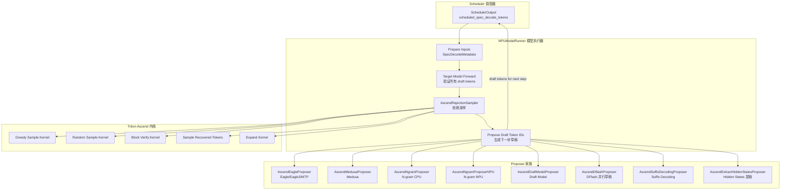
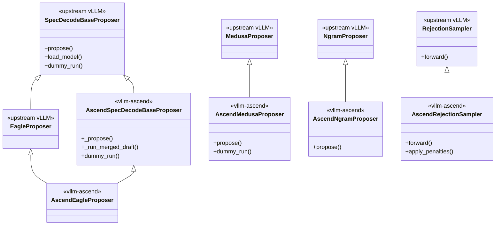
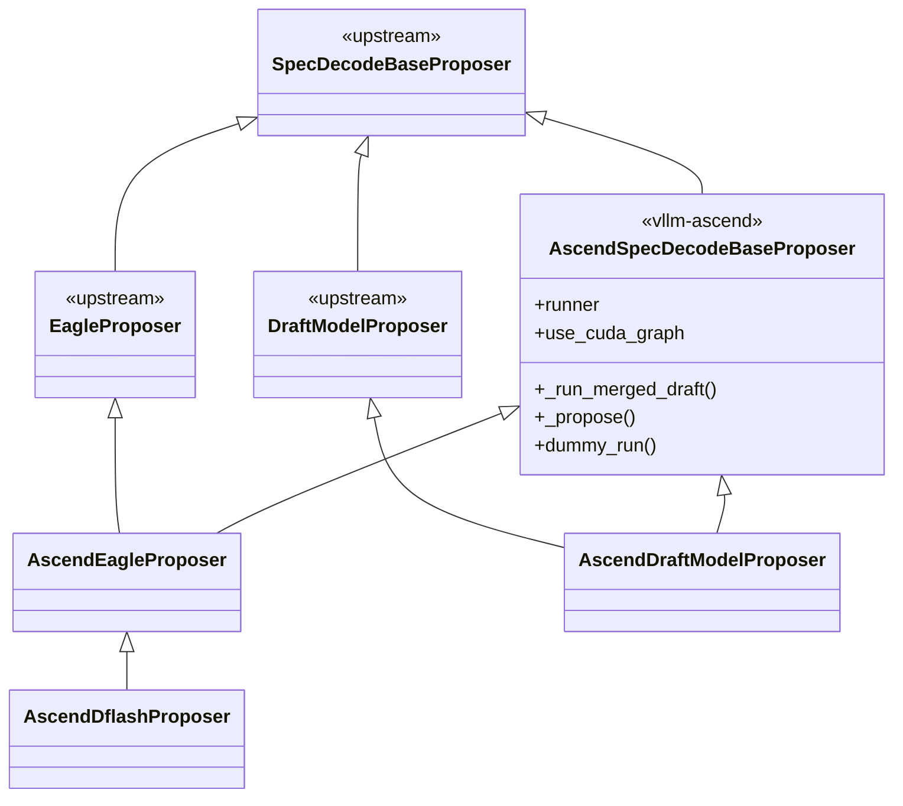
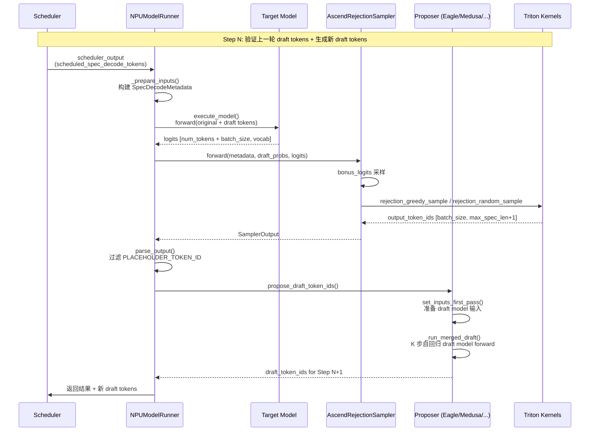
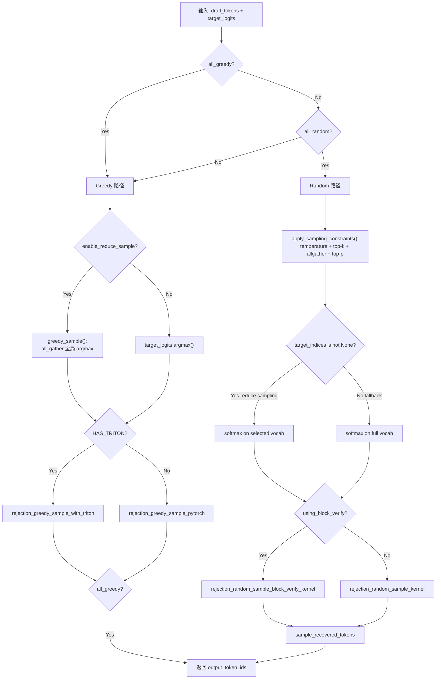

# vLLM Ascend 投机解码（Speculative Decoding）特性学习文档

> **文档版本**: 1.0
> **分析代码版本**: vllm-ascend main 分支（截至 2025-06）
> **最后更新**: 2025-06-11

---

## 文档概述

本文档深入分析 vllm-ascend 中投机解码（Speculative Decoding）特性的完整实现，涵盖所有 Proposer 类型（Eagle/Eagle3、Medusa、N-gram、DFlash、Draft Model、Suffix Decoding）、NPU 优化的 Rejection Sampler，以及与上游 vLLM GPU 版本的关键差异。

**目标读者**：
- 需要在 Ascend NPU 上部署投机解码的工程师
- 希望理解 vllm-ascend 投机解码架构的开发者
- 需要调试或优化 NPU 投机解码性能的研究人员

**阅读指南**：
- 第一部分介绍投机解码的基本原理和 NPU 适配动机
- 第二部分分析插件如何与上游 vLLM 集成
- 第三部分深入源码走读各 Proposer 和 Rejection Sampler
- 第四部分提供配置参数和使用指南

---

# 第一部分: 投机解码基础与背景

## 1.1 问题背景与动机

### 1.1.1 为什么需要投机解码

LLM 推理的 Decode 阶段是 **memory-bound** 的——每次生成一个 token 都需要完整读取模型权重，但计算量极小。这导致 NPU/GPU 的计算单元大量时间处于空闲状态。

投机解码通过"**用小模型猜、大模型验**"的策略，在一次 target model forward pass 中验证多个 draft token，从而在不牺牲输出质量的前提下，将单步生成的有效 token 数从 1 提升到 K+1（K 为投机长度），显著提升吞吐量。

$$\text{加速比} \approx \frac{\text{每步接受 token 数} \times T_{target}}{T_{target} + K \times T_{draft}}$$

### 1.1.2 与上游 vLLM / GPU 版的差异

| 维度 | GPU (vLLM) | NPU (vllm-ascend) |
|------|-----------|-------------------|
| 图优化 | CUDA Graph (`torch.cuda.CUDAGraph`) | ACL Graph (`torch.npu.NPUGraph` via `ACLGraphWrapper`) |
| Triton 内核 | 标准 Triton (CUDA backend) | Triton-Ascend (NPU backend) + PyTorch fallback |
| Greedy 采样 | 本地 `argmax(dim=-1)` | 分布式 `all_gather` + 全局 argmax（TP 分片词汇表） |
| 拒绝采样优化 | 标准逐 token 拒绝 | Block Verify + Entropy Verify（NPU 独有） |
| 词汇表处理 | 全词汇 softmax | Reduce Sampling（top-k 子集 + all-gather） |
| CPU-NPU 同步 | 标准 CUDA async | `pin_memory` + `non_blocking` 最小化同步 |
| Proposer 类型 | Eagle/Eagle3、DraftModel、Medusa、Ngram、Suffix | 全部支持 + DFlash（NPU 独有并行草稿） |
| 模型特定 Patch | 无 | MTP 模型类型映射、DeepSeek MTP rot 层、Mamba block table 等 |

> **关键洞察**: Ascend NPU 的词汇表在 TP 场景下是分片存储的（每个 rank 持有 `vocab_size // tp_size` 个 logits），因此 greedy 采样不能简单做本地 argmax，需要通过 `all_gather` 收集所有 rank 的局部最大值后做全局比较。这是 NPU 版本与 GPU 版本最核心的差异之一。

## 1.2 核心概念与原理

### 1.2.1 基本思想

投机解码将 LLM 推理分为两个阶段：

1. **Draft（草稿）阶段**：使用轻量级方法快速生成 K 个候选 token
2. **Verify（验证）阶段**：使用 target model 一次性验证所有候选 token
3. **Accept/Reject（接受/拒绝）阶段**：通过 rejection sampling 保证输出分布与直接解码一致

### 1.2.2 关键术语

| 术语 | 含义 |
|------|------|
| **Proposer / Drafter** | 生成候选 token 的模块（Eagle、Medusa、N-gram 等） |
| **Target Model** | 被加速的目标大模型 |
| **Draft Token** | Proposer 生成的候选 token |
| **Bonus Token** | 所有 draft token 都被接受时额外采样的 token |
| **Rejection Sampler** | 验证并决定接受/拒绝 draft token 的模块 |
| **Spec Length (K)** | 每步推测的 token 数量（`num_speculative_tokens`） |
| **Block Verify** | NPU 独有：基于累积概率乘积的块级验证，提升接受率 |
| **Entropy Verify** | NPU 独有：基于目标分布熵的动态阈值调整 |
| **Reduce Sampling** | NPU 独有：top-k 子集上执行拒绝采样，减少全词汇计算开销 |
| **MTP** | Multi-Token Prediction，DeepSeek 系列模型的多 token 预测头 |
| **DFlash** | 并行草稿生成方法，使用 cross-attention 一次性生成所有投机 token |

## 1.3 整体架构

### 1.3.1 系统架构总览图



### 1.3.2 核心组件与职责

| 组件 | 文件 | 职责 |
|------|------|------|
| `get_spec_decode_method` | `spec_decode/__init__.py` | 工厂函数，根据 method 字符串创建对应 Proposer |
| `AscendSpecDecodeBaseProposer` | `spec_decode/llm_base_proposer.py` | 模型类 Proposer 的 NPU 基类（ACL Graph、输入准备、多步执行） |
| `AscendRejectionSampler` | `sample/rejection_sampler.py` | NPU 优化的拒绝采样器 |
| `NPUModelRunner._set_up_drafter` | `worker/model_runner_v1.py` | 初始化 drafter 和 rejection sampler |
| `NPUModelRunner.propose_draft_token_ids` | `worker/model_runner_v1.py` | 协调各 Proposer 生成草稿 token |
| Triton Kernels | `ops/triton/reject_sample.py` | NPU 适配的 Triton 拒绝采样内核 |

### 1.3.3 与 vLLM 上游的集成关系



---

# 第二部分: 插件集成机制分析

## 2.1 Proposer 工厂注册

vllm-ascend 通过 `get_spec_decode_method()` 工厂函数替代上游 vLLM 的 Proposer 创建逻辑。Model Runner 在 `_set_up_drafter()` 中调用此工厂：

```python
# 文件: vllm_ascend/worker/model_runner_v1.py
def _set_up_drafter(self):
    self.drafter = None
    self.decode_token_per_req = 1
    if self.speculative_config:
        spec_token_num = self.speculative_config.num_speculative_tokens
        self.decode_token_per_req = 1 + spec_token_num
        if get_pp_group().is_last_rank:
            self.drafter = self._get_drafter()
            self.rejection_sampler = AscendRejectionSampler(self.sampler)

def _get_drafter(self):
    return get_spec_decode_method(
        self.speculative_config.method,
        self.vllm_config, self.device, self
    )
```

工厂函数支持 8 种 method 类型：

```python
# 文件: vllm_ascend/spec_decode/__init__.py
def get_spec_decode_method(method, vllm_config, device, runner):
    if method == "ngram":
        return AscendNgramProposer(vllm_config, runner)
    elif method == "ngram_gpu":
        return AscendNgramProposerNPU(vllm_config, device, runner)
    elif method == "suffix":
        return AscendSuffixDecodingProposer(vllm_config, runner)
    elif method == "medusa":
        return AscendMedusaProposer(vllm_config, device)
    elif method in ("eagle", "eagle3", "mtp"):
        return AscendEagleProposer(vllm_config, device, runner)
    elif method == "dflash":
        return AscendDflashProposer(vllm_config, device, runner)
    elif method == "draft_model":
        return AscendDraftModelProposer(vllm_config, device, runner)
    elif method == "extract_hidden_states":
        return AscendExtractHiddenStatesProposer(vllm_config, device, runner)
```

## 2.2 Patch 机制

### 2.2.1 Rejection Sampler Patch

vllm-ascend 通过 monkey-patch 替换上游 `rejection_sampler` 模块中的三个关键函数：

```python
# 文件: vllm_ascend/patch/worker/patch_rejection_sampler.py
import vllm.v1.sample.rejection_sampler as rs
from vllm_ascend.sample.rejection_sampler import (
    apply_sampling_constraints,
    expand_batch_to_tokens,
    rejection_sample,
)

rs.apply_sampling_constraints = apply_sampling_constraints
rs.rejection_sample = rejection_sample
rs.expand_batch_to_tokens = expand_batch_to_tokens
```

> **为什么 patch 模块级函数而非类方法？** 上游 vLLM 的 `RejectionSampler.forward()` 内部调用了模块级函数 `rejection_sample()`、`apply_sampling_constraints()` 和 `expand_batch_to_tokens()`。由于这些函数不是类方法，无法通过继承覆写，因此必须使用 monkey-patch 替换。

### 2.2.2 SpeculativeConfig Patch

`patch_speculative_config.py` 覆写了 `SpeculativeConfig.hf_config_override` 字典，将多种 MTP 模型类型映射到 NPU 兼容的架构：

| 原始 model_type | 映射后架构 |
|---|---|
| `deepseek_v3` (MTP) | DeepSeek MTP 架构 |
| `pangu` | Pangu MTP 架构 |
| `glm4_moe` | GLM4 MoE MTP 架构 |
| `ernie4_moe` | Ernie4 MoE MTP 架构 |
| `qwen3` / `qwen3_moe` | Qwen3 MTP 架构 |

此 patch 由环境变量 `VLLM_ASCEND_APPLY_DSV4_PATCH` 控制加载。

### 2.2.3 其他 Spec Decode 相关 Patch

| Patch 文件 | 目标 | 作用 |
|---|---|---|
| `patch_deepseek_mtp.py` | `DeepseekMultiTokenPredictorLayer` | 为 GLM-MOE-DSA 目标模型添加 `rot` 旋转线性层 |
| `patch_mamba_utils.py` | Mamba block table 工具 | 处理 Mamba 模型的投机 block 映射 |
| `patch_gdn_attn.py` | `GDNAttentionMetadataBuilder` | 为 Qwen3.5/Qwen3Next 添加 GDN 注意力投机解码支持 |
| `patch_draft_quarot.py` | Draft model 权重加载 | QuaRot 量化在 draft model 上的适配 |
| `patch_balance_schedule.py` | 调度器 | 跟踪 `scheduled_spec_decode_tokens` 实现均衡调度 |

## 2.3 继承与扩展

### 2.3.1 基类与子类关系

vllm-ascend 的 Proposer 通过 **多重继承** 组合上游基类和 NPU 适配基类：



`AscendSpecDecodeBaseProposer` 是核心 NPU 适配基类，提供：
- ACL Graph 捕获和回放（`ACLGraphWrapper`）
- Ascend forward context 管理（`set_ascend_forward_context`）
- 多步投机执行的 attention metadata 更新
- PCP/DCP 上下文并行支持
- 分布式 greedy 采样（`all_gather` 全局 argmax）
- Embedding / LM Head 共享逻辑

---

# 第三部分: 核心实现深度分析

## 3.1 投机解码执行流程

### 3.1.1 完整执行时序图



## 3.2 Proposer 实现详解

### 3.2.1 Eagle / Eagle3 / MTP Proposer

Eagle 系列是 vllm-ascend 中最复杂的 Proposer，支持 Eagle、Eagle3 和 MTP（Multi-Token Prediction）三种模式。

```python
# 文件: vllm_ascend/spec_decode/eagle_proposer.py
class AscendEagleProposer(EagleProposer, AscendSpecDecodeBaseProposer):
    def __init__(self, vllm_config, device, runner=None):
        AscendSpecDecodeBaseProposer.__init__(
            self, vllm_config, device,
            pass_hidden_states_to_model=True, runner=runner
        )
```

`AscendEagleProposer` 使用多重继承：
- `EagleProposer`（上游）：提供 Eagle 特定的配置和接口
- `AscendSpecDecodeBaseProposer`（NPU）：提供 ACL Graph、forward context、多步执行等 NPU 基础设施

**核心执行流程 `_run_merged_draft()`**：

```python
# 文件: vllm_ascend/spec_decode/llm_base_proposer.py
def _run_merged_draft(self, num_input_tokens, batch_size,
                       token_indices_to_sample, target_positions,
                       inputs_embeds, multi_steps_attn_metadata,
                       num_tokens, is_prefill=None):
    model_input_ids = self.input_ids[:num_input_tokens]
    model_positions = self._get_positions(num_input_tokens)

    model_kwargs = {
        "input_ids": model_input_ids,
        "positions": model_positions,
        "inputs_embeds": inputs_embeds,
    }
    if self.pass_hidden_states_to_model:
        model_hidden_states = self.hidden_states[:num_input_tokens]
        model_hidden_states, model_positions = \
            self.maybe_pad_and_reduce(model_hidden_states, model_positions)
        model_kwargs["hidden_states"] = model_hidden_states

    ret_hidden_states = self.model(**model_kwargs)
    # ... 处理输出，采样 draft token
    sample_hidden_states = last_hidden_states[token_indices_to_sample]
    draft_token_ids = self.compute_draft_token_ids(sample_hidden_states)
    return draft_token_ids
```

> **NPU 差异**: `_run_merged_draft` 将所有 K 步投机执行合并为一次模型调用（merged draft），利用 ACL Graph 捕获完整的多步执行图。每步之间通过更新 attention metadata（slot_mapping、seq_lens、positions）实现 KV Cache 的增量写入。

**分布式 Greedy 采样**：

```python
# 文件: vllm_ascend/spec_decode/llm_base_proposer.py
def greedy_sample(logits: torch.Tensor) -> torch.Tensor:
    tp_group = get_tp_group()
    B, V_local = logits.shape
    rank = tp_group.rank_in_group

    local_max_logits, local_max_indices = logits.max(dim=-1)
    local_global_idx = local_max_indices + rank * V_local

    gathered_logits = tp_group.all_gather(
        local_max_logits.unsqueeze(-1), dim=-1)
    gathered_global_idx = tp_group.all_gather(
        local_global_idx.unsqueeze(-1), dim=-1)

    global_max_rank = gathered_logits.argmax(dim=-1)
    target_argmax = gathered_global_idx.gather(
        dim=-1, index=global_max_rank.unsqueeze(-1)).squeeze(-1)
    return target_argmax
```

> **关键洞察**: 由于 Ascend NPU 的 TP 实现中，词汇表被均匀切分到各 rank（每个 rank 持有 `vocab_size / tp_size` 个 logits），简单的本地 `argmax` 只能找到局部最大值。`greedy_sample()` 通过 `all_gather` 收集所有 rank 的局部最大值及其全局索引，然后在收集后的结果上做全局 argmax，确保找到真正的全局最大 token。

### 3.2.2 Medusa Proposer

Medusa 不需要独立的 draft model，而是利用 target model 最后一层的 hidden states 通过多个预测头直接生成候选 token。

```python
# 文件: vllm_ascend/spec_decode/medusa_proposer.py
class AscendMedusaProposer(MedusaProposer):
    def propose(self, valid_sampled_token_ids, sampling_metadata,
                spec_decode_metadata, sample_hidden_states):
        if sample_hidden_states.shape[0] == len(valid_sampled_token_ids):
            hidden_states = sample_hidden_states
        else:
            num_accepted_tokens = torch.tensor(
                [len(t) for t in valid_sampled_token_ids],
                device=self.device, dtype=torch.long)
            num_draft_tokens = torch.tensor(
                spec_decode_metadata.num_draft_tokens,
                device=self.device, dtype=torch.long)
            offsets = torch.cumsum(num_draft_tokens + 1, dim=0) \
                - (num_draft_tokens + 1)
            indices = offsets + num_accepted_tokens - 1
            hidden_states = sample_hidden_states[indices]

        spec_token_ids = super().propose(
            target_hidden_states=hidden_states,
            sampling_metadata=sampling_metadata,
        )
        return spec_token_ids
```

**NPU 适配要点**：
- `dummy_run()` 使用 `set_ascend_forward_context` 替代上游的 `set_forward_context`
- 支持 `aclgraph_runtime_mode` 参数以兼容 ACL Graph 捕获
- `propose()` 从 target model 输出中提取正确位置的 hidden states（考虑了接受/拒绝后的偏移）

### 3.2.3 N-gram Proposer

N-gram 是最轻量的 Proposer，不需要额外模型，通过在当前上下文中匹配 n-gram 模式来预测后续 token。

```python
# 文件: vllm_ascend/spec_decode/ngram_proposer.py
class AscendNgramProposer(NgramProposer):
    def __init__(self, vllm_config, runner):
        self.runner = runner
        super().__init__(vllm_config)

    def load_model(self, *args, **kwargs):
        pass  # 无模型需要加载

    def dummy_run(self, num_tokens, **kwargs):
        pass  # 无模型需要预热

    def propose(self, sampled_token_ids, **kwargs):
        valid_ngram_requests = []
        for i, sampled_ids in enumerate(sampled_token_ids):
            if not len(sampled_ids):
                continue
            req_id = self.runner.input_batch.req_ids[i]
            if req_id in self.runner.input_batch.spec_decode_unsupported_reqs:
                continue
            # 更新 CPU 端 token buffer
            start_idx = self.runner.input_batch.num_tokens_no_spec[i]
            end_idx = start_idx + len(sampled_ids)
            self.runner.input_batch.token_ids_cpu[i, start_idx:end_idx] = sampled_ids
            valid_ngram_requests.append(i)

        draft_token_ids = self.batch_propose(
            len(sampled_token_ids), valid_ngram_requests,
            self.runner.input_batch.num_tokens_no_spec,
            self.runner.input_batch.token_ids_cpu,
        )
        return draft_token_ids
```

**NPU 适配要点**：
- 直接访问 `runner.input_batch` 获取请求状态（上游版本通过参数传递）
- 过滤 `spec_decode_unsupported_reqs`（如已达到 max_model_len 的请求）
- `dummy_run()` 为空操作，因为 N-gram 不涉及模型执行

### 3.2.4 DFlash Proposer（NPU 独有）

DFlash 是 vllm-ascend 独有的并行草稿生成方法，继承自 `AscendEagleProposer`，使用 cross-attention 机制一次性生成所有投机 token，而非逐步自回归。

```python
# 文件: vllm_ascend/spec_decode/dflash_proposer.py
class AscendDflashProposer(AscendEagleProposer):
    def __init__(self, vllm_config, device, runner=None):
        super().__init__(vllm_config, device, runner=runner)
        self.max_query_tokens = self.max_batch_size * (1 + self.num_speculative_tokens)
        # 预分配 buffer
        self._context_slot_mapping_buffer = torch.zeros(...)
        self._slot_mapping_buffer = torch.zeros(...)
        self._context_positions_buffer = torch.zeros(...)
        self.positions = torch.zeros(...)
```

**DFlash 核心流程**：

1. **First Pass（Context KV 计算）**：将 target model 的 hidden states 作为 context，通过 `precompute_and_store_context_kv()` 预计算并存储 context K/V
2. **Second Pass（Query 并行生成）**：使用 cross-attention（Q 来自 query embeddings，K/V 来自 context）一次性生成所有投机位置的 token

```python
# 文件: vllm_ascend/spec_decode/dflash_proposer.py
def set_inputs_first_pass(self, target_token_ids, next_token_ids,
                          target_positions, target_hidden_states, ...):
    # 存储 context hidden states
    self._dflash_hidden_states[:num_context] = target_hidden_states

    # 使用 Triton kernel 展开输入
    copy_and_expand_dflash_inputs_kernel_single_grid[1,](
        next_token_ids_ptr=next_token_ids,
        target_positions_ptr=target_positions,
        out_input_ids_ptr=self.input_ids,
        out_context_positions_ptr=self._context_positions_buffer,
        out_query_positions_ptr=self.positions,
        out_context_slot_mapping_ptr=self._context_slot_mapping_buffer,
        out_query_slot_mapping_ptr=self._slot_mapping_buffer,
        out_token_indices_ptr=token_indices_to_sample,
        block_table_ptr=cad.block_table_tensor,
        ...
    )
    # 设置非因果注意力（cross-attention）
    cad.causal = False
    cad.attn_mask = None
    cad.attn_state = AscendAttentionState.ChunkedPrefill
```

> **NPU 差异**: DFlash 是 Ascend 独有的并行草稿方法。与 Eagle 的逐步自回归不同，DFlash 利用 cross-attention 将所有 K 个投机位置的计算并行化，减少了 K-1 次 draft model forward pass 的延迟。代价是 cross-attention 的计算量更大，但在 NPU 上并行效率更高。

### 3.2.5 Draft Model Proposer

```python
# 文件: vllm_ascend/spec_decode/draft_proposer.py
class AscendDraftModelProposer(DraftModelProposer, AscendSpecDecodeBaseProposer):
    def __init__(self, vllm_config, device, runner=None):
        AscendSpecDecodeBaseProposer.__init__(
            self, vllm_config, device, False, runner=runner)
        self._raise_if_vocab_size_mismatch()
        self._raise_if_draft_tp_mismatch()
```

Draft Model 使用独立的小型 draft model（如用 Llama-68M 为 Llama-7B 生成草稿），`pass_hidden_states_to_model=False` 表示 draft model 不需要 target model 的 hidden states 作为输入。

### 3.2.6 其他 Proposer

| Proposer | 继承关系 | NPU 适配要点 |
|---|---|---|
| `AscendSuffixDecodingProposer` | `SuffixDecodingProposer` | `dummy_run()` 空操作；`propose()` 传递 `runner.input_batch` |
| `AscendExtractHiddenStatesProposer` | `ExtractHiddenStatesProposer` | ACL Graph `dummy_run()` 适配；`prepare_next_token_ids_padded()` 使用 indices/count 模式 |
| `AscendNgramProposerNPU` | `NgramProposerGPU` | NPU 硬件加速的 N-gram（通过 `torch.ops._C_ascend.npu_ngram_spec_decode`） |

## 3.3 AscendRejectionSampler 深度分析

### 3.3.1 类结构

```python
# 文件: vllm_ascend/sample/rejection_sampler.py
class AscendRejectionSampler(RejectionSampler):
    def __init__(self, sampler):
        super().__init__(sampler)
        self._ascend_optimizations_enabled = True
        self.top_k = None

    def forward(self, metadata, draft_probs, logits, sampling_metadata):
        # 1. Bonus token 采样
        bonus_logits = logits[bonus_logits_indices]
        bonus_sampler_output = self.sampler(logits=bonus_logits, ...)

        # 2. Target logits 处理
        target_logits = logits[target_logits_indices].to(torch.float32)
        target_logits = self.apply_logits_processors(target_logits, ...)
        target_logits = apply_sampling_constraints(
            target_logits, metadata.cu_num_draft_tokens,
            sampling_metadata, self.top_k)

        # 3. 拒绝采样
        output_token_ids = rejection_sample(
            metadata.draft_token_ids, metadata.num_draft_tokens,
            metadata.max_spec_len, metadata.cu_num_draft_tokens,
            draft_probs, target_logits, bonus_token_ids,
            sampling_metadata, ori_target_logits=raw_target_logits)

        return SamplerOutput(sampled_token_ids=output_token_ids, ...)
```

### 3.3.2 拒绝采样核心流程



### 3.3.3 Greedy 拒绝采样

Greedy 模式下，接受条件为 `draft_token_id == argmax(target_logits)`：

```python
# 文件: vllm_ascend/sample/rejection_sampler.py
if not sampling_metadata.all_random:
    if get_ascend_config().enable_reduce_sample:
        target_argmax = greedy_sample(target_logits)  # 分布式 all_gather
    else:
        target_argmax = target_logits.argmax(dim=-1).view(-1)

    if HAS_TRITON:
        rejection_greedy_sample_with_triton(
            output_token_ids, num_draft_tokens, cu_num_draft_tokens,
            draft_token_ids, target_argmax, bonus_token_ids,
            is_greedy, max_spec_len, grid, block_size)
    else:
        if min(num_draft_tokens) == 1 and max(num_draft_tokens) == 1 \
                and sampling_metadata.all_greedy:
            # 优化路径：spec_len=1 时全 batch 向量化
            rejection_greedy_sample_spec_len_1_pytorch(...)
        else:
            rejection_greedy_sample_pytorch(...)
```

> **性能提示**: 当 `spec_len=1` 且全部请求都是 greedy 模式时，`rejection_greedy_sample_spec_len_1_pytorch` 使用完全向量化的比较和 `torch.where`，避免了循环和矩阵构建，性能最优。

### 3.3.4 Random 拒绝采样与 Block Verify

Random 模式下，标准接受条件为：

$$\text{accept} = \frac{p_{target}(x)}{p_{draft}(x)} \geq u, \quad u \sim U(0,1)$$

**Block Verify**（NPU 独有优化）将逐 token 的独立验证改为块级验证：

$$\pi_i = \min\left(\pi_{i-1} \times \frac{p_{target}(x_i)}{p_{draft}(x_i)},\ 1.0\right)$$

通过累积概率乘积，即使某个位置的 token 被标准方法拒绝，如果前面位置的累积接受概率足够高，该 token 仍可能被接受。这显著提升了整体接受率。

**Entropy Verify**（NPU 独有优化）根据目标分布的熵动态调整接受阈值：

$$\text{threshold} = \min\left(e^{-\alpha \cdot H(p_{target})},\ \tau\right)$$

其中 $H(p_{target})$ 是目标分布的熵，$\alpha$ 是缩放因子（`posterior_alpha`），$\tau$ 是上限阈值（`posterior_threshold`）。高熵（不确定）分布降低阈值使接受更容易，低熵（确定）分布保持严格验证。

```python
# 文件: vllm_ascend/sample/rejection_sampler.py
using_block_verify = max_spec_len >= 3 and bool(
    get_ascend_config().rejection_sampler_config.enable_block_verify)
using_entropy_verify = bool(
    get_ascend_config().rejection_sampler_config.enable_entropy_verify)
posterior_threshold = float(
    get_ascend_config().rejection_sampler_config.posterior_threshold)
posterior_alpha = float(
    get_ascend_config().rejection_sampler_config.posterior_alpha)
```

### 3.3.5 Reduce Sampling（NPU 独有）

Reduce Sampling 将拒绝采样从全词汇表缩减到 top-k 候选子集：

1. 对 target logits 执行 top-k 选择
2. 通过 `all_gather` 收集所有 TP rank 的 top-k 结果
3. 在合并后的 `top_k * tp_size` 个候选上执行 top-p 和 softmax
4. 在缩减后的概率分布上执行拒绝采样

```python
# 文件: vllm_ascend/sample/rejection_sampler.py
def apply_sampling_constraints(logits, cu_num_draft_tokens,
                                sampling_metadata, top_k):
    # ... temperature scaling ...
    logits.div_(temperature.unsqueeze(-1))

    if get_ascend_config().enable_reduce_sample:
        return apply_top_k_top_p(logits, k, p, top_k)
    else:
        return apply_top_k_top_p(logits, k, p)
```

> **性能提示**: Reduce Sampling 在词汇表很大（如 150K+ tokens 的多语言模型）时效果显著，将 softmax 和 rejection sampling 的计算量从 O(V) 降低到 O(K × TP)。

## 3.4 Triton-Ascend 内核

### 3.4.1 内核总览

| 内核名 | 文件 | 功能 |
|--------|------|------|
| `rejection_greedy_sample_spec_len_1_triton` | `ops/triton/reject_sample.py` | spec_len=1 的快速 greedy 拒绝 |
| `rejection_greedy_sample_triton` | `ops/triton/reject_sample.py` | 通用 greedy 拒绝采样 |
| `rejection_random_sample_kernel` | `ops/triton/reject_sample.py` | 概率拒绝采样（支持 reduce sampling + entropy verify） |
| `rejection_random_sample_block_verify_kernel` | `ops/triton/reject_sample.py` | Block Verify 拒绝采样 |
| `sample_recovered_tokens_kernel` | `ops/triton/reject_sample.py` | 恢复 token 采样 |
| `expand_kernel` | `ops/triton/reject_sample.py` | 批量值扩展 |
| `prepare_inputs_padded_kernel` | `ops/triton/spec_decode/utils.py` | 填充投机输入 |
| `copy_and_expand_dflash_inputs_kernel` | `ops/triton/spec_decode/utils.py` | DFlash 输入展开 |

### 3.4.2 Grid/Block 配置

```python
# 文件: vllm_ascend/ops/triton/reject_sample.py
def cal_grid_and_block_size(batch_size):
    # 基于 NPU vector core 数量计算 grid 和 block 大小
    vectorcore_num = get_vectorcore_num()
    block_size = min(batch_size, vectorcore_num)
    grid = (cdiv(batch_size, block_size),)
    return grid, block_size
```

> **NPU 差异**: NPU 的 Triton 执行模型与 GPU 不同，grid 和 block 的大小需要根据 NPU 的 vector core 数量来配置，而非 GPU 的 SM 数量。

## 3.5 ACL Graph 与投机解码的集成

`AscendSpecDecodeBaseProposer` 使用 `ACLGraphWrapper` 将多步投机执行包装为 ACL Graph：

```python
# 文件: vllm_ascend/spec_decode/llm_base_proposer.py
if self.vllm_config.compilation_config.cudagraph_mode.has_full_cudagraphs() \
        and self.use_cuda_graph:
    self.update_stream = torch.npu.Stream()
    self._runnable = ACLGraphWrapper(
        self._run_merged_draft,
        self.vllm_config,
        runtime_mode=CUDAGraphMode.FULL,
        use_eagle=self.use_eagle,
        enable_enpu=self.enable_enpu,
    )
```

**关键挑战**：投机解码的多步执行中，每步的 attention metadata（slot_mapping、seq_lens、positions）都不同。ACL Graph 要求输入地址固定，因此需要：

1. 为每步预分配独立的 `slot_mapping_group[i]`、`seq_lens_group[i]`、`query_start_loc_group[i]` buffer
2. 在 `_propose()` 中通过 `copy_()` 更新各步 buffer 的内容，而非创建新 tensor
3. 通过 `multi_steps_attn_metadata` 列表传递每步的 per-layer attention metadata

```python
# 预分配每步的 slot_mapping buffer
self.slot_mapping_group = [
    torch.zeros(slot_mapping_lens, dtype=torch.int32, device=device)
    for _ in range(self.num_speculative_tokens)
]
```

---

# 第四部分: 配置与使用指南

## 4.1 环境变量与配置参数

### 4.1.1 环境变量

| 环境变量 | 默认值 | 说明 |
|----------|--------|------|
| `VLLM_ASCEND_APPLY_DSV4_PATCH` | `"0"` | 启用后加载 `patch_speculative_config.py`，映射 MTP 模型类型 |

### 4.1.2 AscendConfig 参数

通过 `--additional-config` 传递：

| 参数 | 类型 | 默认值 | 说明 |
|------|------|--------|------|
| `enable_reduce_sample` | bool | `False` | 启用 Reduce Sampling（top-k 子集拒绝采样） |
| `rejection_sampler_config.enable_block_verify` | bool | `False` | 启用 Block Verify（块级累积概率验证） |
| `rejection_sampler_config.enable_entropy_verify` | bool | `False` | 启用 Entropy Verify（熵自适应阈值） |
| `rejection_sampler_config.posterior_threshold` | float | `0.95` | Entropy Verify 的接受阈值上限 |
| `rejection_sampler_config.posterior_alpha` | float | `0.4` | Entropy Verify 的熵缩放因子 |

### 4.1.3 vLLM 上游配置

| 参数 | 说明 |
|------|------|
| `--speculative-model` | Draft model 路径或 `"ngram"` |
| `--num-speculative-tokens` | 投机 token 数量 K |
| `--speculative-method` | 投机方法（eagle/eagle3/mtp/medusa/ngram/draft_model/dflash/suffix） |
| `--draft-tensor-parallel-size` | Draft model 的 TP 大小 |

## 4.2 典型使用场景

### 4.2.1 Eagle3 投机解码

```bash
vllm serve /path/to/target_model \
    --speculative-model /path/to/eagle3_model \
    --num-speculative-tokens 5 \
    --speculative-method eagle3 \
    --additional-config '{
        "rejection_sampler_config": {
            "enable_block_verify": true,
            "enable_entropy_verify": true,
            "posterior_threshold": 0.95,
            "posterior_alpha": 0.4
        }
    }'
```

### 4.2.2 N-gram 投机解码

```bash
vllm serve /path/to/model \
    --speculative-model ngram \
    --num-speculative-tokens 3 \
    --speculative-method ngram
```

### 4.2.3 Medusa 投机解码

```bash
vllm serve /path/to/medusa_model \
    --num-speculative-tokens 3 \
    --speculative-method medusa
```

### 4.2.4 MTP（DeepSeek Multi-Token Prediction）

```bash
VLLM_ASCEND_APPLY_DSV4_PATCH=1 vllm serve /path/to/deepseek_model \
    --speculative-model /path/to/mtp_model \
    --num-speculative-tokens 1 \
    --speculative-method mtp
```

### 4.2.5 DFlash 并行草稿

```bash
vllm serve /path/to/target_model \
    --speculative-model /path/to/dflash_model \
    --num-speculative-tokens 4 \
    --speculative-method dflash \
    --additional-config '{"enable_reduce_sample": true}'
```

## 4.3 性能调优建议

| 优化项 | 建议 | 适用场景 |
|--------|------|----------|
| **Block Verify** | `enable_block_verify=true`，要求 `max_spec_len >= 3` | 所有 random sampling 场景 |
| **Entropy Verify** | `enable_entropy_verify=true`，配合 `posterior_threshold=0.95` | 高温度采样（temperature > 0.7） |
| **Reduce Sampling** | `enable_reduce_sample=true` | 大词汇表模型（vocab > 100K） |
| **ACL Graph** | 默认启用，`--enforce-eager` 关闭 | Decode 阶段（batch_size 稳定时） |
| **Spec Length** | K=3~5 通常最优，过大导致接受率下降 | 所有场景 |
| **Greedy 优化** | spec_len=1 时自动使用向量化路径 | Greedy decoding |

## 4.4 已知限制与注意事项

1. **Xlite Graph Mode 不兼容投机解码**：`AscendConfig` 中会检查 `speculative_config` 并阻止同时启用
2. **Block Verify 要求 `max_spec_len >= 3`**：`num_speculative_tokens` 至少为 3 才能启用
3. **TP 分片词汇表**：Greedy 采样需要 `all_gather` 通信，TP 越大通信开销越高
4. **DFlash 仅支持特定模型**：目前仅 `DFlashQwen3ForCausalLM` 支持
5. **v2 ModelRunner 仅支持 Eagle**：v2 架构目前只实现了 `AscendEagleSpeculator`
6. **NPU 不支持 `tl_rand64`**：v2 rejection sampling 中使用 `tl.rand`（float32）替代，精度略有差异
7. **PCP/DCP 场景**：投机解码与上下文并行同时使用时，slot_mapping 管理更加复杂，需要预分配 MTP slot mapping

---

# 附录

## A. 关键代码位置索引

| 组件 | 文件路径 |
|------|----------|
| Proposer 工厂 | `vllm_ascend/spec_decode/__init__.py` |
| Eagle/Eagle3/MTP Proposer | `vllm_ascend/spec_decode/eagle_proposer.py` |
| NPU Proposer 基类 | `vllm_ascend/spec_decode/llm_base_proposer.py` |
| Medusa Proposer | `vllm_ascend/spec_decode/medusa_proposer.py` |
| N-gram Proposer (CPU) | `vllm_ascend/spec_decode/ngram_proposer.py` |
| N-gram Proposer (NPU) | `vllm_ascend/spec_decode/ngram_proposer_npu.py` |
| Draft Model Proposer | `vllm_ascend/spec_decode/draft_proposer.py` |
| DFlash Proposer | `vllm_ascend/spec_decode/dflash_proposer.py` |
| Suffix Decoding Proposer | `vllm_ascend/spec_decode/suffix_proposer.py` |
| Extract Hidden States Proposer | `vllm_ascend/spec_decode/extract_hidden_states_proposer.py` |
| AscendRejectionSampler | `vllm_ascend/sample/rejection_sampler.py` |
| Rejection Sampler Patch | `vllm_ascend/patch/worker/patch_rejection_sampler.py` |
| SpeculativeConfig Patch | `vllm_ascend/patch/platform/patch_speculative_config.py` |
| Triton 拒绝采样内核 | `vllm_ascend/ops/triton/reject_sample.py` |
| Triton Spec Decode 工具 | `vllm_ascend/ops/triton/spec_decode/utils.py` |
| AscendConfig | `vllm_ascend/ascend_config.py` |
| v1 Model Runner | `vllm_ascend/worker/model_runner_v1.py` |
| v2 Model Runner | `vllm_ascend/worker/v2/model_runner.py` |
| v2 Eagle Speculator | `vllm_ascend/worker/v2/spec_decode/eagle/speculator.py` |
| v2 Rejection Sampler Utils | `vllm_ascend/worker/v2/spec_decode/rejection_sampler_utils.py` |
| Spec Decode Utils | `vllm_ascend/spec_decode/utils.py` |

## B. 术语表

| 术语 | 英文 | 含义 |
|------|------|------|
| 投机解码 | Speculative Decoding | 使用 draft model 预生成多个 token，target model 一次性验证的加速技术 |
| 草稿 Token | Draft Token | Proposer 生成的候选 token |
| 奖励 Token | Bonus Token | 所有 draft token 均被接受时额外采样的第 K+1 个 token |
| 拒绝采样 | Rejection Sampling | 通过概率比较决定接受或拒绝 draft token 的算法 |
| 块验证 | Block Verify | 使用累积概率乘积进行块级验证，提升接受率 |
| 熵验证 | Entropy Verify | 根据目标分布熵动态调整接受阈值 |
| 缩减采样 | Reduce Sampling | 在 top-k 候选子集上执行拒绝采样 |
| 多 Token 预测 | Multi-Token Prediction (MTP) | DeepSeek 系列模型的内置多 token 预测头 |
| 并行草稿 | DFlash | 使用 cross-attention 并行生成所有投机 token |
| ACL Graph | ACL Graph | Ascend NPU 的计算图捕获和回放机制 |
| 上下文并行 | Context Parallelism (PCP/DCP) | 将长序列切分到多个 NPU 上并行处理 |

## C. 相关 PR / Issue 索引

- vllm-ascend 投机解码核心实现: `vllm_ascend/spec_decode/` 目录
- Rejection Sampler NPU 优化: `vllm_ascend/sample/rejection_sampler.py`
- Block Verify / Entropy Verify 配置: `vllm_ascend/ascend_config.py` 中 `RejectionSamplerConfig`
- 官方文档: https://docs.vllm.ai/projects/ascend/
