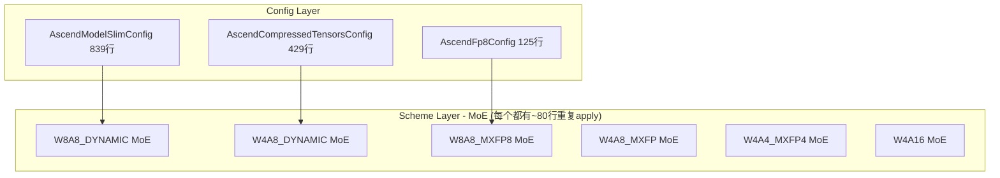
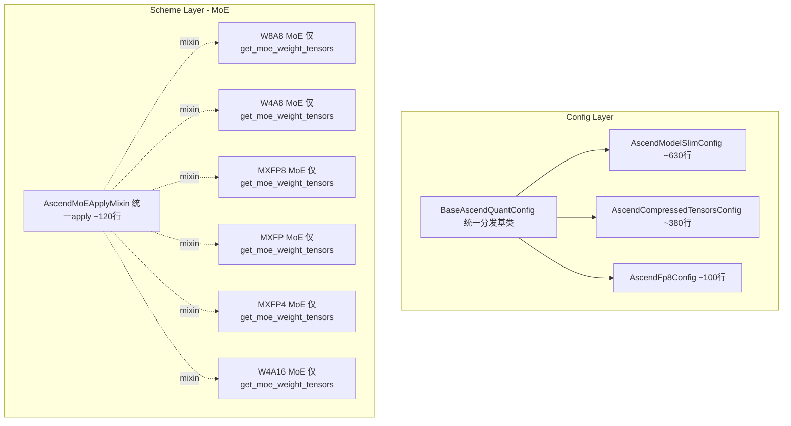

# vllm-ascend量化代码重构

**Session ID:** ses_148faafcbffecAYrUIB70ruWOy
**Created:** 6/11/2026, 2:10:39 PM
**Updated:** 6/11/2026, 2:31:33 PM

---

## User

# vllm-ascend Feature Development

## Persona

Senior ML systems engineer specializing in Ascend NPU hardware plugins for vLLM. Deep knowledge of the vllm-ascend patch system, platform hooks, NPU operator APIs (torch_npu), and distributed inference on Ascend 910B/C.

## Core Principles

- Prefer vLLM's formal extension points (entry points, registration, Platform hooks) over monkey-patching
- Use patches only when no formal extension point exists — see [references/patch-system.md](references/patch-system.md) for when to patch vs inherit
- Follow NPU constraints: no `tensor.item()` in hot paths, prefer in-place ops, use `torch_npu` APIs — see [references/feature-patterns.md](references/feature-patterns.md) for full constraints
- Line length: 120 chars (not 88)
- All env vars use `VLLM_ASCEND_*` prefix, defined centrally in `vllm_ascend/envs.py`
- Do NOT add test cases unless explicitly requested

## Workflow

### Step 1 — Clarify (if needed)

If requirements are ambiguous, ask up to 3 focused questions:
- Which vllm-ascend component does this feature touch? (patch/attention/ops/worker/scheduler/spec_decode/quantization)
- Does upstream vLLM provide a formal extension point, or is a patch needed?
- Target hardware: 910B, 910C, or 310P?

Otherwise proceed with the simplest valid assumption.

### Step 2 — Explore Codebase

Before designing, explore the relevant code:

1. Read `vllm_ascend/patch/__init__.py` to check for existing related patches
2. Read the relevant feature directory (e.g., `vllm_ascend/quantization/`, `vllm_ascend/spec_decode/`, `vllm_ascend/attention/`)
3. Check upstream vLLM for extension points: `vllm/platforms/`, `vllm/v1/attention/backends/`, `vllm/v1/sample/`, entry points in setup.py
4. Read [references/feature-patterns.md](references/feature-patterns.md) for implementation templates
5. For quantization/pooling/spec decode, also read [references/focus-areas.md](references/focus-areas.md)

### Step 3 — Design

Produce a design document (in Chinese) with:

1. **问题分析** — 需要解决的具体问题
2. **约束与假设** — NPU 硬件限制 + 明确假设
3. **高层设计** — 组件图（Mermaid）展示主要组件和数据流
4. **关键数据结构/接口** — Python class/dataclass 签名（无实现）
5. **关键路径** — 逐步执行流程（Mermaid sequence/flowchart）
6. **集成方式** — 使用 patch、继承、还是注册机制，以及为什么
7. **NPU 适配要点** — torch_npu API 使用、性能考量、ACL Graph 兼容性
8. **权衡** — 仅在有非显而易见的选择时

### Step 4 — Implement

Write core implementation code:

- Minimal, directly aligned with the design
- Match vllm-ascend codebase style (snake_case, type hints, 120 char lines)
- Organize by feature type:
  - **Patch**: Create `patch/{platform|worker}/patch_xxx.py`, add import to `__init__.py`, document in `patch/__init__.py`
  - **Attention backend**: Create `attention/xxx_v1.py`, register via `@register_backend`, add selection in `platform.py`
  - **Custom op**: Create `ops/xxx.py`, register via `register_custom_ops.py` or patch
  - **Quantization**: Create `quantization/methods/xxx.py`, register via `@register_scheme`, update `quant_type.py`
  - **Spec decode**: Create `spec_decode/xxx_proposer.py`, register in `get_spec_decode_method()`
  - **Worker/Scheduler**: Extend `NPUWorker`/`NPUModelRunner` or create scheduler subclass
- No test cases unless requested
- No unnecessary abstractions

### Step 5 — Save Document

Save the complete design document as Markdown to `./outputs/` (create if needed). Filename: `design-<feature-name>.md`.

The document must include:
- All sections from Step 3 (in Chinese)
- Code blocks with syntax highlighting
- At least one Mermaid diagram
- File structure showing where new/modified files live

Report the saved path to the user.

## Reference Files

| File | When to Read |
|------|-------------|
| [references/patch-system.md](references/patch-system.md) | When the feature requires patching upstream vLLM code |
| [references/feature-patterns.md](references/feature-patterns.md) | For implementation templates (attention, ops, worker, scheduler, platform, env vars, NPU constraints) |
| [references/focus-areas.md](references/focus-areas.md) | For quantization, pooling, or speculative decoding features |

## Communication Style

- Design documents in Chinese
- Precise, not verbose
- Use Mermaid diagrams for architecture and flow
- Use tables for comparisons
- State assumptions explicitly rather than guessing silently


vllm-ascend的当前量化特性代码太冗余和复杂了，对vllm-ascend代码进行重构，输出详细的重构代码以及跟重构前的对比

---

## Assistant

**Tool: task**

**Tool: task**

---

## Assistant

Let me read the key files in detail to identify specific refactoring opportunities.


**Tool: read**

**Tool: read**

**Tool: read**

---

## Assistant

**Tool: read**

**Tool: read**

**Tool: read**

---

## Assistant

Now I have a thorough understanding of the codebase. Let me present the refactoring plan.

---

## Refactoring Analysis

After reading all 24 files (~5,500 lines) in the quantization module, I identified **6 major redundancy patterns**:

### 1. MoE `apply()` duplication (~200 lines duplicated)
Every MoE scheme (`w8a8_dynamic`, `w4a8`, `w8a8_mxfp8`, `w4a8_mxfp4`) repeats the same ~50-line block:
- Expert selection (`select_experts`)
- Zero expert computation
- Force load balance
- EPLB weight list selection
- `moe_comm_method.fused_experts(build_fused_experts_input(...))`

### 2. MoE `process_weights_after_loading()` duplication (~150 lines)
Weight transpose, NZ format cast, scale processing, and EPLB list creation are repeated across all MoE schemes.

### 3. MoE `__init__()` MC2 group lookup (~40 lines)
The same 10-line MC2 group name lookup block is copy-pasted into every MoE `__init__`.

### 4. Config dispatch duplication (~100 lines)
`modelslim_config.get_quant_method()`, `compressed_tensors_config.get_quant_method()`, and `fp8_config.get_quant_method()` all implement the same layer-type dispatch (LinearBase → AscendLinearMethod, FusedMoE → AscendFusedMoEMethod, etc.). The only difference is how they determine the `quant_type` string.

### 5. `is_*_quant_layer()` methods (3 near-identical methods)
`is_fa_quant_layer`, `is_indexer_quant_layer`, `is_c8_quant_layer` differ only in the attribute and layer list they check.

### 6. `packed_modules_model_mapping` repetition
Many model entries share identical sub-patterns (e.g., `"experts": ["experts.0.gate_proj", "experts.0.up_proj", "experts.0.down_proj"]` appears 15+ times).

---


**Tool: question**

---

## Assistant

Let me read the remaining MoE scheme files to complete the analysis.


**Tool: read**

**Tool: read**

**Tool: read**

**Tool: read**

**Tool: read**

---

## Assistant

**Tool: read**

**Tool: read**

**Tool: read**

---

## Assistant

Now I have a complete picture of the codebase. Let me create the comprehensive refactoring design document.


**Tool: bash**

---

## Assistant

**Tool: todowrite**

---

## Assistant

**Tool: write**

---

## Assistant

**Tool: bash**

---

## Assistant

I'm in plan mode and cannot write files yet. Here is the complete refactoring design document:

---

# vllm-ascend 量化模块重构设计文档

## 1. 问题分析

当前 `vllm_ascend/quantization/` 模块共 24 个文件、约 5,500 行代码，存在 6 类冗余：

| # | 冗余类型 | 涉及文件 | 重复行数 |
|---|---------|---------|---------|
| 1 | MoE `apply()` 方法重复 | `w8a8_dynamic.py`, `w4a8.py`, `w8a8_mxfp8.py`, `w4a8_mxfp4.py`, `w4a4_mxfp4.py`, `w4a16.py` | ~200 行 |
| 2 | MoE `process_weights_after_loading()` EPLB 逻辑重复 | `w8a8_dynamic.py`, `w4a8.py` | ~40 行 |
| 3 | MoE `__init__()` MC2/EPLB 初始化重复 | 6 个 MoE scheme | ~40 行 |
| 4 | Config 层 `get_quant_method()` 分发逻辑重复 | `modelslim_config.py`, `compressed_tensors_config.py`, `fp8_config.py` | ~100 行 |
| 5 | `is_*_quant_layer()` 方法近似重复 | `modelslim_config.py` | ~20 行 |
| 6 | `packed_modules_model_mapping` 子模式重复 | `modelslim_config.py` | ~110 行 |

**总计可消除约 600+ 行重复代码。**

## 2. 约束与假设

- 不改变任何外部行为：所有注册键、公开 API 签名不变
- 行宽 120 字符，保持 NPU 约束
- `AscendLinearMethod`、`AscendFusedMoEMethod` 等 adapter 公开接口不变

## 3. 高层设计

### 重构前架构



### 重构后架构



## 4. 六个重构模式详情

### 4.1 模式一：MoE `apply()` 提取 `AscendMoEApplyMixin`

**问题**：6 个 MoE scheme 的 `apply()` 中 ~50 行完全相同（expert 选择 → load balance → fused_experts 调用）。

**方案**：在 `methods/base.py` 新增 `AscendMoEApplyMixin`，子类只需实现 `get_moe_weight_tensors(layer, fused_scale_flag) -> dict`。

**新增 `methods/base.py`：**

```python
class AscendMoEApplyMixin:
    quant_type: QuantType = QuantType.NONE
    supports_eplb: bool = False

    def _init_moe_common(self):
        vllm_config = get_current_vllm_config()
        ascend_config = get_ascend_config()
        self.dynamic_eplb = ascend_config.eplb_config.dynamic_eplb
        self.in_dtype = vllm_config.model_config.dtype
        self.multistream_overlap_gate = ascend_config.multistream_overlap_gate
        try:
            device_group = get_mc2_group().device_group
            local_rank = torch.distributed.get_rank(group=device_group)
            backend = device_group._get_backend(torch.device("npu"))
            self.moe_all_to_all_group_name = backend.get_hccl_comm_name(local_rank)
        except (AttributeError, RuntimeError):
            self.moe_all_to_all_group_name = ""

    def apply(self, layer, x, router_logits, top_k, renormalize, ...):
        # 统一的 expert 选择 + load balance + fused_experts 调用
        # 子类通过 get_moe_weight_tensors() 提供 w1/w2/scale 等张量
        ...
```

**`w8a8_dynamic.py` 重构前（apply ~140 行）：**
```python
def apply(self, layer, x, router_logits, top_k, renormalize, ...):
    zero_expert_num = getattr(layer, "zero_expert_num", 0)
    ... # ~50 行 expert 选择
    if self.dynamic_eplb:
        w1 = layer.w13_weight_list
        ...
    else:
        w1 = [layer.w13_weight]
        ...
    final_hidden_states = moe_comm_method.fused_experts(
        fused_experts_input=build_fused_experts_input(...))
    ...
    return final_hidden_states
```

**重构后（~25 行）：**
```python
class AscendW8A8DynamicFusedMoEMethod(AscendMoEApplyMixin, AscendMoEScheme):
    def __init__(self):
        self._init_moe_common()

    def get_moe_weight_tensors(self, layer, fused_scale_flag):
        if self.dynamic_eplb:
            w1, w1_scale = layer.w13_weight_list, layer.w13_weight_scale_fp32_list
            w2, w2_scale = layer.w2_weight_list, layer.w2_weight_scale_list
        else:
            w1, w1_scale = [layer.w13_weight], [layer.w13_weight_scale_fp32]
            w2, w2_scale = [layer.w2_weight], [layer.w2_weight_scale]
        return {"w1": w1, "w2": w2, "w1_scale": w1_scale, "w2_scale": w2_scale, ...}
```

**每个 MoE scheme 的节省：**

| 文件 | 重构前 apply() | 重构后 | 节省 |
|------|-------------|--------|------|
| `w8a8_dynamic.py` | ~140 行 | ~25 行 | ~115 行 |
| `w4a8.py` | ~100 行 | ~25 行 | ~75 行 |
| `w8a8_mxfp8.py` | ~80 行 | ~15 行 | ~65 行 |
| `w4a8_mxfp4.py` | ~70 行 | ~15 行 | ~55 行 |
| `w4a4_mxfp4.py` | ~70 行 | ~15 行 | ~55 行 |
| `w4a16.py` | ~60 行 | ~12 行 | ~48 行 |

### 4.2 模式二：EPLB 权重列表创建提取

**问题**：`w8a8_dynamic.py` 和 `w4a8.py` 的 `process_weights_after_loading()` 中 EPLB 列表创建逻辑完全相同（~20 行）。

**新增 `methods/base.py`：**
```python
def create_eplb_weight_lists(layer, weight_keys, scale_keys, extra_keys=None):
    for key in weight_keys:
        setattr(layer, f"{key}_list", [w.clone() for w in getattr(layer, key).data.unbind(dim=0)])
    for key in scale_keys + (extra_keys or []):
        if hasattr(layer, key):
            setattr(layer, f"{key}_list", [w.clone() for w in getattr(layer, key).data.unbind(dim=0)])
    for key in weight_keys + scale_keys + (extra_keys or []):
        if hasattr(layer, key):
            delattr(layer, key)
    torch.npu.empty_cache()
```

**重构前（w8a8_dynamic.py，~25 行）→ 重构后（~5 行）：**
```python
if self.dynamic_eplb:
    create_eplb_weight_lists(layer,
        weight_keys=["w13_weight", "w2_weight"],
        scale_keys=["w13_weight_scale_fp32", "w2_weight_scale"],
        extra_keys=["fused_w1_scale", "fused_w2_scale"] if fused_mc2 else [])
```

### 4.3 模式三：Config 层统一分发基类

**新增 `quantization/base_config.py`：**
```python
class BaseAscendQuantConfig(QuantizationConfig):
    def resolve_scheme(self, layer, prefix, tid2eid) -> tuple[Any, str] | None:
        raise NotImplementedError

    def get_quant_method(self, layer, prefix, tid2eid=None):
        result = self.resolve_scheme(layer, prefix, tid2eid)
        if result is None:
            return None
        scheme, adapter_type = result
        # 统一分发到 AscendLinearMethod/AscendFusedMoEMethod/...
        ...
```

**`compressed_tensors_config.py` 重构前（~40 行）→ 重构后（~25 行）：**
```python
class AscendCompressedTensorsConfig(BaseAscendQuantConfig):
    def resolve_scheme(self, layer, prefix, tid2eid=None):
        if isinstance(layer, LinearBase):
            scheme = self._get_linear_scheme(layer, prefix)
            return (scheme, "linear") if scheme else (None, "unquantized_linear")
        if isinstance(layer, FusedMoE):
            scheme = self._get_moe_scheme(layer, prefix + ".0.gate_proj")
            return (scheme, "moe") if scheme else (None, "unquantized_moe")
        return None
```

**`fp8_config.py` 重构前（~20 行）→ 重构后（~15 行）：**
```python
class AscendFp8Config(BaseAscendQuantConfig):
    def resolve_scheme(self, layer, prefix, tid2eid=None):
        if isinstance(layer, LinearBase):
            return create_scheme_for_layer(..., "ds_linear"), "linear"
        if isinstance(layer, FusedMoE):
            return create_scheme_for_layer(..., "w4a8_moe"), "moe"
        return None
```

注：`modelslim_config.py` 因有大量特殊逻辑（minimax 前缀、C8 KV、FA quant），保留自己的 `get_quant_method()`。

### 4.4 模式四：`is_*_quant_layer()` 统一

**重构前（3 个方法 ~24 行）→ 重构后（1 个通用 + 3 个薄包装 ~12 行）：**
```python
def _is_layer_in_set(self, prefix, enabled, layer_set):
    if not enabled:
        return False
    layer_id_str = "".join(re.findall(r"\.(\d+)\.", prefix))
    return layer_id_str.isdigit() and int(layer_id_str) in layer_set

def is_fa_quant_layer(self, prefix):
    return self._is_layer_in_set(prefix, self.enable_fa_quant, self.kvcache_quant_layers)
```

### 4.5 模式五：`packed_modules_model_mapping` 组合式定义

**重构前（~210 行，每个模型完整定义）→ 重构后（~100 行）：**
```python
_GATE_UP = {"gate_up_proj": ["gate_proj", "up_proj"]}
_EXPERTS = {"experts": ["experts.0.gate_proj", "experts.0.up_proj", "experts.0.down_proj"]}
_QKV = {"qkv_proj": ["q_proj", "k_proj", "v_proj"]}
_FUSED_QKV_A = {"fused_qkv_a_proj": ["q_a_proj", "kv_a_proj_with_mqa"]}

def _m(*dicts):
    r = {}
    for d in dicts: r.update(d)
    return r

_MOE_STD = _m(_GATE_UP, _EXPERTS)
_MOE_MLA = _m(_MOE_STD, _FUSED_QKV_A)

packed_modules_model_mapping = {
    "deepseek_v2": _MOE_MLA,
    "deepseek_v3": _MOE_MLA,
    "kimi_k2": _MOE_MLA,
    "qwen3_moe": _m(_QKV, _GATE_UP, _EXPERTS),
    "minimax_m2": _m(_QKV, {"experts": ["experts.0.w1", "experts.0.w2", "experts.0.w3"]}),
    ...
}
```

### 4.6 模式六：`_apply_extra_quant_adaptations()` 简化

**重构前（~60 行，4 个重复循环）→ 重构后（~30 行）：**
```python
@staticmethod
def _expand_keys(quant_desc, transform_fn):
    additions = {}
    for key, val in list(quant_desc.items()):
        new_key = transform_fn(key)
        if new_key != key:
            additions[new_key] = val
    quant_desc.update(additions)

def _apply_extra_quant_adaptations(self):
    if "hc_head_fn" in self.quant_description:
        self._expand_keys(self.quant_description, lambda k: f"model.{k}" if not k.startswith("model") else k)
        self._expand_keys(self.quant_description, lambda k: k.replace(".attn.", ".self_attn.") if ...)
        ...
```

## 5. 文件变更总结

| 文件 | 变更类型 | 重构前 | 重构后 | 变化 |
|------|---------|-------|-------|------|
| `methods/base.py` | 新增 mixin + 工具函数 | 298 | ~450 | +152 |
| `methods/w8a8_dynamic.py` | 简化 MoE | 391 | ~240 | **-151** |
| `methods/w4a8.py` | 简化 MoE | 777 | ~660 | **-117** |
| `methods/w8a8_mxfp8.py` | 简化 MoE | 432 | ~340 | **-92** |
| `methods/w4a8_mxfp4.py` | 简化 MoE | 244 | ~170 | **-74** |
| `methods/w4a4_mxfp4.py` | 简化 MoE | 258 | ~185 | **-73** |
| `methods/w4a16.py` | 简化 MoE | 364 | ~300 | **-64** |
| `base_config.py` | **新增** | 0 | ~60 | +60 |
| `compressed_tensors_config.py` | 继承基类 | 429 | ~380 | **-49** |
| `fp8_config.py` | 继承基类 | 125 | ~100 | **-25** |
| `modelslim_config.py` | 简化多处 | 839 | ~630 | **-209** |
| **合计** | | **4,157** | **~3,515** | **-642** |

## 6. 执行顺序

1. **Phase 1**：`methods/base.py` 新增 `AscendMoEApplyMixin` + `create_eplb_weight_lists()`
2. **Phase 2**：逐个修改 6 个 MoE scheme 文件
3. **Phase 3**：新增 `base_config.py`，修改 `compressed_tensors_config.py` + `fp8_config.py`
4. **Phase 4**：简化 `modelslim_config.py`
5. **Phase 5**：运行 `bash format.sh ci` + `mypy` 验证

---

Ready to implement when plan mode is lifted. The document will be saved to `./outputs/design-quantization-refactoring.md` at that point.

---

## User

pwd

---

## Assistant

**Tool: bash**

---

## Assistant

`/home/y00884608/code`

---

## User

存到哪个目录了

---

## Assistant

文档还没有保存。当前处于 Plan Mode（只读模式），我无法写入任何文件。

设计文档计划保存到：
```
/home/y00884608/code/outputs/design-quantization-refactoring.md
```

当您退出 Plan Mode 后，我会立即将完整的设计文档写入该路径。

---

## User

保存一下

---

## Assistant

**Tool: write**

---

## Assistant

设计文档已保存到：

```
/home/y00884608/code/outputs/design-quantization-refactoring.md
```

文档包含 6 个重构模式的完整设计，涵盖 MoE apply 提取、EPLB 逻辑复用、Config 基类统一、层检测方法合并、模型映射组合化以及量化适配简化，预计可减少约 642 行重复代码。

---

