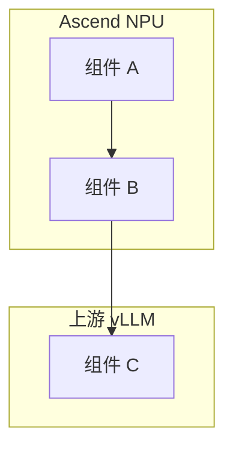
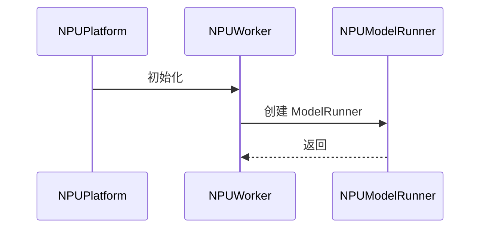
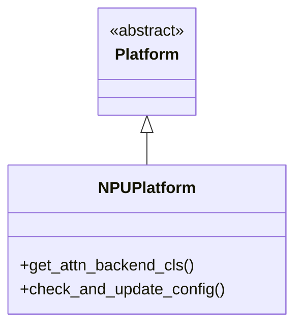

# vLLM Ascend 特性学习文档风格指南

本文件定义 vllm-ascend 特性学习文档的结构和格式规范。

## 文档结构

完整学习文档遵循以下多部分结构：

```
# vLLM Ascend [特性名称] 特性学习文档

> **文档版本**: 1.0
> **分析代码版本**: vllm-ascend main 分支（截至 YYYY-MM）
> **最后更新**: YYYY-MM-DD

---

## 文档概述
(范围、目标读者、阅读指南)

# 第一部分: [特性] 基础与背景
## 1.1 问题背景与动机
### 1.1.1 为什么需要这个特性
### 1.1.2 与上游 vLLM / GPU 版的差异
## 1.2 核心概念与原理
### 1.2.1 基本思想
### 1.2.2 关键术语
## 1.3 整体架构
### 1.3.1 系统架构总览图
### 1.3.2 核心组件与职责
### 1.3.3 与 vLLM 上游的集成关系

# 第二部分: 插件集成机制分析
## 2.1 Entry Point 注册流程
## 2.2 Patch 机制（如适用）
### 2.2.1 Patch 目标与替换逻辑
### 2.2.2 Patch 生命周期
## 2.3 继承与扩展（如适用）
### 2.3.1 基类与子类关系
### 2.3.2 方法覆写分析

# 第三部分: 核心实现深度分析
## 3.1 关键数据结构
## 3.2 核心算法/流程
## 3.3 源码走读
### 3.3.x 关键代码段分析（含文件路径标注）
## 3.4 NPU 特有优化（如有）

# 第四部分: 配置与使用指南
## 4.1 环境变量与配置参数
## 4.2 典型使用场景
## 4.3 性能调优建议
## 4.4 已知限制与注意事项

# 附录
## A. 关键代码位置索引
## B. 术语表
## C. 相关 PR / Issue 索引（如有）
```

注意：并非所有部分都必须包含。根据特性复杂度调整：
- 简单特性（如 CPU Binding）可合并为 2-3 部分
- 复杂特性（如 Attention 后端、MoE）可扩展为 5+ 部分
- "插件集成机制分析" 对于不涉及 patch/继承的特性可省略

## 格式规范

### Mermaid 图表

大量使用以展示架构、流程和组件关系：







### 表格

用于对比、参数说明和步骤总结：

```markdown
| 参数 | 类型 | 默认值 | 说明 |
|------|------|--------|------|
| `enable_xxx` | bool | False | 启用 xxx 功能 |
```

```markdown
| 维度 | GPU (vLLM) | NPU (vllm-ascend) |
|------|-----------|-------------------|
| 图优化 | CUDA Graph | ACL Graph |
| 通信库 | NCCL | HCCL |
```

### 代码片段

引用 vllm-ascend 真实代码并标注文件路径：

```python
# 文件: vllm_ascend/platform.py
class NPUPlatform(Platform):
    device_type: str = "npu"
    # 关键逻辑注释
```

### 提示块

```markdown
> **关键洞察**: 关于特性设计决策的重要说明。

> **NPU 差异**: 与 GPU 版本的关键差异点。

> **注意**: 警告或重要提示。

> **性能提示**: 性能相关建议。
```

### 数学公式

算法分析时使用 LaTeX：

```markdown
$$\text{speedup} = \frac{T_{baseline}}{T_{optimized}}$$
```

## 语言

- 使用中文（简体中文）撰写
- 技术术语保留英文原文（e.g., KV Cache, Token, Attention, Prefill, Decode, Patch, MoE）
- 代码标识符保留英文原名
- 章节标题使用中文，必要时夹注英文术语

## 内容深度

- 从问题背景和动机出发，解释"为什么"
- 深入源码实现，标注文件路径
- 重点阐述 NPU 特有设计和与 GPU 版的差异
- 提供具体配置示例和使用场景
- 交叉引用相关组件和文件

## 特别关注

vllm-ascend 学习文档应特别关注以下方面：

1. **插件架构视角** — 说明特性如何通过 patch/继承/entry point 与上游 vLLM 集成
2. **NPU 硬件特性** — 解释 Ascend NPU 的硬件约束如何影响软件设计
3. **性能优化思路** — 分析 NPU 特有的性能优化手段（通信优化、图融合、内存管理等）
4. **配置灵活性** — 列出所有相关环境变量和配置参数
